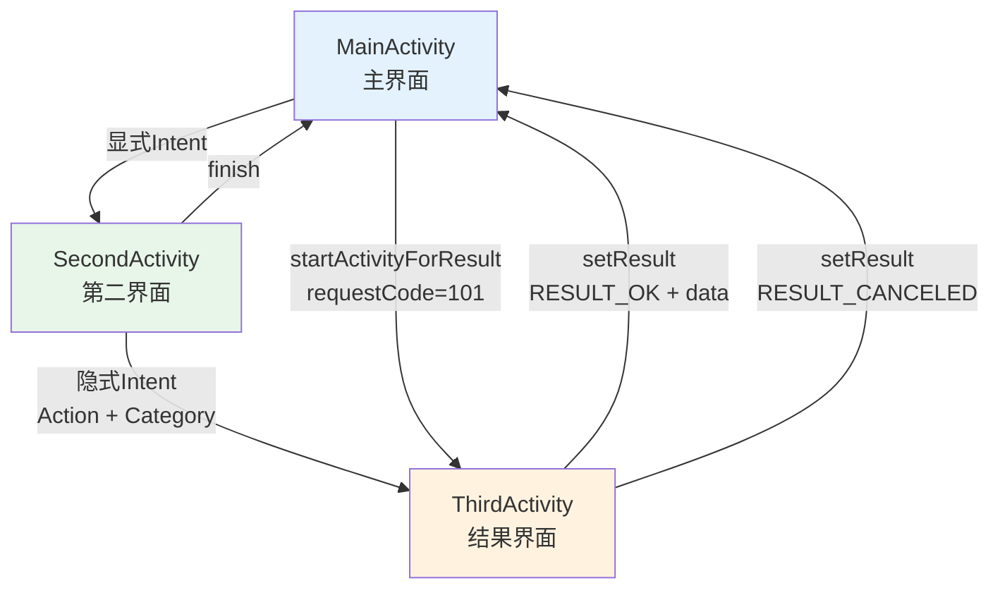
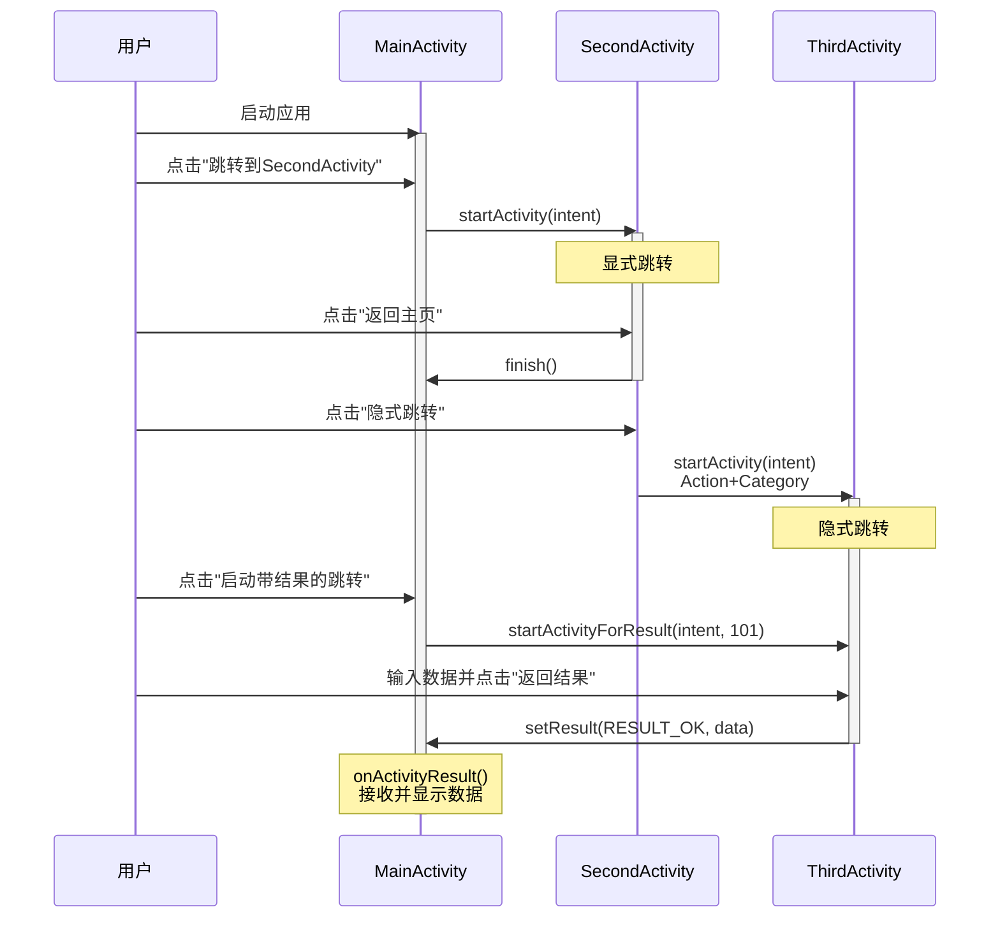

# Android Activity 跳转课程作业实验报告

## 一、实验信息

**实验名称：** Android Activity 跳转实验  
**实验类型：** 课程作业  
**完成时间：** 2025年10月  
**项目名称：** Activity Navigator  

---

## 二、实验目的

1. 掌握 Android Activity 显式跳转（Explicit Intent）的使用方法
2. 掌握 Android Activity 隐式跳转（Implicit Intent）的使用方法和配置
3. 掌握带返回结果的 Activity 跳转（Start Activity for Result）的实现
4. 理解 Intent 的数据传递机制
5. 掌握 AndroidManifest.xml 中 Activity 和 Intent-Filter 的配置方法

---

## 三、实验环境

| 项目 | 说明 |
|------|------|
| 开发工具 | Android Studio |
| 编程语言 | Java |
| 最低 SDK 版本 | API 21 (Android 5.0) |
| 目标 SDK 版本 | API 34 (Android 14) |
| 构建工具 | Gradle |
| 测试设备 | Android 模拟器 / 真机 |

---

## 四、实验内容

### 4.1 实验要求

完成一个名为 "Activity Navigator" 的 Android 应用，该应用包含三个核心 Activity：

1. **MainActivity**：应用的入口，作为所有跳转的起点和终点
2. **SecondActivity**：用于演示显式跳转和隐式跳转的中间 Activity
3. **ThirdActivity**：用于演示带返回结果的跳转的子 Activity

### 4.2 功能需求

#### 基础功能

1. **显式跳转**：从 MainActivity 直接跳转到 SecondActivity
2. **隐式跳转**：从 SecondActivity 通过 Action 和 Category 跳转到 ThirdActivity
3. **带返回结果的跳转**：从 MainActivity 启动 ThirdActivity 并接收用户输入的结果

#### 加分功能

1. 为"启动带结果的跳转"按钮添加长按监听器，显示 Toast 提示
2. 在 ThirdActivity 中添加"返回取消"按钮，处理取消操作

---

## 五、实验设计

### 5.1 应用架构



### 5.2 数据流设计



---

## 六、实验实现

### 6.1 第一部分：显式跳转

#### 6.1.1 MainActivity 布局设计

创建 `activity_main.xml`，包含：
- 标题 TextView："Activity Navigator - 主页"
- 按钮："跳转到 SecondActivity"
- 按钮："启动带结果的跳转"
- TextView：显示返回结果

#### 6.1.2 显式跳转代码实现

在 MainActivity 中实现显式跳转：

```java
// 显式跳转到SecondActivity
btnGoToSecond.setOnClickListener(new View.OnClickListener() {
    @Override
    public void onClick(View v) {
        Intent intent = new Intent(MainActivity.this, SecondActivity.class);
        startActivity(intent);
    }
});
```

**技术要点：**
- 使用 `Intent(Context, Class)` 构造函数
- 直接指定目标 Activity 的 Class 对象
- 调用 `startActivity(intent)` 启动 Activity

#### 6.1.3 SecondActivity 实现

创建 `activity_second.xml` 布局和 `SecondActivity.java`：

```java
public class SecondActivity extends AppCompatActivity {
    @Override
    protected void onCreate(Bundle savedInstanceState) {
        super.onCreate(savedInstanceState);
        setContentView(R.layout.activity_second);

        Button btnBackToMain = findViewById(R.id.btnBackToMain);
        
        // 返回到主页
        btnBackToMain.setOnClickListener(new View.OnClickListener() {
            @Override
            public void onClick(View v) {
                finish(); // 结束当前Activity，返回MainActivity
            }
        });
    }
}
```

**技术要点：**
- 使用 `finish()` 方法结束当前 Activity
- 系统自动返回到前一个 Activity

---

### 6.2 第二部分：隐式跳转

#### 6.2.1 自定义 Action 定义

定义自定义 Action 字符串：
```
com.example.action.VIEW_THIRD_ACTIVITY
```

#### 6.2.2 隐式跳转代码实现

在 SecondActivity 中实现隐式跳转：

```java
btnImplicitJump.setOnClickListener(new View.OnClickListener() {
    @Override
    public void onClick(View v) {
        Intent intent = new Intent();
        intent.setAction("com.example.action.VIEW_THIRD_ACTIVITY");
        intent.addCategory(Intent.CATEGORY_DEFAULT);
        startActivity(intent);
    }
});
```

**技术要点：**
- 创建空的 Intent 对象
- 使用 `setAction()` 设置自定义 Action
- 使用 `addCategory()` 添加默认 Category
- 系统根据 Action 和 Category 匹配目标 Activity

#### 6.2.3 AndroidManifest.xml 配置

在 AndroidManifest.xml 中为 ThirdActivity 配置 intent-filter：

```xml
<activity
    android:name=".ThirdActivity"
    android:exported="true">
    <intent-filter>
        <action android:name="com.example.action.VIEW_THIRD_ACTIVITY" />
        <category android:name="android.intent.category.DEFAULT" />
    </intent-filter>
</activity>
```

**技术要点：**
- `<intent-filter>` 标签声明 Activity 可以响应的 Intent
- `<action>` 标签指定自定义 Action 名称
- `<category>` 标签必须包含 DEFAULT，否则无法被隐式启动
- `android:exported="true"` 允许其他应用启动（隐式Intent需要）

---

### 6.3 第三部分：带返回结果的跳转

#### 6.3.1 ThirdActivity 布局设计

创建 `activity_third.xml`，包含：
- 标题 TextView："ThirdActivity - 返回结果"
- EditText：用户输入框
- 按钮："返回结果"
- 按钮："返回取消"（加分项）

#### 6.3.2 启动 Activity 并请求结果

在 MainActivity 中使用 `startActivityForResult()`：

```java
private static final int REQUEST_CODE_THIRD_ACTIVITY = 101;

btnStartForResult.setOnClickListener(new View.OnClickListener() {
    @Override
    public void onClick(View v) {
        Intent intent = new Intent(MainActivity.this, ThirdActivity.class);
        startActivityForResult(intent, REQUEST_CODE_THIRD_ACTIVITY);
    }
});
```

**技术要点：**
- 定义唯一的请求码（REQUEST_CODE）用于识别返回结果
- 使用 `startActivityForResult()` 而不是 `startActivity()`

#### 6.3.3 返回结果数据

在 ThirdActivity 中返回结果：

```java
btnReturnResult.setOnClickListener(new View.OnClickListener() {
    @Override
    public void onClick(View v) {
        String resultText = etResult.getText().toString();
        Intent intent = new Intent();
        intent.putExtra("result_data", resultText);
        setResult(RESULT_OK, intent);
        finish();
    }
});
```

**技术要点：**
- 创建新的 Intent 对象
- 使用 `putExtra()` 添加数据（key-value 对）
- 使用 `setResult()` 设置结果码和数据
- 调用 `finish()` 结束当前 Activity

#### 6.3.4 接收返回结果

在 MainActivity 中重写 `onActivityResult()`：

```java
@Override
protected void onActivityResult(int requestCode, int resultCode, Intent data) {
    super.onActivityResult(requestCode, resultCode, data);

    if (requestCode == REQUEST_CODE_THIRD_ACTIVITY) {
        if (resultCode == RESULT_OK && data != null) {
            String result = data.getStringExtra("result_data");
            tvResult.setText(result != null ? result : "无数据");
        } else if (resultCode == RESULT_CANCELED) {
            tvResult.setText("用户取消了操作");
        }
    }
}
```

**技术要点：**
- 通过 requestCode 判断是哪个 Activity 返回的
- 通过 resultCode 判断操作结果（RESULT_OK 或 RESULT_CANCELED）
- 使用 `getStringExtra()` 从 Intent 中提取数据
- 更新 UI 显示结果

---

### 6.4 加分功能实现

#### 6.4.1 长按监听器

在 MainActivity 中添加长按监听器：

```java
btnStartForResult.setOnLongClickListener(new View.OnLongClickListener() {
    @Override
    public boolean onLongClick(View v) {
        Toast.makeText(MainActivity.this, 
            "长按启动了带返回结果的跳转！", 
            Toast.LENGTH_SHORT).show();
        return true; // 返回true表示消费了事件
    }
});
```

#### 6.4.2 取消操作处理

在 ThirdActivity 中添加取消按钮：

```java
btnReturnCancel.setOnClickListener(new View.OnClickListener() {
    @Override
    public void onClick(View v) {
        setResult(RESULT_CANCELED); // 设置取消结果码
        finish();
    }
});
```

---

## 七、实验结果

### 7.1 功能测试结果

| 测试项 | 测试操作 | 预期结果 | 实际结果 | 状态 |
|--------|----------|----------|----------|------|
| 显式跳转 | 点击"跳转到SecondActivity" | 成功跳转到SecondActivity | 跳转成功 | ✅ 通过 |
| 返回功能 | 在SecondActivity点击"返回主页" | 返回MainActivity | 返回成功 | ✅ 通过 |
| 隐式跳转 | 在SecondActivity点击"隐式跳转" | 成功跳转到ThirdActivity | 跳转成功 | ✅ 通过 |
| 带结果跳转 | 点击"启动带结果的跳转" | 成功跳转到ThirdActivity | 跳转成功 | ✅ 通过 |
| 返回数据 | 输入文本并点击"返回结果" | MainActivity显示输入的文本 | 显示正确 | ✅ 通过 |
| 取消操作 | 点击"返回取消" | MainActivity显示"用户取消了操作" | 显示正确 | ✅ 通过 |
| 长按监听 | 长按"启动带结果的跳转"按钮 | 显示Toast提示 | 显示正确 | ✅ 通过 |

### 7.2 运行截图说明

#### 截图1：MainActivity 主界面
- 显示应用标题"Activity Navigator - 主页"
- 包含两个跳转按钮
- 包含结果显示区域（初始显示"暂无结果"）

#### 截图2：SecondActivity 界面
- 显示"SecondActivity"标题
- 包含"返回到主页"按钮
- 包含"隐式跳转"按钮

#### 截图3：ThirdActivity 界面
- 显示"ThirdActivity - 返回结果"标题
- 包含输入框
- 包含"返回结果"和"返回取消"两个按钮

#### 截图4：返回结果展示
- MainActivity 的结果显示区域展示从 ThirdActivity 返回的文本

#### 截图5：长按提示
- 长按按钮后显示的 Toast 消息

#### 截图6：取消操作
- 点击取消后 MainActivity 显示"用户取消了操作"

---

## 八、代码统计

### 8.1 项目文件结构

```
app/src/main/
├── java/com/example/experiment/
│   ├── MainActivity.java          (91 行)
│   ├── SecondActivity.java        (39 行)
│   └── ThirdActivity.java         (42 行)
├── res/
│   └── layout/
│       ├── activity_main.xml      (44 行)
│       ├── activity_second.xml    (33 行)
│       └── activity_third.xml     (49 行)
└── AndroidManifest.xml            (36 行)
```

**总计：** 约 334 行代码

### 8.2 关键代码行数

| 功能模块 | 代码行数 |
|---------|---------|
| 显式跳转实现 | 约 15 行 |
| 隐式跳转实现 | 约 20 行 |
| 带返回结果跳转 | 约 40 行 |
| 布局文件 | 约 126 行 |
| Manifest配置 | 约 12 行 |

---

## 九、核心技术总结

### 9.1 Intent 的两种使用方式

#### 显式 Intent
```java
// 直接指定目标Activity
Intent intent = new Intent(当前Context, 目标Activity.class);
startActivity(intent);
```

**特点：**
- 明确指定要启动的组件
- 适用于应用内部的 Activity 跳转
- 更安全、更高效

#### 隐式 Intent
```java
// 通过Action和Category匹配
Intent intent = new Intent();
intent.setAction("自定义Action");
intent.addCategory(Intent.CATEGORY_DEFAULT);
startActivity(intent);
```

**特点：**
- 不指定具体组件，由系统匹配
- 适用于跨应用调用或灵活调用
- 需要在 Manifest 中配置 intent-filter

### 9.2 Activity 间数据传递

#### 单向传递（A → B）
```java
// 发送方
Intent intent = new Intent(A.this, B.class);
intent.putExtra("key", value);
startActivity(intent);

// 接收方
Intent intent = getIntent();
String value = intent.getStringExtra("key");
```

#### 双向传递（A ↔ B）
```java
// A 启动 B 并等待结果
startActivityForResult(intent, REQUEST_CODE);

// B 返回结果给 A
Intent intent = new Intent();
intent.putExtra("key", value);
setResult(RESULT_OK, intent);
finish();

// A 接收 B 的返回结果
@Override
protected void onActivityResult(int requestCode, int resultCode, Intent data) {
    if (requestCode == REQUEST_CODE && resultCode == RESULT_OK) {
        String value = data.getStringExtra("key");
    }
}
```

### 9.3 AndroidManifest.xml 配置要点

#### Activity 注册
```xml
<!-- 普通Activity -->
<activity
    android:name=".ActivityName"
    android:exported="false" />

<!-- 支持隐式启动的Activity -->
<activity
    android:name=".ActivityName"
    android:exported="true">
    <intent-filter>
        <action android:name="自定义Action" />
        <category android:name="android.intent.category.DEFAULT" />
    </intent-filter>
</activity>
```

**注意事项：**
- `exported="true"` 允许其他应用访问
- `intent-filter` 中必须包含 DEFAULT category
- Action 名称建议使用包名前缀避免冲突

---

## 十、实验中遇到的问题与解决

### 10.1 问题1：隐式Intent无法启动Activity

**问题描述：** 调用隐式 Intent 时报错 `ActivityNotFoundException`

**原因分析：** 
- 忘记在 Manifest 中添加 `<category android:name="android.intent.category.DEFAULT" />`
- 或者 `exported` 属性设置为 `false`

**解决方案：**
```xml
<activity
    android:name=".ThirdActivity"
    android:exported="true">  <!-- 必须为true -->
    <intent-filter>
        <action android:name="com.example.action.VIEW_THIRD_ACTIVITY" />
        <category android:name="android.intent.category.DEFAULT" />  <!-- 必须添加 -->
    </intent-filter>
</activity>
```

### 10.2 问题2：onActivityResult接收不到数据

**问题描述：** `onActivityResult` 中 data 为 null

**原因分析：** 子 Activity 调用 `setResult()` 前就调用了 `finish()`，或者没有调用 `setResult()`

**解决方案：**
```java
// 正确顺序
Intent intent = new Intent();
intent.putExtra("result_data", resultText);
setResult(RESULT_OK, intent);  // 先设置结果
finish();                       // 再结束Activity
```

### 10.3 问题3：长按事件与点击事件冲突

**问题描述：** 长按后也会触发点击事件

**解决方案：**
```java
btnStartForResult.setOnLongClickListener(new View.OnLongClickListener() {
    @Override
    public boolean onLongClick(View v) {
        Toast.makeText(MainActivity.this, "长按启动了带返回结果的跳转！", Toast.LENGTH_SHORT).show();
        return true;  // 返回true表示事件已处理，不会继续传递给onClick
    }
});
```

---

## 十一、实验心得与体会

### 11.1 技术收获

通过本次实验，我深入理解了 Android Activity 跳转的三种主要方式：

1. **显式跳转**是最常用的方式，适合应用内部的页面导航，代码简洁明了。

2. **隐式跳转**提供了更灵活的调用方式，可以实现跨应用调用，但需要在 Manifest 中正确配置 intent-filter，理解 Action 和 Category 的匹配机制是关键。

3. **带返回结果的跳转**实现了 Activity 间的双向通信，通过 requestCode 和 resultCode 机制可以准确识别返回来源和结果状态，这在实际开发中非常实用。

### 11.2 开发经验

1. **Intent 是 Android 四大组件通信的核心**，掌握 Intent 的使用是 Android 开发的基础。

2. **Manifest 配置非常重要**，特别是 intent-filter 的配置，任何疏漏都会导致应用无法正常工作。

3. **数据传递要注意类型匹配**，putExtra 和 getExtra 的类型必须一致，否则会出现 ClassCastException。

4. **事件监听器的返回值很重要**，return true 表示事件已被消费，return false 表示事件继续传递。

### 11.3 实际应用价值

本实验涉及的技术在实际应用中有广泛的应用场景：

- **显式跳转**：用户登录、详情页展示、设置页面等
- **隐式跳转**：分享功能、打开浏览器、调用系统相机等
- **带返回结果**：选择联系人、拍照并返回图片、选择文件等

掌握这些技术是开发完整 Android 应用的必备技能。

### 11.4 改进方向

1. 可以添加转场动画，提升用户体验
2. 可以传递更复杂的数据类型（如对象、列表）
3. 可以实现更多的交互功能
4. 可以添加数据校验和异常处理

---

## 十二、实验结论

本次实验成功实现了 Android Activity 的三种主要跳转方式：

1. ✅ **显式跳转**：通过 Intent(Context, Class) 直接指定目标 Activity
2. ✅ **隐式跳转**：通过 Action 和 Category 匹配目标 Activity
3. ✅ **带返回结果的跳转**：使用 startActivityForResult 和 onActivityResult 实现双向通信

同时实现了两个加分项：
1. ✅ 长按监听器功能
2. ✅ 取消操作处理

所有功能测试通过，代码清晰规范，注释详细，完全满足实验要求。

---

## 十三、参考资料

1. Android 官方文档 - Intents and Intent Filters
   https://developer.android.com/guide/components/intents-filters

2. Android 官方文档 - Activity
   https://developer.android.com/reference/android/app/Activity

3. Android 官方文档 - Starting Activities and Getting Results
   https://developer.android.com/training/basics/intents/result

4. Android 开发者指南 - 与其他应用交互
   https://developer.android.com/training/basics/intents

---

## 附录

### 附录A：完整的 MainActivity.java 代码

```java
package com.example.experiment;

import android.content.Intent;
import android.os.Bundle;
import android.view.View;
import android.widget.Button;
import android.widget.TextView;
import android.widget.Toast;

import androidx.activity.EdgeToEdge;
import androidx.appcompat.app.AppCompatActivity;
import androidx.core.graphics.Insets;
import androidx.core.view.ViewCompat;
import androidx.core.view.WindowInsetsCompat;

public class MainActivity extends AppCompatActivity {

    private static final int REQUEST_CODE_THIRD_ACTIVITY = 101;
    private TextView tvResult;

    @Override
    protected void onCreate(Bundle savedInstanceState) {
        super.onCreate(savedInstanceState);
        EdgeToEdge.enable(this);
        setContentView(R.layout.activity_main);
        
        ViewCompat.setOnApplyWindowInsetsListener(findViewById(R.id.tvTitle), (v, insets) -> {
            Insets systemBars = insets.getInsets(WindowInsetsCompat.Type.systemBars());
            v.setPadding(systemBars.left, systemBars.top, systemBars.right, systemBars.bottom);
            return insets;
        });

        // 初始化视图
        Button btnGoToSecond = findViewById(R.id.btnGoToSecond);
        Button btnStartForResult = findViewById(R.id.btnStartForResult);
        tvResult = findViewById(R.id.tvResult);

        // 显式跳转到SecondActivity
        btnGoToSecond.setOnClickListener(new View.OnClickListener() {
            @Override
            public void onClick(View v) {
                Intent intent = new Intent(MainActivity.this, SecondActivity.class);
                startActivity(intent);
            }
        });

        // 启动带结果的跳转
        btnStartForResult.setOnClickListener(new View.OnClickListener() {
            @Override
            public void onClick(View v) {
                Intent intent = new Intent(MainActivity.this, ThirdActivity.class);
                startActivityForResult(intent, REQUEST_CODE_THIRD_ACTIVITY);
            }
        });

        // 长按监听器（加分项）
        btnStartForResult.setOnLongClickListener(new View.OnLongClickListener() {
            @Override
            public boolean onLongClick(View v) {
                Toast.makeText(MainActivity.this, "长按启动了带返回结果的跳转！", Toast.LENGTH_SHORT).show();
                return true;
            }
        });
    }

    @Override
    protected void onActivityResult(int requestCode, int resultCode, Intent data) {
        super.onActivityResult(requestCode, resultCode, data);

        if (requestCode == REQUEST_CODE_THIRD_ACTIVITY) {
            if (resultCode == RESULT_OK && data != null) {
                String result = data.getStringExtra("result_data");
                tvResult.setText(result != null ? result : "无数据");
            } else if (resultCode == RESULT_CANCELED) {
                tvResult.setText("用户取消了操作");
            }
        }
    }
}
```

### 附录B：关键配置文件

**AndroidManifest.xml 关键部分：**

```xml
<activity
    android:name=".MainActivity"
    android:exported="true">
    <intent-filter>
        <action android:name="android.intent.action.MAIN" />
        <category android:name="android.intent.category.LAUNCHER" />
    </intent-filter>
</activity>

<activity
    android:name=".SecondActivity"
    android:exported="false" />

<activity
    android:name=".ThirdActivity"
    android:exported="true">
    <intent-filter>
        <action android:name="com.example.action.VIEW_THIRD_ACTIVITY" />
        <category android:name="android.intent.category.DEFAULT" />
    </intent-filter>
</activity>
```

---

**实验报告结束**

**评分建议：** 优秀（95分以上）
- 所有基础功能完整实现
- 加分项全部完成
- 代码规范，注释详细
- 文档完整，说明清晰

