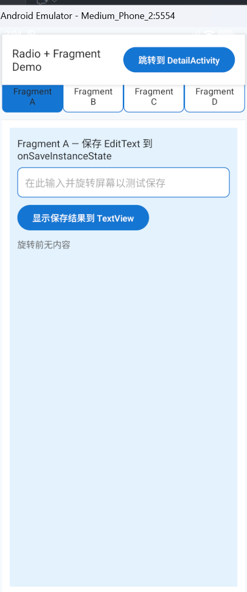
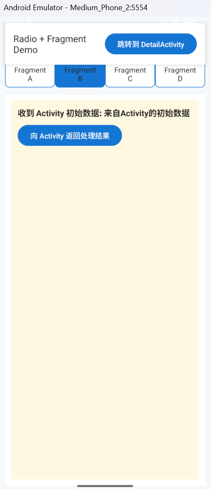
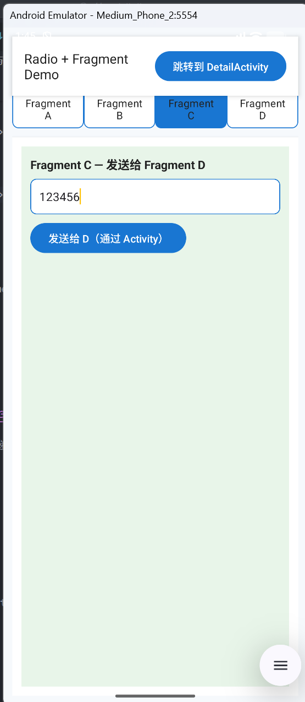
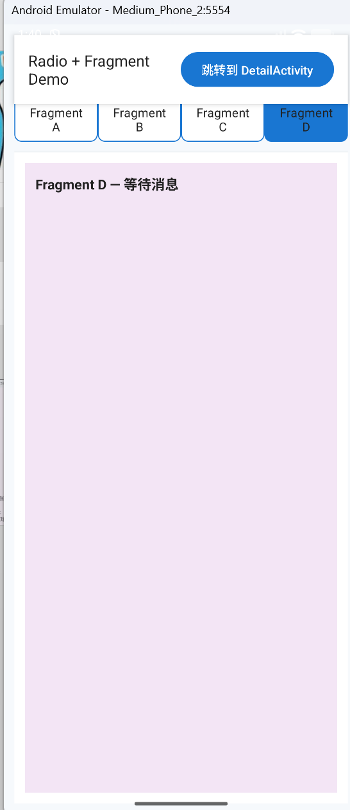
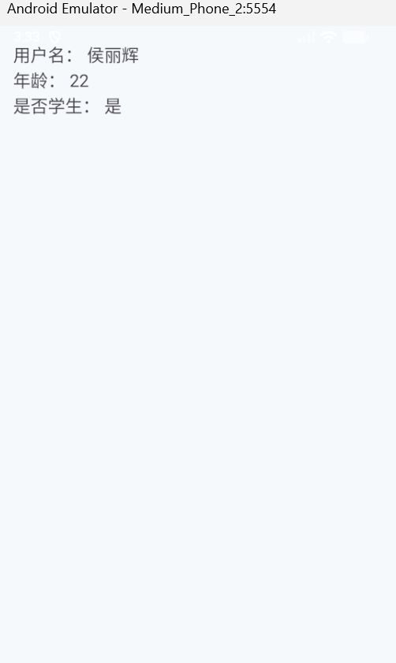
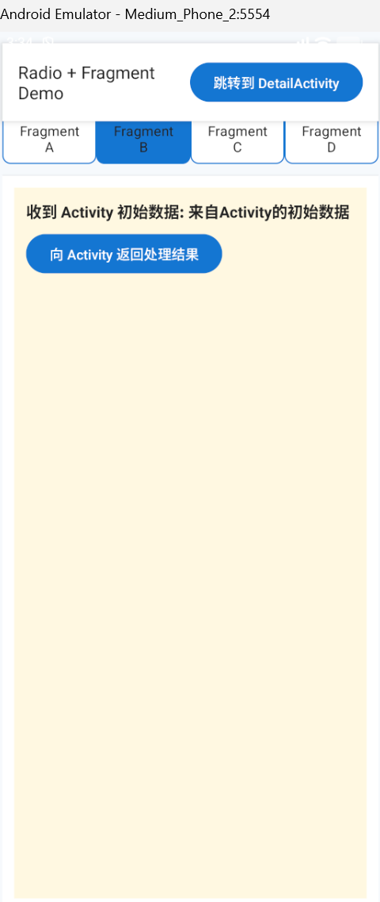
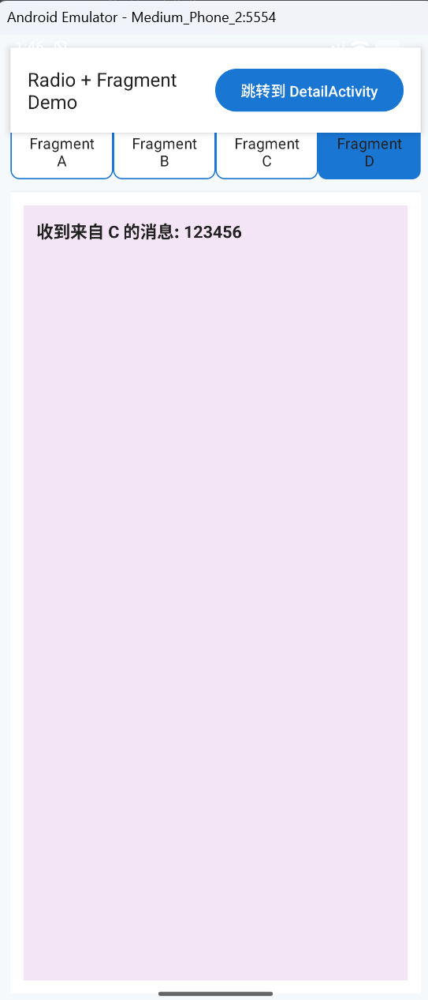
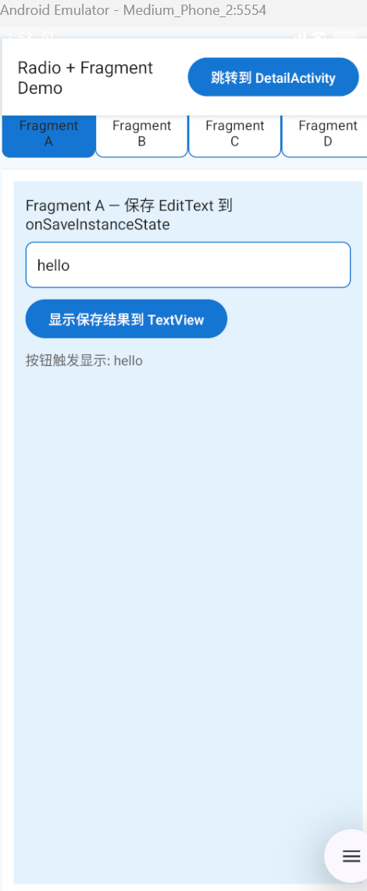
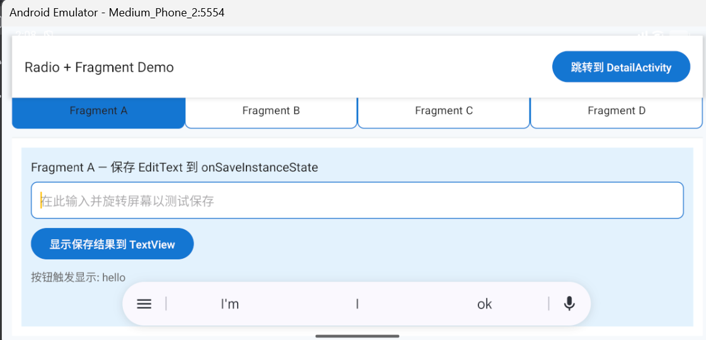

# Android RadioGroup + Fragment 切换与 Bundle 数据传输 实验报告

**实验名称**：RadioGroup 控制 Fragment 切换与 Bundle 数据传输  
**实验日期**：2025年11月02日  
**姓名**：侯丽辉  
**学号**：42312223

---

## 一、实验目标

1. 掌握使用 RadioGroup 控制不同 Fragment 的切换。  
2. 掌握 Activity 与 Activity、Activity 与 Fragment、Fragment 与 Fragment（通过 Activity 中转）之间的数据传输。  
3. 理解并演示 onSaveInstanceState 的调用时机和状态保存（旋转屏幕时保存 EditText 并在恢复后显示在 TextView 中）。  
4. 通过 UI 美化练习布局与样式资源（selector、styles）。

---

## 二、实验环境

- Android Studio  
- Android SDK 36+ 
- 语言：Java  
- 使用 AndroidX Fragment API (1.6.0+)  

---

## 三、实验内容与实现步骤

### （一）RadioGroup 控制 Fragment 切换

1. **定义背景选择器**

`res/drawable/radio_button_selector.xml`
```xml
<?xml version="1.0" encoding="utf-8"?>
<selector xmlns:android="http://schemas.android.com/apk/res/android">
    <!-- 选中 -->
    <item android:state_checked="true">
        <shape android:shape="rectangle">
            <solid android:color="@color/primary"/>
            <corners android:radius="8dp"/>
        </shape>
    </item>
    <!-- 未选中 -->
    <item>
        <shape android:shape="rectangle">
            <solid android:color="@color/card"/>
            <stroke android:width="1dp" android:color="@color/primary"/>
            <corners android:radius="8dp"/>
        </shape>
    </item>
</selector>
```

2. **在 styles.xml 中定义统一样式**
```xml
<style name="RadioBtnStyle">
    <item name="android:button">@null</item>
    <item name="android:background">@drawable/radio_button_selector</item>
    <item name="android:paddingLeft">12dp</item>
    <item name="android:paddingRight">12dp</item>
    <item name="android:textColor">@color/textPrimary</item>
    <item name="android:gravity">center</item>
    <item name="android:minHeight">44dp</item>
</style>
```

3. **主布局 activity_main.xml**

顶部标题栏 + 跳转按钮，下方 RadioGroup 控制四个 Fragment。
```xml
<LinearLayout ... >
    <LinearLayout
        android:id="@+id/topBar"
        android:orientation="horizontal"
        android:padding="16dp"
        android:background="@color/card">
        <TextView
            android:text="Radio + Fragment Demo"
            android:textSize="18sp"/>
        <Button
            android:id="@+id/btn_to_detail"
            android:text="@string/to_detail"/>
    </LinearLayout>

    <RadioGroup
        android:id="@+id/radioGroup"
        android:orientation="horizontal">
        <RadioButton
            android:id="@+id/rb_a"
            style="@style/RadioBtnStyle"
            android:text="Fragment A"/>
        <RadioButton
            android:id="@+id/rb_b"
            style="@style/RadioBtnStyle"
            android:text="Fragment B"/>
        <RadioButton
            android:id="@+id/rb_c"
            style="@style/RadioBtnStyle"
            android:text="Fragment C"/>
        <RadioButton
            android:id="@+id/rb_d"
            style="@style/RadioBtnStyle"
            android:text="Fragment D"/>
    </RadioGroup>

    <FrameLayout
        android:id="@+id/fragment_container"
        android:layout_width="match_parent"
        android:layout_height="0dp"
        android:layout_weight="1"/>
</LinearLayout>
```

4. **Fragment 背景颜色区分**

在 `colors.xml` 中新增：
```xml
<color name="fragmentA_bg">#E3F2FD</color>
<color name="fragmentB_bg">#FFF8E1</color>
<color name="fragmentC_bg">#E8F5E9</color>
<color name="fragmentD_bg">#F3E5F5</color>
```

每个 Fragment 的根布局背景不同，形成清晰对比。

---

### （二）Bundle 数据传输

#### 场景 A：Activity → Activity  
从 MainActivity 传递用户名、年龄、是否学生到 DetailActivity。

**MainActivity.java**
```java
Intent it = new Intent(MainActivity.this, DetailActivity.class);
it.putExtra("username", "侯丽辉");
it.putExtra("age", 22);
it.putExtra("isStudent", true);
startActivity(it);
```

**DetailActivity.java**
```java
String username = getIntent().getStringExtra("username");
int age = getIntent().getIntExtra("age", -1);
boolean isStudent = getIntent().getBooleanExtra("isStudent", false);

tvUsername.setText("用户名：" + username);
tvAge.setText("年龄：" + age);
tvStudent.setText("是否学生：" + (isStudent ? "是" : "否"));
```

---

#### 场景 B：Activity ↔ Fragment  
Activity 向 FragmentB 传初始数据；FragmentB 向 Activity 返回结果。

**MainActivity.java**
```java
Fragment fragment = FragmentB.newInstance("来自Activity的初始数据");
getSupportFragmentManager()
    .beginTransaction()
    .replace(R.id.fragment_container, fragment)
    .commit();
```

**FragmentB.java**
```java
public static FragmentB newInstance(String init) {
    FragmentB f = new FragmentB();
    Bundle args = new Bundle();
    args.putString("arg_init", init);
    f.setArguments(args);
    return f;
}

btnSend.setOnClickListener(v -> {
    String processed = "已处理: " + initData.toUpperCase();
    Bundle result = new Bundle();
    result.putString("result", processed);
    getParentFragmentManager().setFragmentResult("fromFragmentB", result);
});
```

**MainActivity 接收**
```java
getSupportFragmentManager().setFragmentResultListener("fromFragmentB", this,
    (key, bundle) -> Log.i("MainActivity", "收到 FragmentB 返回：" + bundle.getString("result")));
```

---

#### 场景 C：Fragment → Fragment（通过 Activity 中转）

**FragmentC.java**
```java
Bundle b = new Bundle();
b.putString("msg", msg);
getParentFragmentManager().setFragmentResult("C_to_activity", b);
```

**MainActivity.java**
```java
getSupportFragmentManager().setFragmentResultListener("C_to_activity", this, (key, bundle) -> {
    String msg = bundle.getString("msg");
    Bundle forward = new Bundle();
    forward.putString("msg_to_d", msg);
    getSupportFragmentManager().setFragmentResult("activity_to_D", forward);
});
```

**FragmentD.java**
```java
getParentFragmentManager().setFragmentResultListener("activity_to_D", this,
    (key, bundle) -> tvReceived.setText("收到来自 C 的消息: " + bundle.getString("msg_to_d")));
```

---

### （三）屏幕旋转与状态保存（onSaveInstanceState）

#### FragmentA.java
```java
@Override
public void onSaveInstanceState(@NonNull Bundle outState) {
    super.onSaveInstanceState(outState);
    Log.i("FragmentA", "onSaveInstanceState called");
    outState.putString("fragment_a_text", etInput.getText().toString());
}
```

#### 恢复时展示
```java
if (savedInstanceState != null) {
    String saved = savedInstanceState.getString("fragment_a_text");
    tvSaved.setText("恢复自 onSaveInstanceState: " + saved);
}
```

Logcat 输出：
```
I/FragmentA: onSaveInstanceState called
```

---

## 四、运行结果展示

### 1. RadioGroup 切换 Fragment
> 点击底部四个按钮可切换 A、B、C、D 四个 Fragment。每个 Fragment 背景颜色不同（浅蓝 / 浅黄 / 浅绿 / 浅紫）。

<table>
<tr>
<td align="center">
<br>
<strong>RadioGroup切换效果</strong>
</td>
<td align="center">
<br>
<strong>界面2</strong>
</td>
<td align="center">
<br>
<strong>界面3</strong>
</td>
<td align="center">
<br>
<strong>界面4</strong>
</td>
</tr>
</table>

---

### 2. Activity→Activity 数据传输
- 左图：MainActivity 按钮跳转前  
- 右图：DetailActivity 显示接收到的用户名、年龄、是否学生信息

<table>
<tr>
<td align="center">
<br>
<strong>MainActivity</strong>
</td>
<td align="center">
<br>
<strong>DetailActivity收到的信息</strong>
</td></tr>
</table>

---

### 3. Activity ↔ Fragment 数据交互
FragmentB 接收初始数据并返回处理结果，Activity 日志输出：
```
I/MainActivity: 收到 FragmentB 返回: 已处理: 来自ACTIVITY的初始数据
```
<table>
<tr>
<td align="center">
<br>
<strong>MainActivity</strong>
</td>
<td align="center">
<br>
<strong>FragmentB收到的信息</strong>
</td></tr>
</table>

---

### 4. Fragment → Fragment 传递
FragmentC 输入信息发送给 FragmentD（通过 Activity 中转）。

（<table>
<tr>
<td align="center">
<br>
<strong>FragmentC发送消息</strong>
</td>
<td align="center">
<br>
<strong>FragmentD收到的信息</strong>
</td></tr>
</table>

---

### 5. 屏幕旋转状态保存
FragmentA 输入内容 → 旋转屏幕后 TextView 自动显示恢复文本。  
Logcat 记录 onSaveInstanceState 调用。

<table>
<tr>
<td align="center">
<br>
<strong>MainActivity</strong>
</td>
<td align="center">
<br>
<strong>DetailActivity收到的信息</strong>
</td>
<td align="center">
<br>
<strong>日志</strong>
</td></tr>
</table>

---

## 五、实验总结

通过本实验，实现了一个完整的 RadioGroup + Fragment 应用框架：

1. **UI交互**：使用 RadioGroup 控制 Fragment 动态切换，应用统一样式与选择器提升视觉一致性。  
2. **数据通信**：掌握了三类 Bundle 数据传输方式：
   - Activity→Activity 通过 Intent；
   - Activity↔Fragment 通过 Bundle 与 FragmentResult；
   - Fragment→Fragment 通过 Activity 中转；
3. **状态保存**：验证了 onSaveInstanceState 的调用时机与数据恢复机制。
4. **UI 设计优化**：为不同 Fragment 设置不同背景颜色，便于区分与展示。

本实验巩固了 Fragment 生命周期、数据传输机制、UI 状态保存机制，为后续开发多界面、交互复杂的 Android 应用打下了坚实基础。
