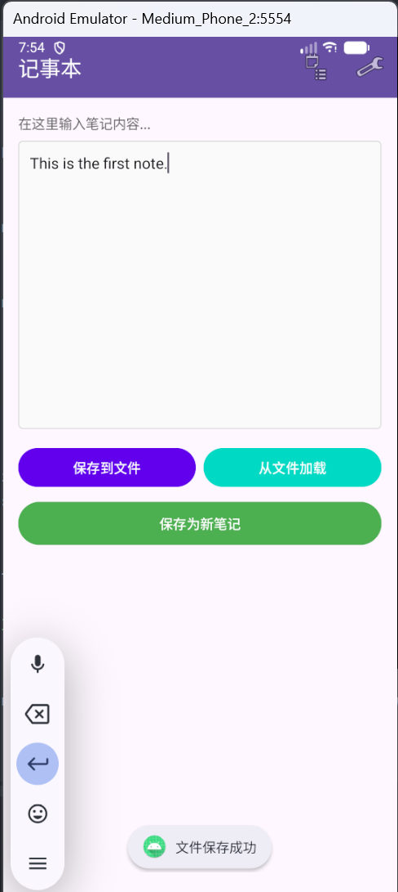
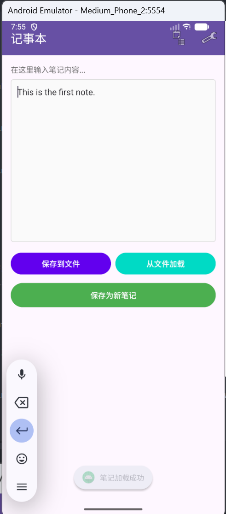
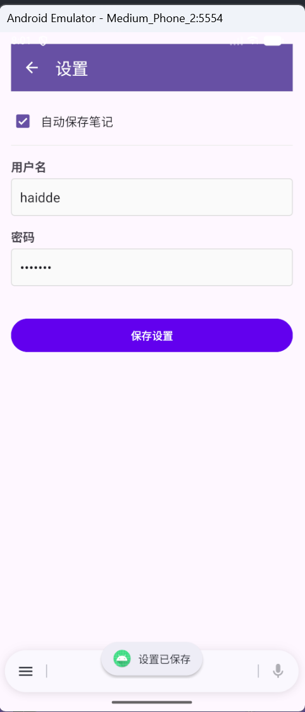
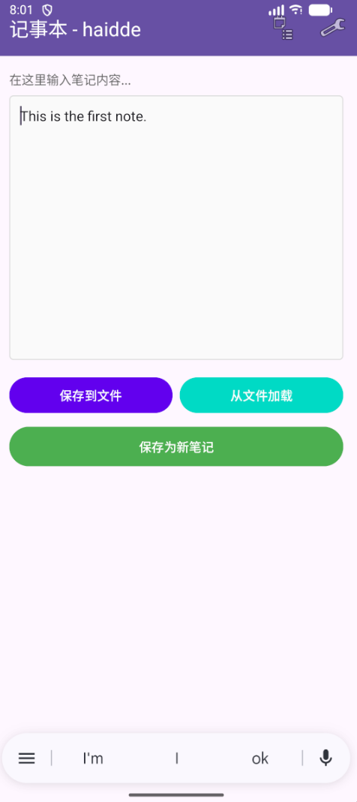
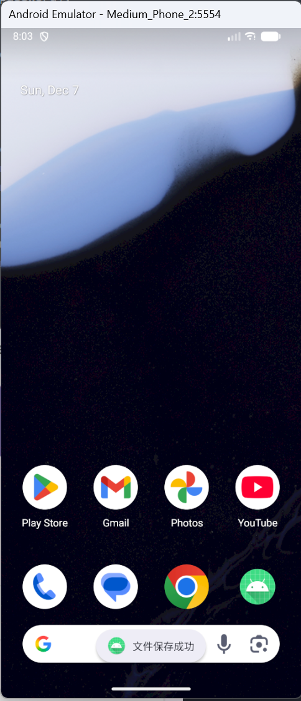
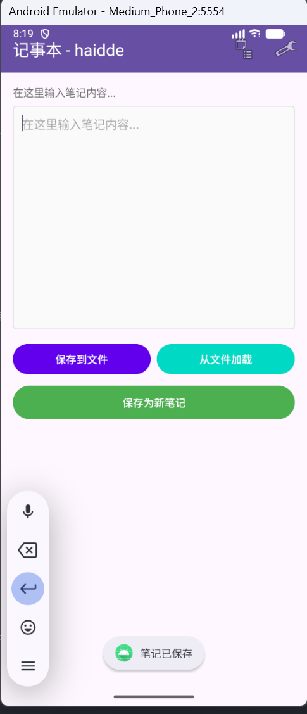
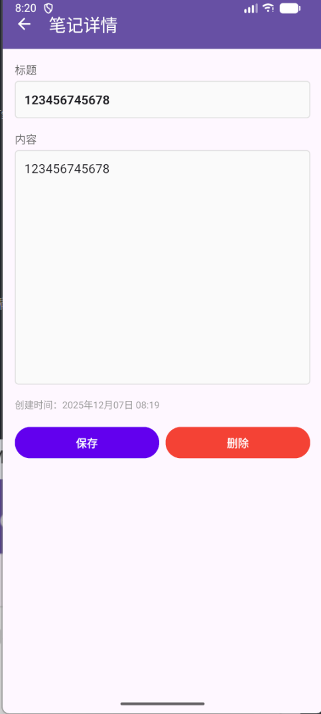
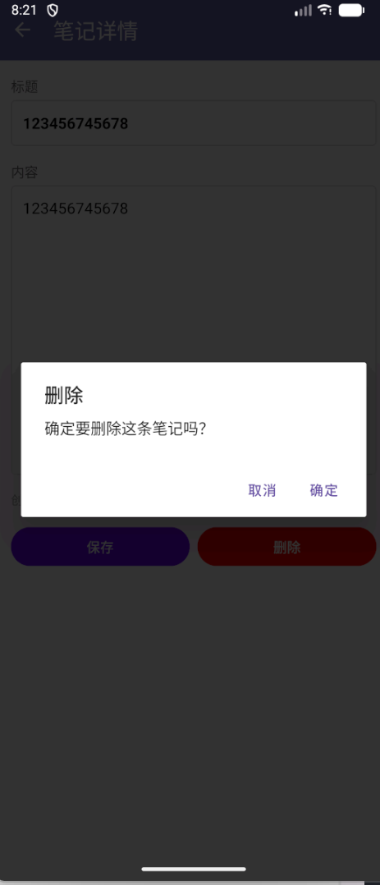

# Android 本地数据持久化综合实验报告
姓名：侯丽辉

学号：42312223

## 一、实验目的
掌握Android中三种常用本地数据存储方式的使用方法。

## 二、实验内容

### 1. 文件读写功能
**实现文件：** `MainActivity.java`

**功能描述：**
- 在主界面提供多行文本框供用户输入内容
- 点击"保存到文件"按钮，将内容写入应用私有目录的`note.txt`文件
- 点击"从文件加载"按钮，从`note.txt`读取内容并显示
- 实现了完整的异常处理，文件不存在时给出Toast提示

**核心代码：**
```java
// 保存到文件
private void saveToFile() {
    String text = editNote.getText().toString();
    try {
        FileOutputStream fos = openFileOutput(FILE_NAME, MODE_PRIVATE);
        fos.write(text.getBytes());
        fos.close();
        Toast.makeText(this, R.string.file_saved, Toast.LENGTH_SHORT).show();
    } catch (IOException e) {
        e.printStackTrace();
        Toast.makeText(this, R.string.error_saving, Toast.LENGTH_SHORT).show();
    }
}

// 从文件加载
private void loadFromFile() {
    try {
        FileInputStream fis = openFileInput(FILE_NAME);
        byte[] buffer = new byte[fis.available()];
        fis.read(buffer);
        fis.close();
        String text = new String(buffer);
        editNote.setText(text);
        Toast.makeText(this, "Note loaded successfully", Toast.LENGTH_SHORT).show();
    } catch (IOException e) {
        e.printStackTrace();
        Toast.makeText(this, R.string.file_not_found, Toast.LENGTH_SHORT).show();
    }
}
```
**运行结果展示：**
<table>
  <tr>
    <td style="text-align:center; padding: 10px;">
      
      <br><em>内容保存到文件</em>
    </td>
    <td style="text-align:center; padding: 10px;">
      
      <br><em>从文件中加载内容</em>
    </td>
  </tr>
</table>

### 2. SharedPreferences设置功能
**实现文件：** `SettingsActivity.java`

**功能描述：**
- 提供CheckBox控制是否开启"自动保存"功能
- 提供EditText输入用户名和密码
- 点击"保存设置"按钮将配置保存到SharedPreferences
- 打开设置界面时自动加载之前保存的配置
- 主界面标题栏显示用户名（在`MainActivity.onResume()`中实现）
- 当自动保存开启时，退出主界面自动保存文件（在`MainActivity.onPause()`中实现）

**核心代码：**
```java
// 保存设置
private void saveSettings() {
    boolean autoSave = checkBoxAutoSave.isChecked();
    String username = editTextUsername.getText().toString().trim();
    String password = editTextPassword.getText().toString().trim();
    
    SharedPreferences.Editor editor = sharedPreferences.edit();
    editor.putBoolean(KEY_AUTO_SAVE, autoSave);
    editor.putString(KEY_USERNAME, username);
    editor.putString(KEY_PASSWORD, password);
    editor.apply();
    
    Toast.makeText(this, R.string.settings_saved, Toast.LENGTH_SHORT).show();
}

// 加载设置
private void loadSettings() {
    boolean autoSave = sharedPreferences.getBoolean(KEY_AUTO_SAVE, false);
    String username = sharedPreferences.getString(KEY_USERNAME, "");
    String password = sharedPreferences.getString(KEY_PASSWORD, "");
    
    checkBoxAutoSave.setChecked(autoSave);
    editTextUsername.setText(username);
    editTextPassword.setText(password);
}
```
**运行结果展示：**
<table>
  <tr>
    <td style="text-align:center; padding: 10px;">
      
      <br><em>是否开启自动保存</em>
    </td>
    <td style="text-align:center; padding: 10px;">
      
      <br><em>输入姓名后界面文字不同</em>
    </td>
    <td style="text-align:center; padding: 10px;">
      
      <br><em>开启自动保存</em>
    </td>
  </tr>
</table>

### 3. SQLite数据库功能
**实现文件：** `DatabaseHelper.java`, `RecordListActivity.java`, `RecordDetailActivity.java`

**数据库设计：**
- 数据库名：`notes.db`
- 表名：`notes`
- 字段：
  - `_id` INTEGER PRIMARY KEY AUTOINCREMENT
  - `title` TEXT
  - `content` TEXT
  - `timestamp` DATETIME DEFAULT CURRENT_TIMESTAMP

**功能实现：**

#### (1) DatabaseHelper类
继承自SQLiteOpenHelper，实现数据库的创建和管理：
```java
public class DatabaseHelper extends SQLiteOpenHelper {
    private static final String DATABASE_NAME = "notes.db";
    private static final int DATABASE_VERSION = 1;
    
    @Override
    public void onCreate(SQLiteDatabase db) {
        String sql = "CREATE TABLE notes (" +
                "_id INTEGER PRIMARY KEY AUTOINCREMENT," +
                "title TEXT," +
                "content TEXT," +
                "timestamp DATETIME DEFAULT CURRENT_TIMESTAMP)";
        db.execSQL(sql);
    }
    
    // 实现了完整的CRUD操作
    public long insertNote(String title, String content) { ... }
    public List<Note> getAllNotes() { ... }
    public Note getNote(long id) { ... }
    public int updateNote(Note note) { ... }
    public void deleteNote(long id) { ... }
}
```

#### (2) 新增记录
在主界面点击"保存为新笔记"按钮，将当前文本内容保存到数据库：
- 标题自动从内容前20个字符生成
- 内容为完整文本
- 时间戳自动生成

#### (3) 显示记录列表
`RecordListActivity`使用ListView展示所有笔记：
- 显示标题和时间
- 点击列表项进入详情页面
- 长按列表项弹出删除确认对话框
- 空列表时显示提示信息

#### (4) 查看和编辑详情
`RecordDetailActivity`实现笔记的查看和编辑：
- 显示标题、内容和创建时间
- 支持编辑标题和内容
- 点击"保存"按钮更新数据库
- 点击"删除"按钮删除记录（带确认对话框）

**运行结果展示：**
<table>
  <tr>
    <td style="text-align:center; padding: 10px;">
      
      <br><em>保存笔记到数据库</em>
    </td>
    <td style="text-align:center; padding: 10px;">
      
      <br><em>笔记列表</em>
    </td>
    <td style="text-align:center; padding: 10px;">
      
      <br><em>查看笔记</em>
    </td>
    <td style="text-align:center; padding: 10px;">
      
      <br><em>可删除笔记</em>
    </td>
  </tr>
</table>
## 三、界面设计

### 1. MainActivity（主界面）
- Toolbar工具栏，显示应用名称和用户名
- 多行EditText文本输入框
- 三个按钮：保存到文件、从文件加载、保存为新笔记
- 菜单：设置、我的笔记

### 2. SettingsActivity（设置界面）
- Toolbar带返回按钮
- CheckBox：自动保存开关
- EditText：用户名输入
- EditText：密码输入（密码类型）
- Button：保存设置

### 3. RecordListActivity（笔记列表）
- Toolbar带返回按钮
- ListView显示所有笔记
- 自定义列表项布局（标题+时间）
- 空列表提示

### 4. RecordDetailActivity（笔记详情）
- Toolbar带返回按钮
- EditText：标题编辑
- EditText：内容编辑（多行）
- TextView：显示创建时间
- 两个按钮：保存、删除

## 四、技术要点

### 1. 文件存储
- 使用`openFileOutput()`和`openFileInput()`操作应用私有目录文件
- 文件保存在`/data/data/包名/files/`目录下
- 实现了完整的异常处理机制

### 2. SharedPreferences
- 使用`getSharedPreferences("settings", MODE_PRIVATE)`获取实例
- 通过Editor进行写入操作
- 支持Boolean、String等多种数据类型
- 数据持久化保存，应用重启后仍然有效

### 3. SQLite数据库
- 使用SQLiteOpenHelper管理数据库生命周期
- 实现了完整的CRUD操作
- 使用ContentValues进行数据插入和更新
- 使用Cursor进行数据查询
- 实现了数据库版本管理（onUpgrade）

### 4. 界面交互
- 使用Toolbar替代ActionBar
- 通过Menu实现界面导航
- 使用Intent在Activity间传递数据
- AlertDialog实现删除确认
- Toast提供操作反馈

## 五、额外功能

1. **编辑笔记**：支持修改已保存的笔记内容
2. **删除确认**：删除操作前弹出确认对话框
3. **时间格式化**：将时间戳格式化为易读格式
4. **空列表提示**：列表为空时显示友好提示
5. **长按删除**：长按列表项快速删除
6. **自动保存**：根据设置自动保存文件

## 六、实验总结

本实验完整实现了Android三种本地数据存储方式：

1. **文件存储**适合保存简单的文本数据，操作简单直接
2. **SharedPreferences**适合保存配置信息和用户偏好设置
3. **SQLite数据库**适合保存结构化数据，支持复杂查询和大量数据管理

通过本实验，深入理解了Android数据持久化的原理和应用场景，掌握了实际开发中常用的数据存储技术。

## 七、项目文件清单

### Java文件
- `MainActivity.java` - 主界面，实现文件读写
- `SettingsActivity.java` - 设置界面，实现SharedPreferences
- `RecordListActivity.java` - 笔记列表
- `RecordDetailActivity.java` - 笔记详情
- `DatabaseHelper.java` - 数据库助手类
- `NoteAdapter.java` - ListView适配器

### 布局文件
- `activity_main.xml` - 主界面布局
- `activity_settings.xml` - 设置界面布局
- `activity_record_list.xml` - 笔记列表布局
- `activity_record_detail.xml` - 笔记详情布局
- `list_item_note.xml` - 列表项布局

### 资源文件
- `strings.xml` - 字符串资源
- `colors.xml` - 颜色资源
- `themes.xml` - 主题配置
- `main_menu.xml` - 菜单资源
- `edit_text_background.xml` - 输入框背景

### 配置文件
- `AndroidManifest.xml` - 应用清单文件
