### Android Activity 跳转课程作业

**实验名称**：Activity Navigator
应用开发（显式跳转、隐式跳转、带返回结果跳转）

**实验日期**：2025**年9月29日**

**姓名：侯丽辉**

**学号**：42312223

### **一、作业目标**

1.  掌握**显式跳转**（Explicit
    > Intent）的用法，能够从一个Activity启动另一个指定的Activity。

2.  掌握**隐式跳转**（Implicit
    > Intent）的用法，能够通过Action和Category启动符合条件的Activity。

3.  掌握**带返回结果的跳转**（Start Activity for
    > Result），能够从子Activity返回数据给父Activity。

### **二、作业内容**

请完成一个名为 **\"Activityphoto\
Navigator\"** 的Android应用。该应用包含三个核心Activity：

-   **MainActivity**：应用的入口。它将作为所有跳转的起点和终点。

-   **SecondActivity**：一个用于演示显式和隐式跳转的中间Activity。

-   **ThirdActivity**：一个用于演示带返回结果跳转的子Activity。

### **作业详细步骤**

### （一）显式跳转（MainActivity和SecondActivity之间）

1. #### 创建 MainActivity 布局

在activity_main.xml文件中添加 "跳转到 SecondActivity"按钮。
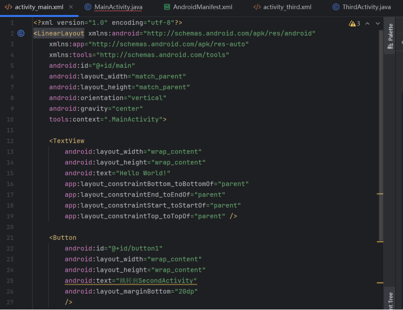

2. #### 添加MainActivity.java 代码

为 "跳转到 SecondActivity" 按钮设置点击事件监听器，通过显式 Intent 启动
SecondActivity。
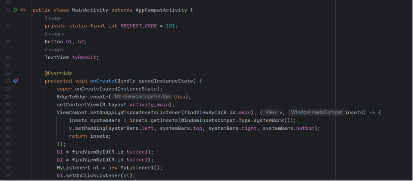
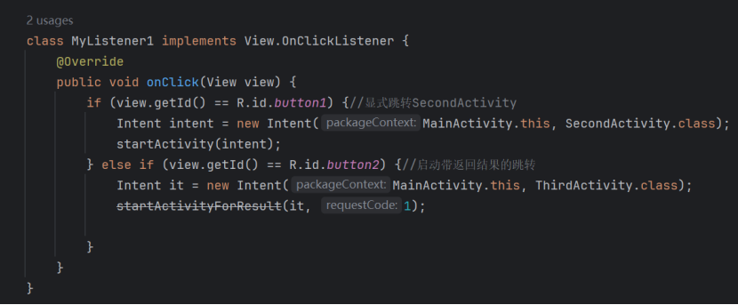

3. #### 创建 SecondActivity 布局

添加 "返回到主页" 按钮和 "隐式跳转" 按钮。

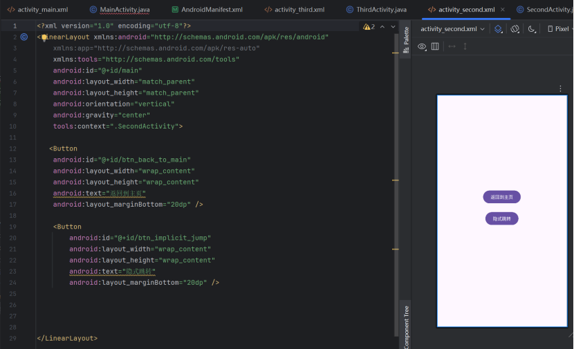

4. #### 添加SecondActivity.java 代码

为 "返回到主页" 按钮设置点击事件，通过 finish() 结束当前 Activity
并返回到MainActivity。
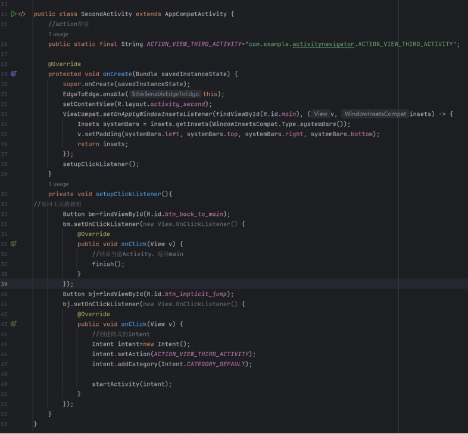

### （二）隐式跳转（SecondActivity → ThirdActivity）

注：隐式跳转的按钮已经在第一部分创建SecondActivity布局时已经添加过；并在java代码中给该按钮设置过监听器。

1.  #### 添加SecondActivity.java文件

    在点击事件中，创建一个隐式Intent。Action: 自定义一个字符串常量\"com.example.action.VIEW_THIRD_ACTIVITY\"；Category: Intent.CATEGORY_DEFAULT。

    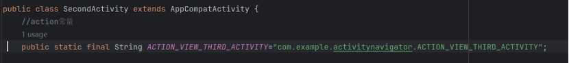
    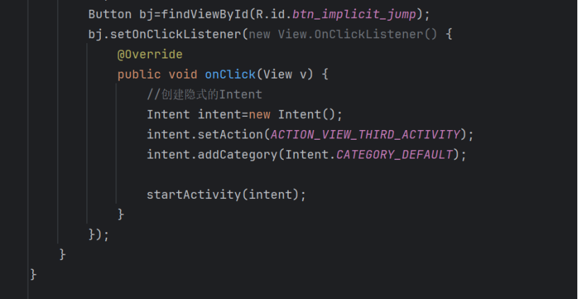
    

2. #### 配置 AndroidManifest.xml

为 ThirdActivity 添加 \<intent-filter\>，声明其可响应自定义 Action
和默认 Category。

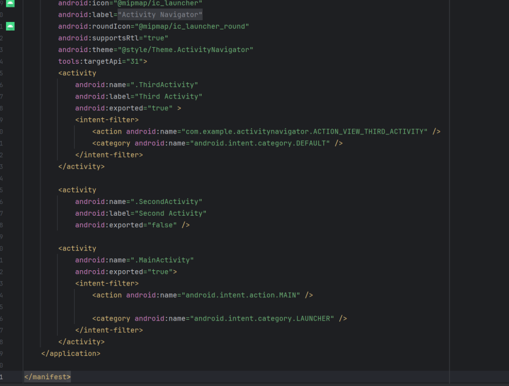

### （三）带返回结果的跳转（MainActivity和ThirdActivity之间）

1. #### 创建MainActivity布局

添加一个名为 \"启动带结果的跳转\" 的按钮，以及一个用于显示返回结果的 TextView。

（注：MainActivity.java中在第一部分已经展示过给该按钮设置了监听器）

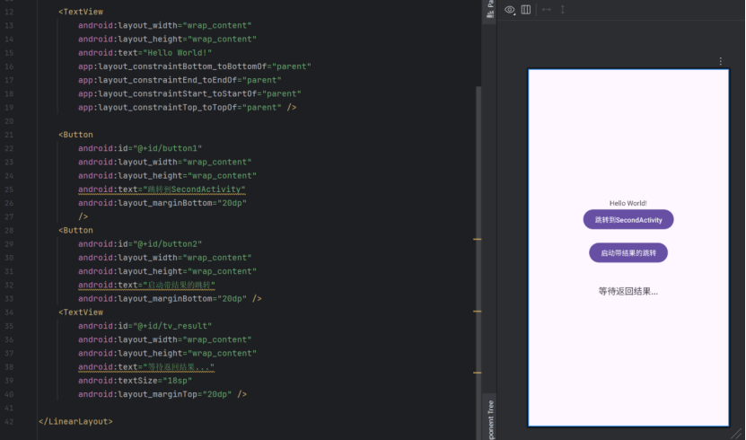

2.  #### 添加MainActivity.java代码

    在点击事件中，使用 startActivityForResult() 方法启动 ThirdActivity。为这个跳转设置一个唯一的请求码（requestCode
    101）

   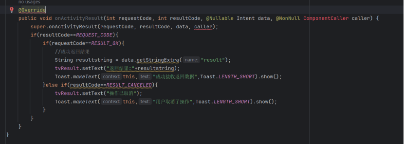

3. #### 创建 ThirdActivity 布局

添加 EditText（输入返回内容）、"返回结果" 按钮、"返回取消"
按钮（加分项）。

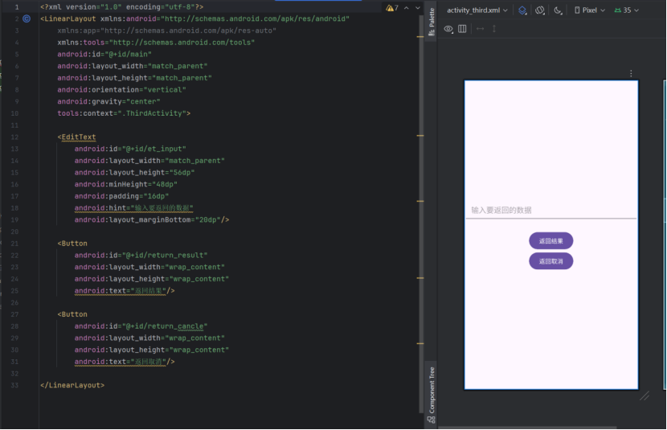

4. #### 添加ThirdActivity 代码

处理 "返回结果" 和 "返回取消" 按钮点击事件，传递数据或取消信号给
MainActivity。

（1）在 ThirdActivity 的代码中，为"返回结果"按钮设置点击事件。

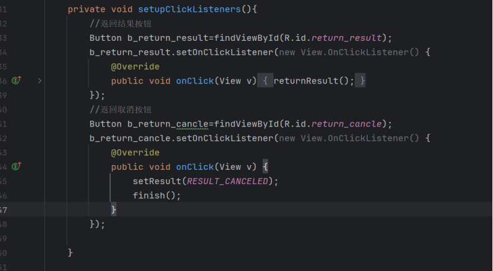

（2）在点击事件中，创建一个新的 Intent 对象，并将 EditText 中的文本作为额外数据（Extra）放入Intent中。

（3）使用 setResult(int resultCode, Intent
data) 方法设置返回结果。resultCode 设置为 Activity.RESULT_OK。

（4）调用 finish() 方法结束 ThirdActivity。

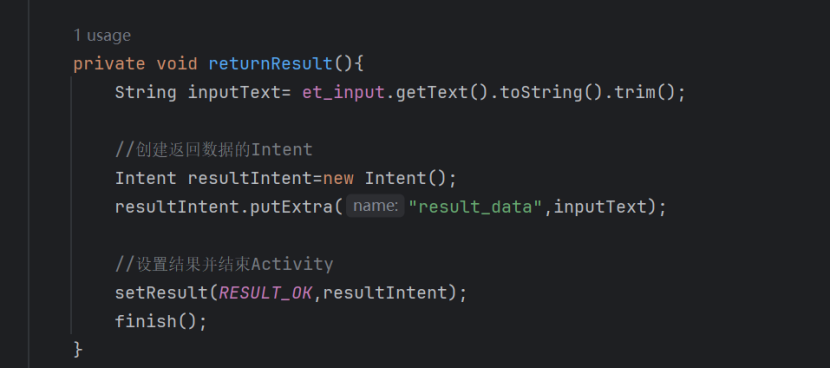

**5.添加 MainActivity.java代码**

重写 onActivityResult(int requestCode, int resultCode, Intent
data) 方法。在 onActivityResult 方法中，根据 requestCode 和 resultCode 判断是否为预期的返回结果。如果是，从 data Intent
中获取返回的文本数据，并更新 MainActivity 的 TextView。

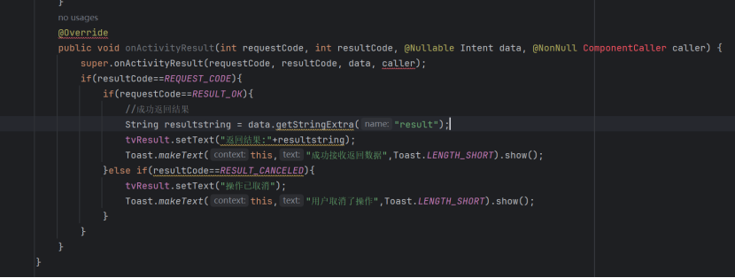

### （四）加分项

1.在 MainActivity 中，为 "启动带结果的跳转" 按钮添加一个长按监听器。

2.长按按钮时，弹出一个 Toast 提示用户"长按启动了带返回结果的跳转！"。

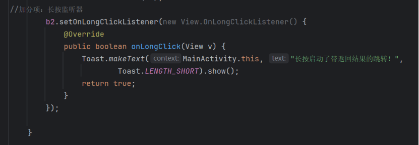

4.在 ThirdActivity 中，添加一个名为 \"返回取消\" 的按钮。点击后使用setResult(Activity.RESULT_CANCELED)并finish()在 MainActivity 的 onActivityResult 中处理这个取消操作。

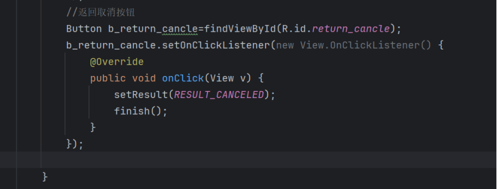

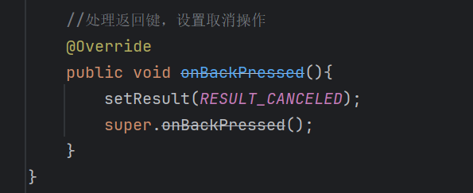

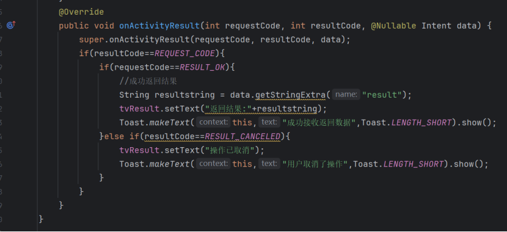

**运行结果：**

1.  **显示跳转功能**

   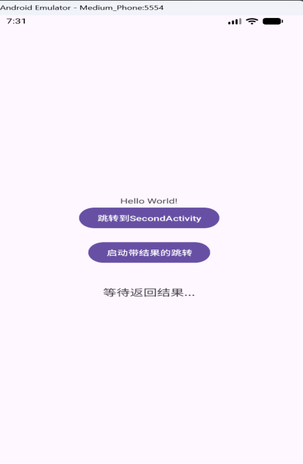   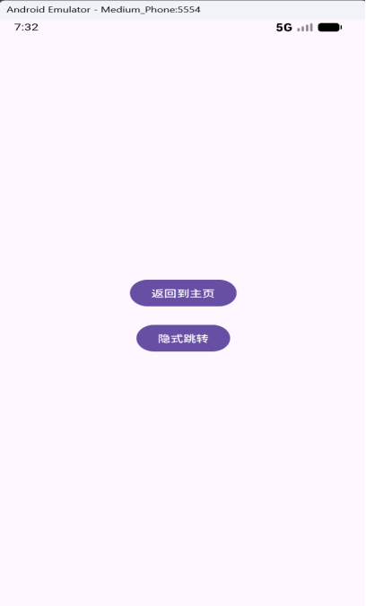

    MainActivity界面和跳转到SecondActivity之后的界面

2.  **隐式跳转功能**

   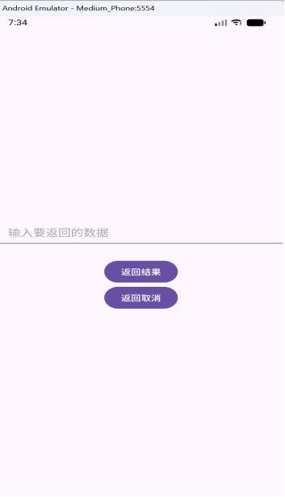

    从SecondActivity界面隐式跳转到ThirdActivity之后的界面

3.  **带返回结果的跳转**

    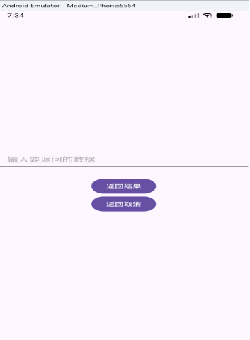
    !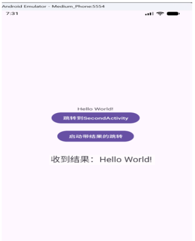

    ThirdActivity的界面，输入HelloWorld!点击返回结果按钮    的截图和MainActivity界面中显示收到了结果的截图

    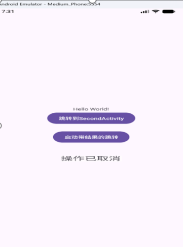

ThirdActivity 点击 "返回取消" 按钮，MainActivity 的 TextView 显示
"操作已取消"

4.  **长按功能（加分项）**

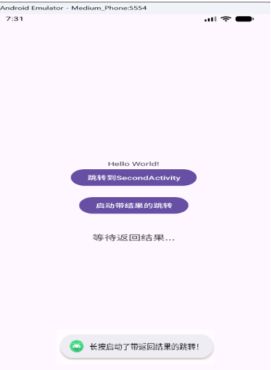

长按 MainActivity 的 "启动带结果的跳转" 按钮，弹出 Toast 提示
"长按启动了带返回结果的跳转！"

### **三、总结**

通过完成\"ActivityNavigator\"应用开发，我掌握了Android三大核心跳转机制：显式Intent用于精确启动指定Activity，隐式Intent通过Action和Category匹配目标组件，带返回结果的跳转实现了Activity间的数据双向传递。同时深入理解了Intent数据传递方式和AndroidManifest的组件配置。

在开发过程中，我提升了实际问题解决能力：学会了使用物理设备调试替代虚拟设备网络问题，正确处理SDK版本兼容性警告，优化Gradle配置解决构建失败。这些经验为后续Android开发奠定了扎实基础。
