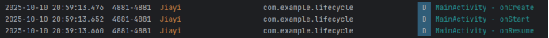
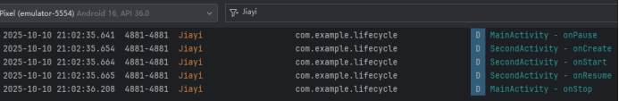
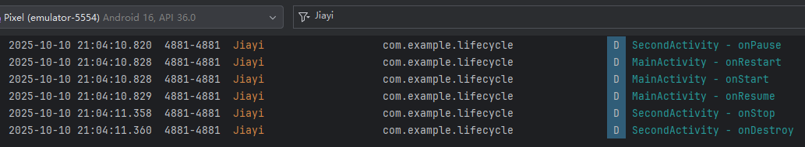
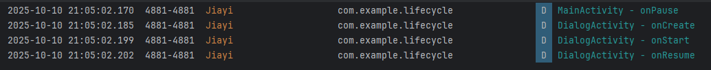
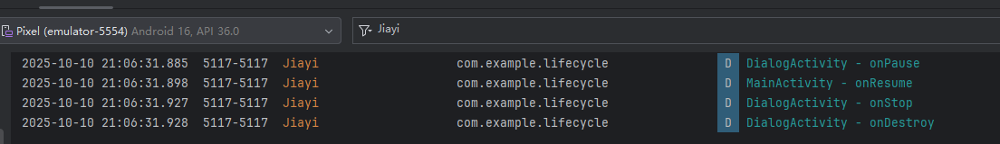

# Android Activity 生命周期观察实验

## 实验目的

- 掌握 Android Activity 生命周期的基本概念
- 通过 Log 观察 Activity 在不同场景下的生命周期变化
- 理解 Activity 跳转和返回时的生命周期调用顺序
- 分析普通 Activity 与 Dialog Activity 在生命周期上的差异

## 实验要求

### 基础任务

1. **创建主 Activity**
   - 创建 MainActivity，重写所有生命周期方法。
   - 在每个生命周期方法中添加 Log 输出，格式：`Log.d("Lifecycle", "MainActivity - 方法名")`
   
2. **创建普通 SecondActivity**
   - 创建第二个普通 Activity。
   - 同样重写所有生命周期方法并添加 Log 输出。
   
3. **创建 Dialog Activity**
   - 创建第三个 Activity，设置为主题为对话框样式（Theme.AppCompat.Dialog）。
   - 重写所有生命周期方法并添加 Log 输出。

## 实验步骤

### 第一部分：基础生命周期观察

1. **应用启动**
   - 启动应用，观察 MainActivity 的生命周期调用顺序。
   - 记录 Logcat 中的输出。
   
   
2. **普通 Activity 跳转（Main → SecondActivity）**
   - 从 MainActivity 跳转到 SecondActivity。
   - 观察两个 Activity 的生命周期变化。
   
3. **从 SecondActivity 返回**
   - 按返回键回到 MainActivity。
   - 再次观察生命周期变化。
   
4. **Dialog Activity 跳转（Main → Dialog Activity）**
   - 从 MainActivity 跳转到 DialogActivity。
   - 观察生命周期变化。
   
5. **从 Dialog Activity 返回**
   - 关闭对话框 Activity。
   - 观察生命周期变化。
   
### 第二部分：数据记录与分析

| 场景 | MainActivity 生命周期顺序 | 目标 Activity 生命周期顺序 |
| --- | ------------------------- | -------------------------- |
| 应用启动（MainActivity 被创建） | onCreate() → onStart() → onResume() | —— |
| Main → SecondActivity（跳转到全屏 Activity） | onPause() → onStop() | onCreate() → onStart() → onResume() |
| SecondActivity 返回（按返回键回到 Main） | onRestart() → onStart() → onResume() | onPause() → onStop() → onDestroy() |
| Main → Dialog Activity（跳转到对话框式 Activity） | onPause()（不会调用 onStop()） | onCreate() → onStart() → onResume() |
| DialogActivity 返回（关闭对话框） | onResume()（直接恢复，无 onRestart） | onPause() → onStop() → onDestroy() |

### 核心结论与分析

#### 全屏 Activity vs 对话框 Activity 的区别

| 类型 | 是否遮挡主界面 | 主 Activity 是否调用 onStop() | 是否触发 onRestart() |
| --- | -------------- | ---------------------------- | -------------------- |
| 全屏 Activity（如 SecondActivity） | 是  | 是  | 是  |
| 对话框 Activity（如 DialogActivity） | 否 （主界面仍部分可见） | 否  | 否  |

#### 关键机制说明：

- 只有当 Activity 执行过 onStop() 后再次回到前台，才会调用 onRestart()。
- 因此，从 DialogActivity 返回时，MainActivity 不会调用 onRestart()，而是直接调用 onResume()。

#### 生命周期执行顺序逻辑分析对比

- 系统总是先暂停当前 Activity（调用 onPause()）
- 再启动新 Activity（依次调用 onCreate() → onStart() → onResume()）
- 新 Activity 完全显示后，旧 Activity 才会进入 onStop()
- onStop() 的调用时机晚于新 Activity 的 onResume()。
- `onDestroy()` 只有在 Activity 被销毁时才会调用（如按返回键或调用 finish()）
- 若设备内存不足，系统可能在 onStop() 后回收 Activity，下次启动时会重新创建（调用 onCreate() 而非 onRestart())

---

 日期：2025年10月11日  
 课程：Android 开发基础实验  
 作者：刘佳怡