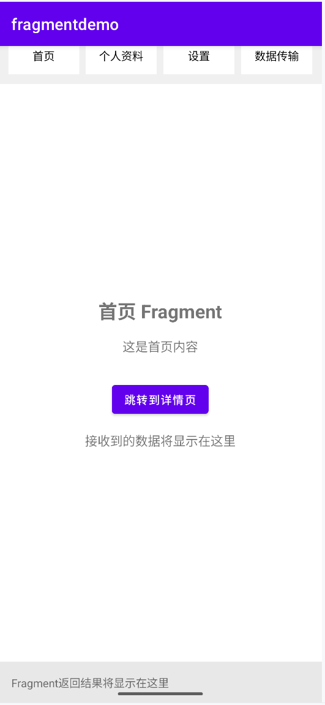
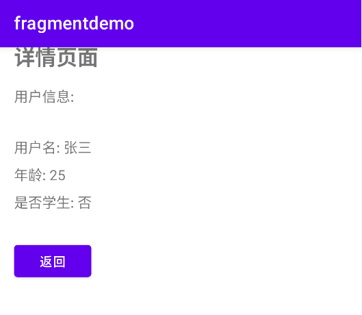
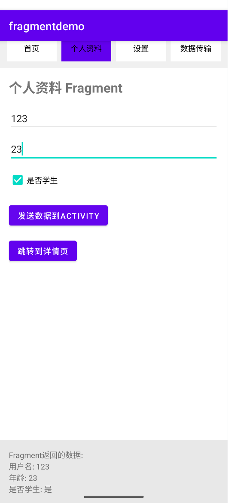
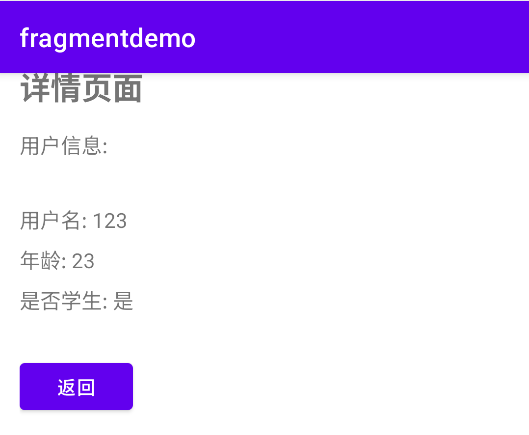
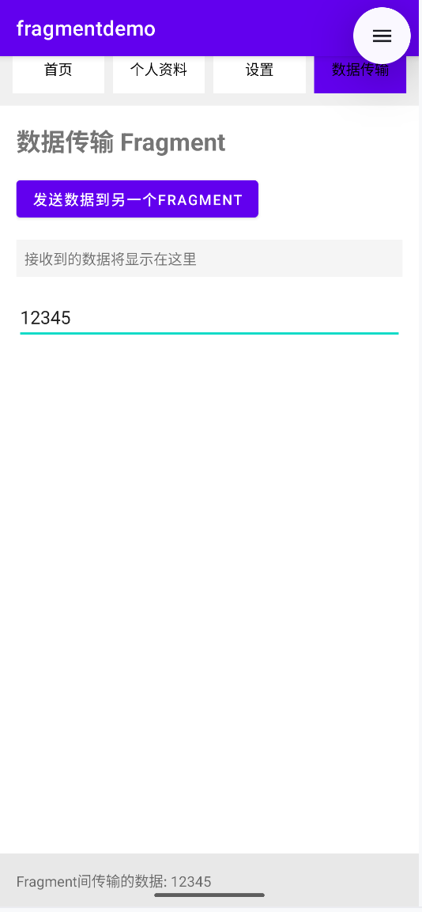
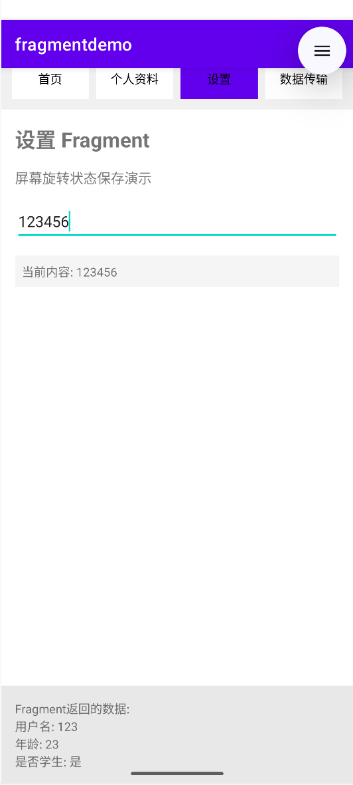
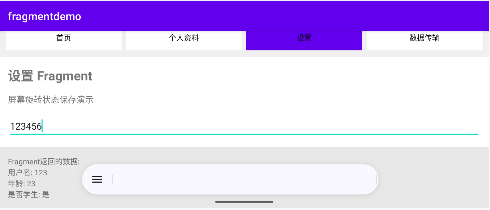

# 第三次作业-Fragment与数据传递

## 功能概述

本次作业实现了以下核心功能：
- RadioGroup控制Fragment切换
- Bundle数据传输的三种场景
- 屏幕旋转状态保存

## 功能一：RadioGroup控制Fragment切换

### 实现效果


### 核心代码实现
```java
private void switchFragment(int fragmentId) {
    FragmentTransaction transaction = getSupportFragmentManager().beginTransaction();
    Fragment fragment = null;

    if (fragmentId == R.id.radioHome) {
        fragment = homeFragment;
    } else if (fragmentId == R.id.radioProfile) {
        fragment = profileFragment;
    } else if (fragmentId == R.id.radioSettings) {
        fragment = settingsFragment;
    } else if (fragmentId == R.id.radioData) {
        fragment = dataTransferFragment;
    }

    if (fragment != null) {
        transaction.replace(R.id.fragmentContainer, fragment);
        transaction.commit();
        currentFragmentId = fragmentId;
    }
}
```

### 生命周期观察

#### Fragment切换时的生命周期顺序：
离开Fragment: `onPause()` → `onStop()` → `onDestroyView()`

进入Fragment: `onCreateView()` → `onActivityCreated()` → `onStart()` → `onResume()`
## 功能二：Bundle数据传输三种场景

### 场景A：Activity → Activity 数据传输

### 实现效果


### 核心代码实现
```java
// MainActivity → DetailActivity
Intent intent = new Intent(getActivity(), DetailActivity.class);
intent.putExtra("user_name", "张三");
intent.putExtra("user_age", 25);
intent.putExtra("is_student", false);
startActivity(intent);


// DetailActivity接收数据
Bundle extras = getIntent().getExtras();
String userName = extras.getString("user_name", "未知");
int age = extras.getInt("user_age", 0);
boolean isStudent = extras.getBoolean("is_student", false);
```

### 场景B：Activity ↔ Fragment 双向数据传输

### 实现效果


### 核心代码实现
```java
// 使用newInstance方式传递初始数据
public static HomeFragment newInstance(String userName) {
    HomeFragment fragment = new HomeFragment();
    Bundle args = new Bundle();
    args.putString(ARG_USER_NAME, userName);
    fragment.setArguments(args);
    return fragment;
}

// 定义回调接口
public interface OnDataReturnListener {
    void onDataReturn(String userName, int age, boolean isStudent);
}

// Fragment中调用回调
if (dataReturnListener != null) {
    dataReturnListener.onDataReturn(userName, age, isStudent);
}
```

### 场景C：Fragment → Fragment 数据传输

### 实现效果


### 数据传输流程
`Fragment A` → `MainActivity` → `Fragment B`

### 核心代码实现
```java
// 在Activity中实现中转
@Override
public void onSendDataToOtherFragment(String data) {
    if (dataTransferFragment != null) {
        dataTransferFragment.updateReceivedData(data);
    }
}
```
## 功能三：屏幕旋转状态保存

### 实现效果



### onSaveInstanceState调用时机
`onPause()` → `onSaveInstanceState()` → `onStop()`

### 核心代码实现
```java
@Override
public void onSaveInstanceState(@NonNull Bundle outState) {
    super.onSaveInstanceState(outState);
    
    // 保存EditText内容
    String inputText = etInput.getText().toString();
    if (!TextUtils.isEmpty(inputText)) {
        outState.putString(KEY_SAVED_TEXT, inputText);
        outState.putString(KEY_EDIT_TEXT, inputText);
    }
}

@Override
public void onViewStateRestored(@Nullable Bundle savedInstanceState) {
    super.onViewStateRestored(savedInstanceState);
    
    if (savedInstanceState != null) {
        String restoredText = savedInstanceState.getString(KEY_EDIT_TEXT, "");
        if (!TextUtils.isEmpty(restoredText)) {
            etInput.setText(restoredText);
            tvSavedText.setText("当前内容: " + restoredText);
        }
    }
}
```

## 关键技术点总结
### 1. Fragment管理
· 使用RadioGroup + FragmentTransaction实现切换

· 通过replace方法更新Fragment显示

· 正确处理Fragment生命周期

### 2. 数据传输方式
| 场景                  | 使用技术                                                                 | 特点                          |
|-----------------------|----------------------------------------------------------------------------|------------------------------------------|
| Activity → Activity             | `Intent + Bundle`                                      | 简单直接，适合页面跳转                                        |
| Activity ↔ Fragment         | `接口回调 + Bundle`                                                     | 实现双向通信，解耦性好    |
| Fragment → Fragment       | `Activity中转`                                     | 通过父Activity协调通信     |

### 3. 状态保存策略
· onSaveInstanceState: 保存临时UI状态

· Fragment Arguments: 保存初始参数

