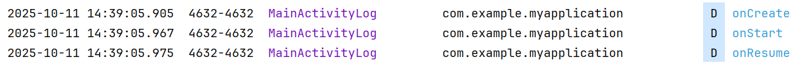
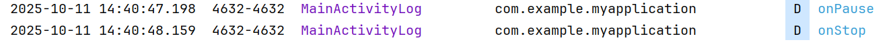
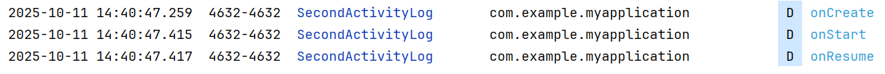
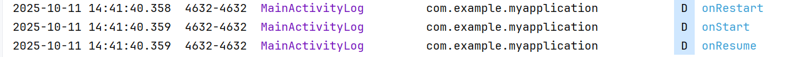
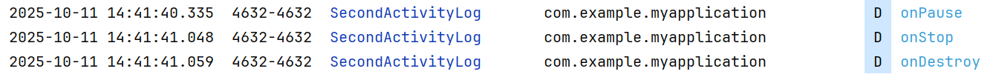
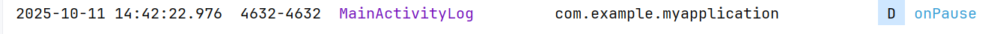
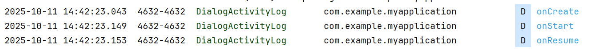
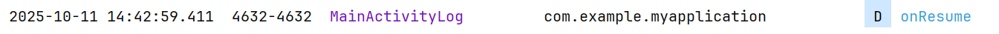

# 第二次作业-生命周期记录

## 场景一：应用启动
**`MainActivity`生命周期顺序：**

## 场景二：Main → SecondActivity
**`MainActivity`生命周期顺序：**

**`SecondActivity`生命周期顺序：**

## 场景三：SecondActivity 返回
**`MainActivity`生命周期顺序：**

**`SecondActivity`生命周期顺序：**

## 场景四：Main → Dialog Activity
**`MainActivity`生命周期顺序：**

**`DialogActivity` 生命周期顺序：**

## 场景五：Dialog Activity 返回
**`MainActivity`生命周期顺序：**

**目标Activity 生命周期顺序：**

## 总结表格
| 场景                  | MainActivity                                                                 | Target Activity                          |
|-----------------------|----------------------------------------------------------------------------|------------------------------------------|
| 应用启动              | `onCreate() → onStart() → onResume()`                                      | —                                        |
| 跳转 Activity         | `onPause() → onStop()`                                                     | `onCreate() → onStart() → onResume()`    |
| 返回原 Activity       | `onRestart() → onStart() → onResume()`                                     | `onPause() → onStop() → onDestroy()`     |
| 打开 Dialog           | `onPause()`                                                                | `onCreate() → onStart() → onResume()`    |
| 关闭 Dialog           | `onResume()`                                                               | `onPause() → onStop() → onDestroy()`     |

