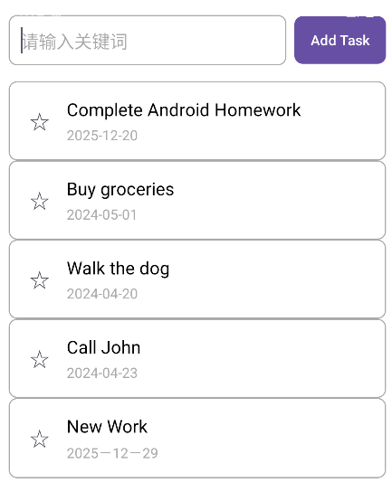
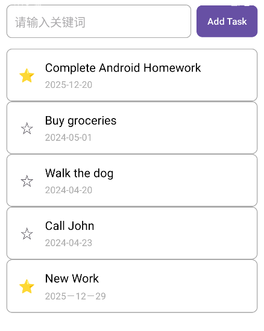
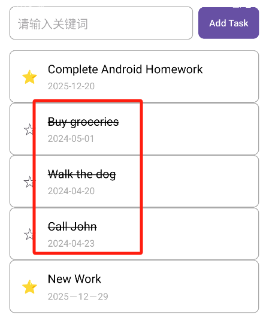
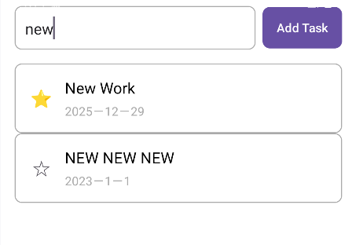
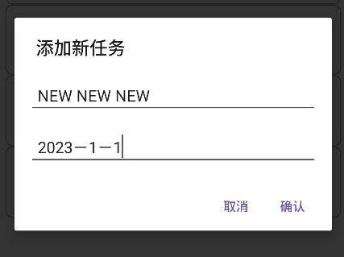
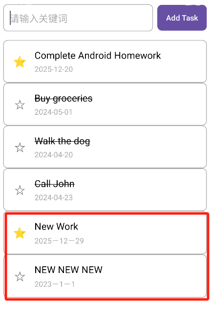

# 第五次作业 - Android ListView 待办事项清单（To-Do List App）

## 功能概述

本次实验实现了一个基于 ListView 的待办事项清单应用，核心功能如下：

- 使用 ListView 展示任务列表，包含任务名称和截止日期
- 自定义列表项布局，实现清晰的视觉分隔
- 支持任务搜索筛选（实时匹配任务名称和日期）
- 支持添加新任务（通过对话框输入）
- 支持任务交互：星星标记（重要任务）和完成状态（文字划横线）
- 数据模型与适配器的绑定，实现列表的动态更新

## 功能一：主界面布局（File）

### 实现效果



### 核心代码实现
#### 主界面布局（activity_main.xml）关键片段
```xml
<!-- 核心布局结构 -->
<LinearLayout 
    android:layout_width="match_parent"
    android:layout_height="match_parent"
    android:orientation="vertical"
    android:padding="16dp">

    <!-- 搜索+添加按钮区域 -->
    <LinearLayout
        android:layout_width="match_parent"
        android:layout_height="wrap_content"
        android:orientation="horizontal">
        <EditText
            android:id="@+id/et_search"
            android:layout_width="0dp"
            android:layout_weight="1"
            android:hint="请输入关键词"/>
        <Button
            android:id="@+id/btn_add_task"
            android:text="Add Task"/>
    </LinearLayout>

    <!-- 待办列表核心控件 -->
    <ListView
        android:id="@+id/lv_tasks"
        android:layout_width="match_parent"
        android:layout_height="match_parent"
        android:divider="@null"/>
</LinearLayout>
```
#### 列表项布局（list_item_task.xml）关键片段
```xml
<LinearLayout 
    android:layout_width="match_parent"
    android:layout_height="wrap_content"
    android:padding="16dp"
    android:layout_marginBottom="12dp" <!-- 列表项分隔核心 -->
    android:orientation="horizontal">

    <!-- 星星标记控件 -->
    <TextView
        android:id="@+id/tv_star"
        android:text="☆"
        android:textSize="20sp"/>

    <!-- 任务信息区域 -->
    <LinearLayout
        android:layout_width="match_parent"
        android:orientation="vertical">
        <TextView
            android:id="@+id/tv_task_name"
            android:textSize="18sp"/>
        <TextView
            android:id="@+id/tv_due_date"
            android:textSize="14sp"
            android:textColor="@android:color/darker_gray"/>
    </LinearLayout>
</LinearLayout>
```

## 功能二：数据模型（TaskItem）

### 核心代码实现
```java
public class TaskItem {
    // 核心属性
    private String taskName;    // 任务名称
    private String dueDate;     // 截止日期
    private boolean isStarred;  // 星星标记状态
    private boolean isCompleted;// 完成状态

    // 核心构造方法
    public TaskItem(String taskName, String dueDate) {
        this.taskName = taskName;
        this.dueDate = dueDate;
        this.isStarred = false;
        this.isCompleted = false;
    }

    // 核心Getter & Setter
    public String getTaskName() { return taskName; }
    public String getDueDate() { return dueDate; }
    public boolean isStarred() { return isStarred; }
    public void setStarred(boolean starred) { isStarred = starred; }
    public boolean isCompleted() { return isCompleted; }
    public void setCompleted(boolean completed) { isCompleted = completed; }
}
```


## 功能三：星星标注和已完成标注
### 实现效果



### 核心代码实现
```java
public class TaskListAdapter extends ArrayAdapter<TaskItem> {
    // ViewHolder核心：缓存视图组件
    static class ViewHolder {
        TextView tvStar;
        TextView tvTaskName;
        TextView tvDueDate;
        LinearLayout llTaskItem;
    }

    @Override
    public View getView(int position, View convertView, ViewGroup parent) {
        ViewHolder holder;
        // 核心：复用convertView优化性能
        if (convertView == null) {
            convertView = LayoutInflater.from(getContext()).inflate(R.layout.list_item_task, parent, false);
            holder = new ViewHolder();
            // 绑定视图组件
            holder.tvStar = convertView.findViewById(R.id.tv_star);
            holder.tvTaskName = convertView.findViewById(R.id.tv_task_name);
            holder.tvDueDate = convertView.findViewById(R.id.tv_due_date);
            holder.llTaskItem = convertView.findViewById(R.id.ll_task_item);
            convertView.setTag(holder);
        } else {
            holder = (ViewHolder) convertView.getTag();
        }

        // 核心：数据绑定
        TaskItem currentTask = getItem(position);
        holder.tvTaskName.setText(currentTask.getTaskName());
        holder.tvDueDate.setText(currentTask.getDueDate());
        // 星星状态展示
        holder.tvStar.setText(currentTask.isStarred() ? "⭐" : "☆");
        // 完成状态（划横线）
        if (currentTask.isCompleted()) {
            holder.tvTaskName.setPaintFlags(holder.tvTaskName.getPaintFlags() | Paint.STRIKE_THRU_TEXT_FLAG);
        } else {
            holder.tvTaskName.setPaintFlags(holder.tvTaskName.getPaintFlags() & ~Paint.STRIKE_THRU_TEXT_FLAG);
        }

        // 核心：星星点击事件
        holder.tvStar.setOnClickListener(v -> {
            currentTask.setStarred(!currentTask.isStarred());
            holder.tvStar.setText(currentTask.isStarred() ? "⭐" : "☆");
        });

        // 核心：列表项点击（切换完成状态）
        holder.llTaskItem.setOnClickListener(v -> {
            currentTask.setCompleted(!currentTask.isCompleted());
            // 刷新完成状态展示
            if (currentTask.isCompleted()) {
                holder.tvTaskName.setPaintFlags(holder.tvTaskName.getPaintFlags() | Paint.STRIKE_THRU_TEXT_FLAG);
            } else {
                holder.tvTaskName.setPaintFlags(holder.tvTaskName.getPaintFlags() & ~Paint.STRIKE_THRU_TEXT_FLAG);
            }
        });
        return convertView;
    }
}
```

## 功能四：示例数据初始化

### 核心代码实现
```java
// 初始化示例数据核心逻辑
private void initAllTasks() {
    allTasks = new ArrayList<>();
    // 作业要求的示例数据
    allTasks.add(new TaskItem("Complete Android Homework", "2025-12-20"));
    allTasks.add(new TaskItem("Buy groceries", "2024-05-01"));
    allTasks.add(new TaskItem("Walk the dog", "2024-04-20"));
    allTasks.add(new TaskItem("Call John", "2024-04-23"));
}
```

## 功能五：搜索筛选功能
### 实现效果

### 核心代码实现
```java
// 搜索监听核心
etSearch.addTextChangedListener(new TextWatcher() {
    @Override
    public void onTextChanged(CharSequence s, int start, int before, int count) {
        filterTasks(s.toString().trim()); // 输入变化时触发筛选
    }
});

// 筛选逻辑核心
private void filterTasks(String keyword) {
    filteredTasks.clear();
    if (keyword.isEmpty()) {
        filteredTasks.addAll(allTasks); // 无关键词显示全部
    } else {
        String lowerKeyword = keyword.toLowerCase();
        for (TaskItem task : allTasks) {
            // 匹配任务名称/日期
            if (task.getTaskName().toLowerCase().contains(lowerKeyword) ||
                    task.getDueDate().toLowerCase().contains(lowerKeyword)) {
                filteredTasks.add(task);
            }
        }
    }
    adapter.notifyDataSetChanged(); // 刷新列表
}
```

## 功能六：添加新任务
### 实现效果



### 核心代码实现
```java
// 添加任务按钮点击事件核心
btnAdd.setOnClickListener(v -> {
    // 加载对话框布局，获取输入框
    View dialogView = getLayoutInflater().inflate(R.layout.dialog_add_task, null);
    EditText etTaskName = dialogView.findViewById(R.id.et_task_name);
    EditText etDueDate = dialogView.findViewById(R.id.et_due_date);

    // 构建对话框核心逻辑
    new AlertDialog.Builder(this)
            .setTitle("添加新任务")
            .setView(dialogView)
            .setPositiveButton("确认", (dialog, which) -> {
                // 获取输入内容并校验
                String taskName = etTaskName.getText().toString().trim();
                String dueDate = etDueDate.getText().toString().trim();
                if (taskName.isEmpty() || dueDate.isEmpty()) {
                    Toast.makeText(MainActivity.this, "任务名称和日期不能为空！", Toast.LENGTH_SHORT).show();
                    return;
                }
                // 添加新任务并刷新列表
                allTasks.add(new TaskItem(taskName, dueDate));
                filterTasks(((EditText) findViewById(R.id.et_search)).getText().toString().trim());
                adapter.notifyDataSetChanged();
            })
            .setNegativeButton("取消", null)
            .show();
});
```

## 关键技术点总结

### 1. ListView 与 Adapter 工作原理
- `ListView`：作为列表容器，通过复用 `Item` 视图优化大量数据展示性能
- `Adapter`：数据与视图的桥梁，`getView()`方法是数据绑定核心
- `ViewHolder` 模式：缓存视图组件，避免重复调用`findViewById()`，提升滑动流畅度

### 2.数据绑定流程
- 定义 `TaskItem` 数据模型存储核心信息
- 自定义 `Adapter` 关联数据列表和 `Item` 布局
- 在`getView()`中通过 `ViewHolder` 绑定数据到 `TextView`

### 3.交互功能实现
- 点击事件：为星星 / 列表项设置`setOnClickListener`实现状态切换
- 实时筛选：通过`TextWatcher`监听输入，动态更新数据集并调用`notifyDataSetChanged()`刷新
- 对话框交互：使用 `AlertDialog` 构建输入界面，校验输入后更新数据源

