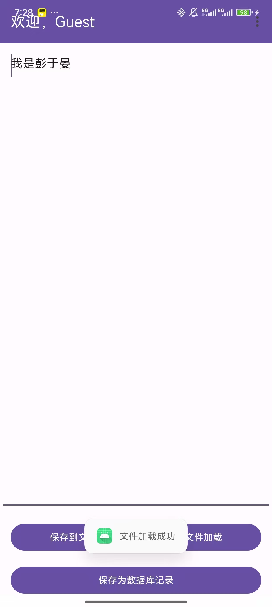
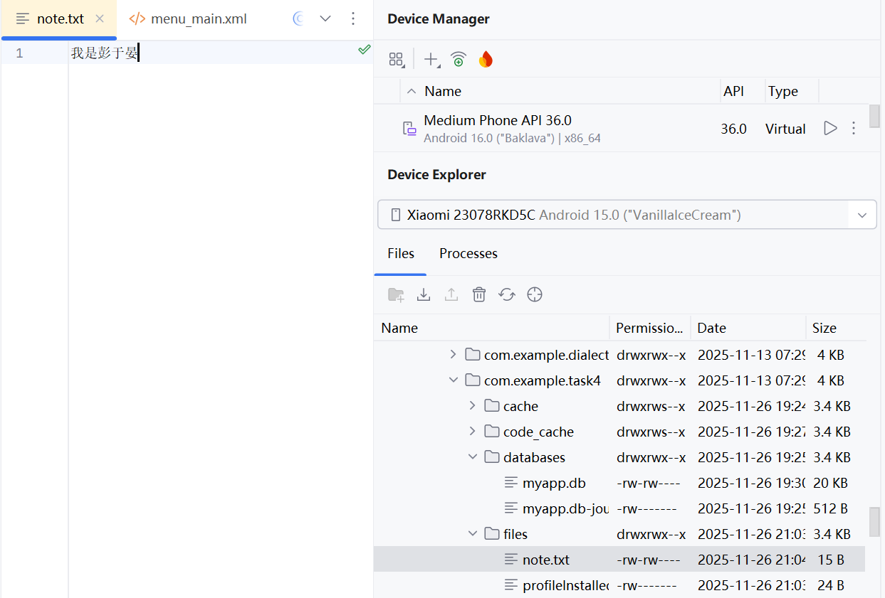
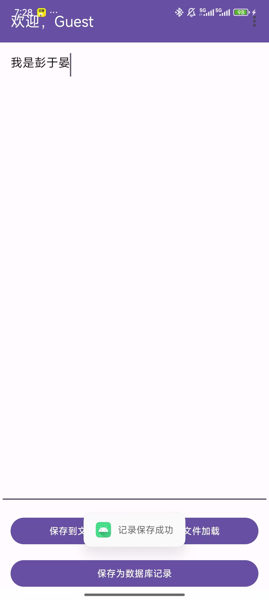
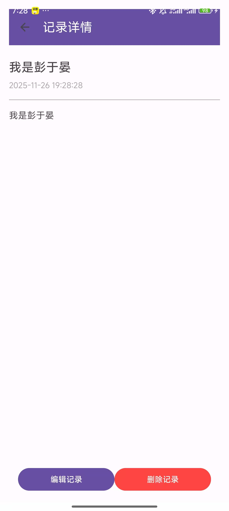
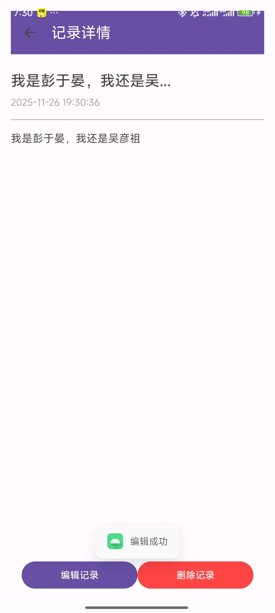
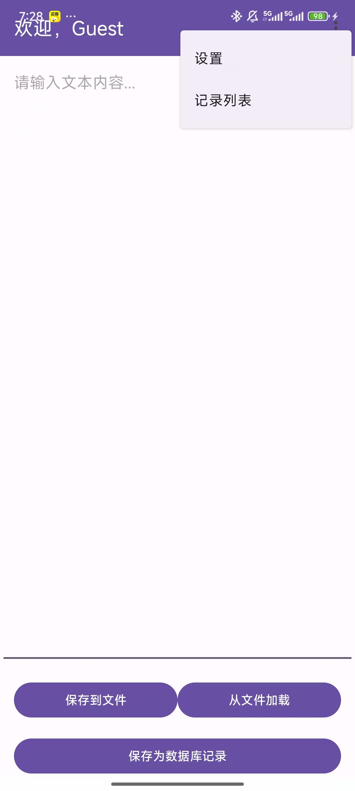

# 第四次作业-Android 本地数据持久化综合实验（Java）

## 功能概述

本次实验实现了 Android 三种核心本地数据持久化方式，结合「记事本 + 设置 + 数据库记录」应用场景，核心功能如下：
- 文件（File）读写：文本内容的保存与加载（应用私有目录）
- SharedPreferences：配置信息存储（自动保存开关、账户信息）
- SQLite 数据库：结构化记录的 CRUD 操作（新增 / 查询 / 编辑 / 删除）
- 多 Activity 跳转与菜单导航（主界面→设置 / 记录列表→详情）

## 功能一：文件读写（File）

### 实现效果




### 核心代码实现
#### 保存文本到文件
```java
private void saveToFile() {
    String content = editTextContent.getText().toString().trim();
    if (content.isEmpty()) {
        Toast.makeText(this, "内容不能为空", Toast.LENGTH_SHORT).show();
        return;
    }

    FileOutputStream fos = null;
    try {
        // 打开应用私有目录文件（不存在自动创建，MODE_PRIVATE仅本应用可访问）
        fos = openFileOutput("note.txt", MODE_PRIVATE);
        fos.write(content.getBytes()); // 写入字节流
        Toast.makeText(this, "文件保存成功", Toast.LENGTH_SHORT).show();
    } catch (IOException e) {
        e.printStackTrace();
        Toast.makeText(this, "保存失败：" + e.getMessage(), Toast.LENGTH_SHORT).show();
    } finally {
        // 关闭流避免资源泄露
        try {
            if (fos != null) fos.close();
        } catch (IOException e) {
            e.printStackTrace();
        }
    }
}
```
#### 从文件加载文本
```java
private void loadFromFile() {
    FileInputStream fis = null;
    try {
        fis = openFileInput("note.txt"); // 打开私有目录文件
        byte[] buffer = new byte[fis.available()]; // 获取文件总长度
        fis.read(buffer); // 读取字节数据
        String content = new String(buffer); // 转换为字符串
        editTextContent.setText(content);
        Toast.makeText(this, "文件加载成功", Toast.LENGTH_SHORT).show();
    } catch (IOException e) {
        e.printStackTrace();
        Toast.makeText(this, "文件不存在或加载失败", Toast.LENGTH_SHORT).show();
    } finally {
        try {
            if (fis != null) fis.close();
        } catch (IOException e) {
            e.printStackTrace();
        }
    }
}
```


## 功能二：SharedPreferences 配置存储

### 实现效果

### 核心代码实现
#### 读取配置信息（加载 UI）
```java
@Override
protected void onResume() {
    super.onResume();
    // 获取SharedPreferences实例（名称：settings，私有模式）
    SharedPreferences sp = getSharedPreferences("settings", MODE_PRIVATE);
    boolean autoSave = sp.getBoolean("auto_save", false); // 默认值false
    String username = sp.getString("user_name", "");      // 默认值空字符串
    String password = sp.getString("passwd", "");

    // 更新UI控件状态
    checkboxAutoSave.setChecked(autoSave);
    editTextUsername.setText(username);
    editTextPassword.setText(password);
}
```
#### 保存配置信息
```java
private void saveSettings() {
    SharedPreferences sp = getSharedPreferences("settings", MODE_PRIVATE);
    SharedPreferences.Editor editor = sp.edit(); // 获取编辑器

    // 存入键值对（布尔值、字符串）
    editor.putBoolean("auto_save", checkboxAutoSave.isChecked());
    editor.putString("user_name", editTextUsername.getText().toString().trim());
    editor.putString("passwd", editTextPassword.getText().toString().trim());

    editor.apply(); // 异步提交 比commit()高效，不阻塞主线程）
}
```

#### 自动保存触发（主界面）
```java
@Override
protected void onPause() {
    super.onPause();
    // 读取自动保存开关状态
    SharedPreferences sp = getSharedPreferences("settings", MODE_PRIVATE);
    boolean autoSave = sp.getBoolean("auto_save", false);
    if (autoSave) {
        saveToFile(); // 自动保存文本到文件
    }
}
```

## 功能三：SQLite 数据库 CRUD 操作
### 子功能 1：新增记录（文本→数据库）
### 实现效果


### 核心代码实现
```java
private void saveToRecord() {
    String content = editTextContent.getText().toString().trim();
    if (content.isEmpty()) {
        Toast.makeText(this, "内容不能为空", Toast.LENGTH_SHORT).show();
        return;
    }

    // 生成标题（前10字+...，避免标题过长）
    String title = content.length() > 10 ? content.substring(0, 10) + "..." : content;
    // 生成当前时间（格式：yyyy-MM-dd HH:mm:ss）
    String time = new SimpleDateFormat("yyyy-MM-dd HH:mm:ss", Locale.getDefault()).format(new Date());

    // 调用数据库帮助类插入记录
    MyDbHelper dbHelper = MyDbHelper.getInstance(this);
    long id = dbHelper.insertRecord(new Record(title, content, time));

    if (id != -1) {
        Toast.makeText(this, "记录保存成功", Toast.LENGTH_SHORT).show();
    } else {
        Toast.makeText(this, "记录保存失败", Toast.LENGTH_SHORT).show();
    }
}
```
### 子功能 2：记录列表展示（ListView）
### 实现效果


### 核心代码实现
```java
private void loadRecords() {
    MyDbHelper dbHelper = MyDbHelper.getInstance(this);
    List<Record> recordList = dbHelper.queryAllRecords(); // 查询所有记录（按时间倒序）

    if (recordList.isEmpty()) {
        Toast.makeText(this, "暂无记录", Toast.LENGTH_SHORT).show();
        return;
    }

    // 转换数据为SimpleAdapter所需格式（List<Map<String, String>>）
    List<Map<String, String>> data = new ArrayList<>();
    for (Record record : recordList) {
        Map<String, String> map = new HashMap<>();
        map.put("title", record.getTitle());
        map.put("time", record.getTime());
        data.add(map);
    }

    // 绑定适配器到ListView
    SimpleAdapter adapter = new SimpleAdapter(
            this,
            data,
            R.layout.list_item_record, // 列表项布局
            new String[]{"title", "time"}, // Map的key
            new int[]{R.id.tv_record_title, R.id.tv_record_time} // 对应控件ID
    );
    listViewRecords.setAdapter(adapter);

    // 列表项点击跳转详情页
    listViewRecords.setOnItemClickListener((parent, view, position, id) -> {
        Record record = recordList.get(position);
        Intent intent = new Intent(this, RecordDetailActivity.class);
        intent.putExtra("record", record); // 序列化传递记录对象
        startActivity(intent);
    });
}
```
### 子功能 3：记录详情查看
### 实现效果


### 核心代码实现
```java
@Override
protected void onCreate(Bundle savedInstanceState) {
    super.onCreate(savedInstanceState);
    setContentView(R.layout.activity_record_detail);

    // 初始化控件
    // 获取序列化传递的记录对象
    record = (Record) getIntent().getSerializableExtra("record");
    if (record == null) {
        Toast.makeText(this, "获取记录失败", Toast.LENGTH_SHORT).show();
        finish();
        return;
    }

    // 更新详情UI
    tvTitle.setText(record.getTitle());
    tvTime.setText(record.getTime());
    tvContent.setText(record.getContent());
}
```
### 子功能 4：记录编辑与删除
### 实现效果




### 核心代码实现
#### 编辑记录核心代码
```java
private void saveEdit() {
    String newContent = editTextContent.getText().toString().trim();
    if (newContent.isEmpty()) {
        Toast.makeText(this, "内容不能为空", Toast.LENGTH_SHORT).show();
        return;
    }

    // 更新标题和时间
    String newTitle = newContent.length() > 10 ? newContent.substring(0, 10) + "..." : newContent;
    String newTime = new SimpleDateFormat("yyyy-MM-dd HH:mm:ss", Locale.getDefault()).format(new Date());

    // 更新记录对象
    record.setTitle(newTitle);
    record.setContent(newContent);
    record.setTime(newTime);

    // 保存到数据库
    MyDbHelper dbHelper = MyDbHelper.getInstance(this);
    int rows = dbHelper.updateRecord(record);
    if (rows > 0) {
        Toast.makeText(this, "修改成功", Toast.LENGTH_SHORT).show();
        setResult(RESULT_OK); // 通知详情页修改成功
        finish();
    } else {
        Toast.makeText(this, "修改失败", Toast.LENGTH_SHORT).show();
    }
}
```
#### 删除记录核心代码
```java
btnDelete.setOnClickListener(v -> {
    MyDbHelper dbHelper = MyDbHelper.getInstance(this);
    int rows = dbHelper.deleteRecord(record.getId()); // 按ID删除
    if (rows > 0) {
        Toast.makeText(this, "删除成功", Toast.LENGTH_SHORT).show();
        finish(); // 返回列表页
    } else {
        Toast.makeText(this, "删除失败", Toast.LENGTH_SHORT).show();
    }
});
```
#### 数据库核心辅助类（MyDbHelper）
```java
public class MyDbHelper extends SQLiteOpenHelper {
    private static final String DB_NAME = "myapp.db"; // 数据库名
    private static final int DB_VERSION = 1;          // 版本号
    private static final String TABLE_RECORDS = "records"; // 表名

    // 单例模式（避免重复创建数据库连接）
    private static MyDbHelper instance;
    public static synchronized MyDbHelper getInstance(Context context) {
        if (instance == null) {
            instance = new MyDbHelper(context.getApplicationContext());
        }
        return instance;
    }

    // 创建表SQL（_id为主键自增）
    @Override
    public void onCreate(SQLiteDatabase db) {
        String createSql = "CREATE TABLE " + TABLE_RECORDS + " (" +
                "_id INTEGER PRIMARY KEY AUTOINCREMENT," +
                "title TEXT NOT NULL," +
                "content TEXT NOT NULL," +
                "time TEXT NOT NULL)";
        db.execSQL(createSql);
    }

    // 数据库升级（删除旧表重建）
    @Override
    public void onUpgrade(SQLiteDatabase db, int oldVersion, int newVersion) {
        db.execSQL("DROP TABLE IF EXISTS " + TABLE_RECORDS);
        onCreate(db);
    }
}
```

## 功能四：界面跳转与菜单导航
### 实现效果


### 核心代码实现
#### 主界面菜单配置（menu_main.xml）
```xml
<menu xmlns:android="http://schemas.android.com/apk/res/android"
    xmlns:app="http://schemas.android.com/apk/res-auto">
    <item
        android:id="@+id/menu_settings"
        android:title="设置"
        app:showAsAction="never" />
    <item
        android:id="@+id/menu_record_list"
        android:title="记录列表"
        app:showAsAction="never" />
</menu>
```
#### 菜单点击事件（MainActivity）
```java
@Override
public boolean onOptionsItemSelected(MenuItem item) {
    int id = item.getItemId();
    // 跳转到设置界面
    if (id == R.id.menu_settings) {
        startActivity(new Intent(this, SettingsActivity.class));
        return true;
    }
    // 跳转到记录列表界面
    else if (id == R.id.menu_record_list) {
        startActivity(new Intent(this, RecordListActivity.class));
        return true;
    }
    return super.onOptionsItemSelected(item);
}
```
#### 带返回键的 Toolbar 配置（SettingsActivity）
```java
@Override
protected void onCreate(Bundle savedInstanceState) {
    super.onCreate(savedInstanceState);
    setContentView(R.layout.activity_settings);

    // 初始化Toolbar并显示返回键
    Toolbar toolbar = findViewById(R.id.toolbar_settings);
    setSupportActionBar(toolbar);
    if (getSupportActionBar() != null) {
        getSupportActionBar().setDisplayHomeAsUpEnabled(true);
    }
}

// 返回键点击事件
@Override
public boolean onSupportNavigateUp() {
    saveSettings(); // 返回前保存配置
    finish();
    return true;
}
```


## 关键技术点总结

### 1. 三种持久化方式对比
| 存储方式         | 核心API                                  | 适用场景                  | 优点                          | 缺点                          |
|------------------|-------------------------------------------|---------------------------|-------------------------------|-------------------------------|
| 文件读写（File） | `openFileInput()`/`openFileOutput()`      | 大文本、日志、二进制文件  | 简单易用、无格式限制          | 无索引、查询效率低、难解析    |
| SharedPreferences| `getSharedPreferences()`/`Editor`         | 配置信息、开关状态、账户密码 | 轻量级、API简洁、自动持久化  | 不支持复杂数据、键值对数量有限|
| SQLite 数据库    | `SQLiteOpenHelper`/`SQLiteDatabase`       | 结构化数据、多条目记录    | 支持CRUD、索引、事务、查询    | 需手动管理数据库、SQL语法要求 |

### 2. 核心API总结
#### 文件读写
- 写入：`openFileOutput(String name, int mode)` → `FileOutputStream.write()` → `close()`
- 读取：`openFileInput(String name)` → `FileInputStream.read()` → `close()`

#### SharedPreferences
- 读取：`getSharedPreferences(String name, int mode)` → `getXxx(String key, Xxx defValue)`
- 写入：`edit()` → `putXxx(String key, Xxx value)` → `apply()`/`commit()`

#### SQLite
- 数据库管理：`SQLiteOpenHelper`（`onCreate()`/`onUpgrade()`）
- 操作对象：`getWritableDatabase()`（写操作）/`getReadableDatabase()`（读操作）
- CRUD：`insert()`/`query()`/`update()`/`delete()`

