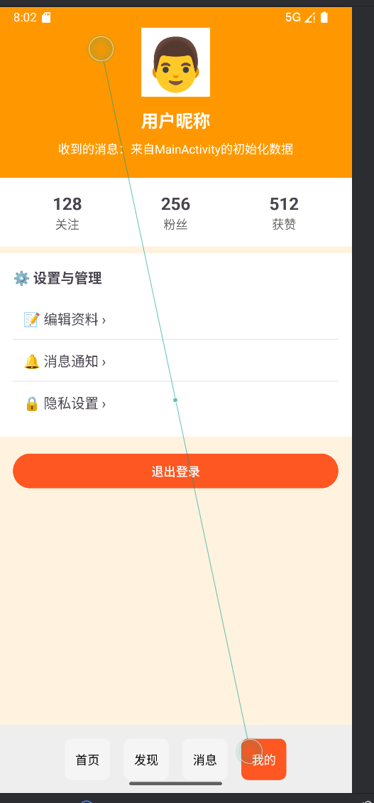
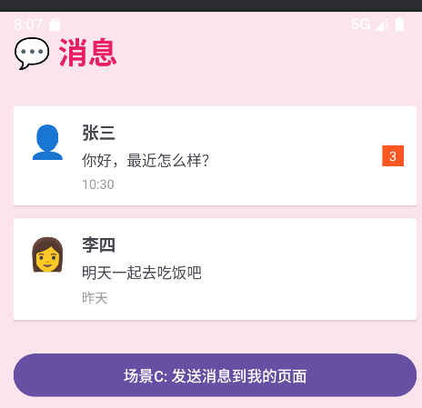
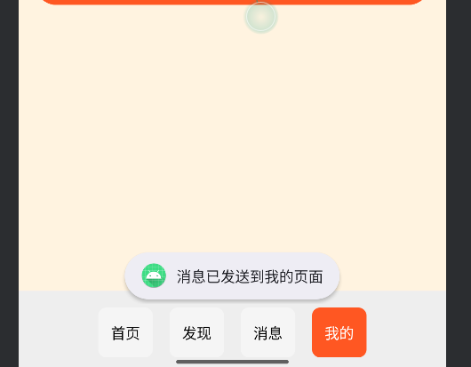
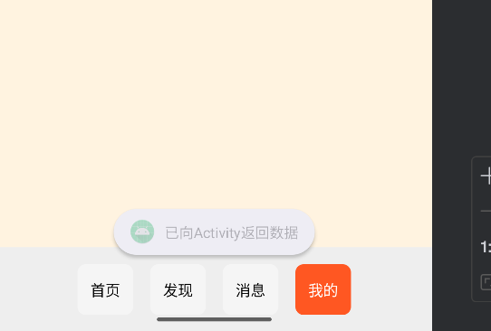

# Android Fragment 切换与数据传输实验报告（基于目录结构修改）

## 一、实验目的


1. 掌握使用 RadioGroup 实现 Fragment 切换的方法

2. 学会使用 Bundle 实现不同组件间的数据传输（Activity 之间、Activity 与 Fragment 之间、Fragment 之间）

3. 理解屏幕旋转时的状态保存机制，掌握 `onSaveInstanceState` 的使用方法

## 二、实验环境


| 环境项            | 具体配置                 |
| -------------- | -------------------- |
| 开发工具           | Android Studio       |
| Android SDK 版本 | API 36.0（Android 14） |
| 运行设备           | 模拟器（Pixel 8）         |
| 开发语言           | Java + XML           |
| 包名             | `com.example.radio`  |

## 三、实验内容与步骤

### （一）第一部分：RadioGroup 控制 Fragment 切换

#### 步骤 1：创建 RadioButton 背景选择器

#### `radio_button_selector.xml` 文件：


```xml
<?xml version="1.0" encoding="utf-8"?>
<selector xmlns:android="http://schemas.android.com/apk/res/android">
    <item android:state_checked="true">
        <shape android:shape="rectangle">
            <solid android:color="#FF5722" />
            <corners android:radius="8dp" />
        </shape>
    </item>
    <item android:state_checked="false">
        <shape android:shape="rectangle">
            <solid android:color="#F5F5F5" />
            <corners android:radius="8dp" />
        </shape>
    </item>
</selector>
```

#### 步骤 2：在 `styles.xml` 中定义 RadioButton 统一样式

打开 `res/values/styles.xml`，添加自定义样式：


```xml
<?xml version="1.0" encoding="utf-8"?>
<selector xmlns:android="http://schemas.android.com/apk/res/android">
    <item android:state_checked="true">
        <shape android:shape="rectangle">
            <solid android:color="#FF5722" />
            <corners android:radius="8dp" />
        </shape>
    </item>
    <item android:state_checked="false">
        <shape android:shape="rectangle">
            <solid android:color="#F5F5F5" />
            <corners android:radius="8dp" />
        </shape>
    </item>
</selector>
```

同时在 `res/color` 目录下创建 `radio_text_selector.xml`：


```xml
<?xml version="1.0" encoding="utf-8"?>
<selector xmlns:android="http://schemas.android.com/apk/res/android">
    <item android:state_checked="true" android:color="@android:color/white" />
    <item android:state_checked="false" android:color="@android:color/black" />
</selector>
```

#### 步骤 3：创建 4 个 Fragment 及其布局

**1. HomeFragment 布局（**`fragment_home.xml`**）**


```xml
<?xml version="1.0" encoding="utf-8"?>
<ScrollView xmlns:android="http://schemas.android.com/apk/res/android"
    android:layout_width="match_parent"
    android:layout_height="match_parent"
    android:background="#F5F5F5">

    <LinearLayout
        android:layout_width="match_parent"
        android:layout_height="wrap_content"
        android:orientation="vertical"
        android:padding="16dp">

        <TextView
            android:layout_width="wrap_content"
            android:layout_height="wrap_content"
            android:text="📱 首页"
            android:textSize="28sp"
            android:textColor="#2196F3"
            android:textStyle="bold"
            android:layout_marginBottom="16dp" />

        <!-- 欢迎卡片 -->
        <androidx.cardview.widget.CardView
            android:layout_width="match_parent"
            android:layout_height="wrap_content"
            android:layout_marginBottom="16dp">
            <LinearLayout
                android:layout_width="match_parent"
                android:layout_height="wrap_content"
                android:orientation="vertical"
                android:padding="16dp">
                <TextView
                    android:layout_width="wrap_content"
                    android:layout_height="wrap_content"
                    android:text="欢迎使用"
                    android:textSize="20sp"
                    android:textStyle="bold" />
                <TextView
                    android:layout_width="wrap_content"
                    android:layout_height="wrap_content"
                    android:text="RadioGroup Fragment 演示应用"
                    android:textSize="14sp"
                    android:layout_marginTop="8dp" />
                <Button
                    android:id="@+id/btn_to_detail"
                    android:layout_width="wrap_content"
                    android:layout_height="wrap_content"
                    android:text="场景A: 跳转到详情页"
                    android:layout_marginTop="12dp" />
            </LinearLayout>
        </androidx.cardview.widget.CardView>

        <!-- 状态保存卡片 -->
        <androidx.cardview.widget.CardView
            android:layout_width="match_parent"
            android:layout_height="wrap_content"
            android:layout_marginBottom="16dp">
            <LinearLayout
                android:layout_width="match_parent"
                android:layout_height="wrap_content"
                android:orientation="vertical"
                android:padding="16dp">
                <TextView
                    android:layout_width="wrap_content"
                    android:layout_height="wrap_content"
                    android:text="屏幕旋转测试"
                    android:textSize="18sp"
                    android:textStyle="bold" />
                <EditText
                    android:id="@+id/et_input"
                    android:layout_width="match_parent"
                    android:layout_height="wrap_content"
                    android:hint="输入内容后旋转屏幕测试"
                    android:layout_marginTop="8dp" />
                <TextView
                    android:id="@+id/tv_saved_content"
                    android:layout_width="match_parent"
                    android:layout_height="wrap_content"
                    android:text="旋转后内容会显示在这里"
                    android:textSize="16sp"
                    android:textColor="#4CAF50"
                    android:layout_marginTop="8dp"
                    android:padding="12dp"
                    android:background="#E8F5E9" />
            </LinearLayout>
        </androidx.cardview.widget.CardView>

    </LinearLayout>
</ScrollView>
```

**HomeFragment 代码**


```java
package com.example.radio;

import android.content.Intent;
import android.os.Bundle;
import android.view.LayoutInflater;
import android.view.View;
import android.view.ViewGroup;
import android.widget.Button;
import android.widget.EditText;
import android.widget.TextView;
import androidx.fragment.app.Fragment;

public class HomeFragment extends Fragment {
    private EditText etInput;
    private TextView tvSavedContent;
    private static final String KEY_SAVED_TEXT = "saved_text";

    @Override
    public View onCreateView(LayoutInflater inflater, ViewGroup container,
                             Bundle savedInstanceState) {
        View view = inflater.inflate(R.layout.fragment_home, container, false);

        etInput = view.findViewById(R.id.et_input);
        tvSavedContent = view.findViewById(R.id.tv_saved_content);
        Button btnToDetail = view.findViewById(R.id.btn_to_detail);

        // 场景A: Activity → Activity 数据传递
        btnToDetail.setOnClickListener(v -> {
            Intent intent = new Intent(getActivity(), DetailActivity.class);
            intent.putExtra("username", "张三");
            intent.putExtra("age", 20);
            intent.putExtra("isStudent", true);
            startActivity(intent);
        });

        // 恢复保存的状态
        if (savedInstanceState != null) {
            String savedText = savedInstanceState.getString(KEY_SAVED_TEXT);
            if (savedText != null && !savedText.isEmpty()) {
                tvSavedContent.setText("已恢复内容：" + savedText);
                etInput.setText(savedText);
            }
        }

        return view;
    }

    @Override
    public void onSaveInstanceState(Bundle outState) {
        super.onSaveInstanceState(outState);
        // 保存EditText中的内容
        String text = etInput.getText().toString();
        outState.putString(KEY_SAVED_TEXT, text);
        android.util.Log.d("HomeFragment", "onSaveInstanceState: 保存了内容 = " + text);
    }
}

```

**2. DiscoverFragment 布局（**`fragment_discover.xml`**）**


```xml
<?xml version="1.0" encoding="utf-8"?>
<LinearLayout xmlns:android="http://schemas.android.com/apk/res/android"
    android:layout_width="match_parent"
    android:layout_height="match_parent"
    android:orientation="vertical"
    android:background="#E0F7FA">

    <LinearLayout
        android:layout_width="match_parent"
        android:layout_height="wrap_content"
        android:orientation="vertical"
        android:padding="16dp">

        <TextView
            android:layout_width="wrap_content"
            android:layout_height="wrap_content"
            android:text="🔍 发现"
            android:textSize="28sp"
            android:textColor="#00BCD4"
            android:textStyle="bold"
            android:layout_marginBottom="16dp" />

        <EditText
            android:id="@+id/et_search"
            android:layout_width="match_parent"
            android:layout_height="wrap_content"
            android:hint="🔎 搜索内容..."
            android:padding="12dp"
            android:background="@android:color/white" />
    </LinearLayout>

    <ScrollView
        android:layout_width="match_parent"
        android:layout_height="match_parent">

        <GridLayout
            android:layout_width="match_parent"
            android:layout_height="wrap_content"
            android:columnCount="2"
            android:padding="8dp">

            <!-- 网格项1 -->
            <androidx.cardview.widget.CardView
                android:layout_width="0dp"
                android:layout_height="150dp"
                android:layout_columnWeight="1"
                android:layout_margin="8dp">
                <LinearLayout
                    android:layout_width="match_parent"
                    android:layout_height="match_parent"
                    android:orientation="vertical"
                    android:gravity="center"
                    android:background="#FF9800">
                    <TextView
                        android:layout_width="wrap_content"
                        android:layout_height="wrap_content"
                        android:text="📸"
                        android:textSize="40sp" />
                    <TextView
                        android:layout_width="wrap_content"
                        android:layout_height="wrap_content"
                        android:text="照片"
                        android:textColor="@android:color/white"
                        android:textSize="16sp" />
                </LinearLayout>
            </androidx.cardview.widget.CardView>

            <!-- 网格项2 -->
            <androidx.cardview.widget.CardView
                android:layout_width="0dp"
                android:layout_height="150dp"
                android:layout_columnWeight="1"
                android:layout_margin="8dp">
                <LinearLayout
                    android:layout_width="match_parent"
                    android:layout_height="match_parent"
                    android:orientation="vertical"
                    android:gravity="center"
                    android:background="#E91E63">
                    <TextView
                        android:layout_width="wrap_content"
                        android:layout_height="wrap_content"
                        android:text="🎵"
                        android:textSize="40sp" />
                    <TextView
                        android:layout_width="wrap_content"
                        android:layout_height="wrap_content"
                        android:text="音乐"
                        android:textColor="@android:color/white"
                        android:textSize="16sp" />
                </LinearLayout>
            </androidx.cardview.widget.CardView>

            <!-- 网格项3 -->
            <androidx.cardview.widget.CardView
                android:layout_width="0dp"
                android:layout_height="150dp"
                android:layout_columnWeight="1"
                android:layout_margin="8dp">
                <LinearLayout
                    android:layout_width="match_parent"
                    android:layout_height="match_parent"
                    android:orientation="vertical"
                    android:gravity="center"
                    android:background="#9C27B0">
                    <TextView
                        android:layout_width="wrap_content"
                        android:layout_height="wrap_content"
                        android:text="🎬"
                        android:textSize="40sp" />
                    <TextView
                        android:layout_width="wrap_content"
                        android:layout_height="wrap_content"
                        android:text="视频"
                        android:textColor="@android:color/white"
                        android:textSize="16sp" />
                </LinearLayout>
            </androidx.cardview.widget.CardView>

            <!-- 网格项4 -->
            <androidx.cardview.widget.CardView
                android:layout_width="0dp"
                android:layout_height="150dp"
                android:layout_columnWeight="1"
                android:layout_margin="8dp">
                <LinearLayout
                    android:layout_width="match_parent"
                    android:layout_height="match_parent"
                    android:orientation="vertical"
                    android:gravity="center"
                    android:background="#4CAF50">
                    <TextView
                        android:layout_width="wrap_content"
                        android:layout_height="wrap_content"
                        android:text="📚"
                        android:textSize="40sp" />
                    <TextView
                        android:layout_width="wrap_content"
                        android:layout_height="wrap_content"
                        android:text="文章"
                        android:textColor="@android:color/white"
                        android:textSize="16sp" />
                </LinearLayout>
            </androidx.cardview.widget.CardView>

        </GridLayout>
    </ScrollView>

</LinearLayout>
```

**DiscoverFragment 代码**


```java
package com.example.radio;

import android.os.Bundle;
import android.text.Editable;
import android.text.TextWatcher;
import android.view.LayoutInflater;
import android.view.View;
import android.view.ViewGroup;
import android.widget.EditText;
import android.widget.Toast;
import androidx.fragment.app.Fragment;

public class DiscoverFragment extends Fragment {
    
    @Override
    public View onCreateView(LayoutInflater inflater, ViewGroup container,
                             Bundle savedInstanceState) {
        View view = inflater.inflate(R.layout.fragment_discover, container, false);
        
        EditText etSearch = view.findViewById(R.id.et_search);
        
        // 添加搜索功能
        etSearch.addTextChangedListener(new TextWatcher() {
            @Override
            public void beforeTextChanged(CharSequence s, int start, int count, int after) {}

            @Override
            public void onTextChanged(CharSequence s, int start, int before, int count) {
                if (s.length() > 0) {
                    Toast.makeText(getContext(), "正在搜索: " + s, Toast.LENGTH_SHORT).show();
                }
            }

            @Override
            public void afterTextChanged(Editable s) {}
        });
        
        return view;
    }
}
```

**3. MessageFragment 布局（**`fragment_message.xml`**）**


```xml
<?xml version="1.0" encoding="utf-8"?>
<LinearLayout xmlns:android="http://schemas.android.com/apk/res/android"
    android:layout_width="match_parent"
    android:layout_height="match_parent"
    android:orientation="vertical"
    android:background="#FCE4EC">

    <TextView
        android:layout_width="wrap_content"
        android:layout_height="wrap_content"
        android:text="💬 消息"
        android:textSize="28sp"
        android:textColor="#E91E63"
        android:textStyle="bold"
        android:padding="16dp" />

    <ScrollView
        android:layout_width="match_parent"
        android:layout_height="match_parent">

        <LinearLayout
            android:layout_width="match_parent"
            android:layout_height="wrap_content"
            android:orientation="vertical"
            android:padding="16dp">

            <!-- 消息项1 -->
            <androidx.cardview.widget.CardView
                android:layout_width="match_parent"
                android:layout_height="wrap_content"
                android:layout_marginBottom="12dp">
                <LinearLayout
                    android:layout_width="match_parent"
                    android:layout_height="wrap_content"
                    android:orientation="horizontal"
                    android:padding="12dp">
                    <TextView
                        android:layout_width="40dp"
                        android:layout_height="40dp"
                        android:text="👤"
                        android:textSize="30sp"
                        android:gravity="center" />
                    <LinearLayout
                        android:layout_width="0dp"
                        android:layout_height="wrap_content"
                        android:layout_weight="1"
                        android:orientation="vertical"
                        android:layout_marginLeft="12dp">
                        <TextView
                            android:layout_width="wrap_content"
                            android:layout_height="wrap_content"
                            android:text="张三"
                            android:textSize="16sp"
                            android:textStyle="bold" />
                        <TextView
                            android:layout_width="wrap_content"
                            android:layout_height="wrap_content"
                            android:text="你好，最近怎么样？"
                            android:textSize="14sp"
                            android:layout_marginTop="4dp" />
                        <TextView
                            android:layout_width="wrap_content"
                            android:layout_height="wrap_content"
                            android:text="10:30"
                            android:textSize="12sp"
                            android:textColor="#999999"
                            android:layout_marginTop="4dp" />
                    </LinearLayout>
                    <TextView
                        android:layout_width="20dp"
                        android:layout_height="20dp"
                        android:text="3"
                        android:textSize="12sp"
                        android:textColor="@android:color/white"
                        android:background="#FF5722"
                        android:gravity="center"
                        android:layout_gravity="center_vertical" />
                </LinearLayout>
            </androidx.cardview.widget.CardView>

            <!-- 消息项2 -->
            <androidx.cardview.widget.CardView
                android:layout_width="match_parent"
                android:layout_height="wrap_content"
                android:layout_marginBottom="12dp">
                <LinearLayout
                    android:layout_width="match_parent"
                    android:layout_height="wrap_content"
                    android:orientation="horizontal"
                    android:padding="12dp">
                    <TextView
                        android:layout_width="40dp"
                        android:layout_height="40dp"
                        android:text="👩"
                        android:textSize="30sp"
                        android:gravity="center" />
                    <LinearLayout
                        android:layout_width="0dp"
                        android:layout_height="wrap_content"
                        android:layout_weight="1"
                        android:orientation="vertical"
                        android:layout_marginLeft="12dp">
                        <TextView
                            android:layout_width="wrap_content"
                            android:layout_height="wrap_content"
                            android:text="李四"
                            android:textSize="16sp"
                            android:textStyle="bold" />
                        <TextView
                            android:layout_width="wrap_content"
                            android:layout_height="wrap_content"
                            android:text="明天一起去吃饭吧"
                            android:textSize="14sp"
                            android:layout_marginTop="4dp" />
                        <TextView
                            android:layout_width="wrap_content"
                            android:layout_height="wrap_content"
                            android:text="昨天"
                            android:textSize="12sp"
                            android:textColor="#999999"
                            android:layout_marginTop="4dp" />
                    </LinearLayout>
                </LinearLayout>
            </androidx.cardview.widget.CardView>

            <!-- Fragment间传递数据按钮 -->
            <Button
                android:id="@+id/btn_send_to_mine"
                android:layout_width="match_parent"
                android:layout_height="wrap_content"
                android:text="场景C: 发送消息到我的页面"
                android:layout_marginTop="16dp" />

        </LinearLayout>
    </ScrollView>

</LinearLayout>
```

**MessageFragment 代码**


```java
package com.example.radio;

import android.os.Bundle;
import android.view.LayoutInflater;
import android.view.View;
import android.view.ViewGroup;
import android.widget.Button;
import android.widget.Toast;
import androidx.fragment.app.Fragment;

public class MessageFragment extends Fragment {
    
    // Fragment通信接口
    public interface OnMessageSendListener {
        void onMessageSend(String message);
    }

    @Override
    public View onCreateView(LayoutInflater inflater, ViewGroup container,
                             Bundle savedInstanceState) {
        View view = inflater.inflate(R.layout.fragment_message, container, false);
        
        Button btnSendToMine = view.findViewById(R.id.btn_send_to_mine);
        
        // 场景C: Fragment → Fragment 通过Activity中转传递数据
        btnSendToMine.setOnClickListener(v -> {
            if (getActivity() instanceof MainActivity) {
                MainActivity activity = (MainActivity) getActivity();
                activity.sendMessageToMineFragment("来自消息页面的问候：你好！");
                Toast.makeText(getContext(), "消息已发送到我的页面", Toast.LENGTH_SHORT).show();
            }
        });
        
        return view;
    }
}
```

**4. MineFragment 布局（**`fragment_mine.xml`**）**


```xml
<?xml version="1.0" encoding="utf-8"?>
<ScrollView xmlns:android="http://schemas.android.com/apk/res/android"
    android:layout_width="match_parent"
    android:layout_height="match_parent"
    android:background="#FFF3E0">

    <LinearLayout
        android:layout_width="match_parent"
        android:layout_height="wrap_content"
        android:orientation="vertical">

        <!-- 用户信息卡片 -->
        <LinearLayout
            android:layout_width="match_parent"
            android:layout_height="wrap_content"
            android:orientation="vertical"
            android:background="#FF9800"
            android:padding="24dp">

            <TextView
                android:layout_width="80dp"
                android:layout_height="80dp"
                android:text="👨"
                android:textSize="60sp"
                android:gravity="center"
                android:background="@android:color/white"
                android:layout_gravity="center_horizontal" />

            <TextView
                android:layout_width="wrap_content"
                android:layout_height="wrap_content"
                android:text="用户昵称"
                android:textSize="20sp"
                android:textColor="@android:color/white"
                android:textStyle="bold"
                android:layout_gravity="center_horizontal"
                android:layout_marginTop="12dp" />

            <TextView
                android:id="@+id/tv_received_message"
                android:layout_width="wrap_content"
                android:layout_height="wrap_content"
                android:text="个性签名：快乐每一天"
                android:textSize="14sp"
                android:textColor="@android:color/white"
                android:layout_gravity="center_horizontal"
                android:layout_marginTop="8dp" />

        </LinearLayout>

        <!-- 统计数据 -->
        <LinearLayout
            android:layout_width="match_parent"
            android:layout_height="wrap_content"
            android:orientation="horizontal"
            android:padding="16dp"
            android:background="@android:color/white">

            <LinearLayout
                android:layout_width="0dp"
                android:layout_height="wrap_content"
                android:layout_weight="1"
                android:orientation="vertical"
                android:gravity="center">
                <TextView
                    android:layout_width="wrap_content"
                    android:layout_height="wrap_content"
                    android:text="128"
                    android:textSize="20sp"
                    android:textStyle="bold" />
                <TextView
                    android:layout_width="wrap_content"
                    android:layout_height="wrap_content"
                    android:text="关注"
                    android:textSize="14sp"
                    android:textColor="#666666" />
            </LinearLayout>

            <LinearLayout
                android:layout_width="0dp"
                android:layout_height="wrap_content"
                android:layout_weight="1"
                android:orientation="vertical"
                android:gravity="center">
                <TextView
                    android:layout_width="wrap_content"
                    android:layout_height="wrap_content"
                    android:text="256"
                    android:textSize="20sp"
                    android:textStyle="bold" />
                <TextView
                    android:layout_width="wrap_content"
                    android:layout_height="wrap_content"
                    android:text="粉丝"
                    android:textSize="14sp"
                    android:textColor="#666666" />
            </LinearLayout>

            <LinearLayout
                android:layout_width="0dp"
                android:layout_height="wrap_content"
                android:layout_weight="1"
                android:orientation="vertical"
                android:gravity="center">
                <TextView
                    android:layout_width="wrap_content"
                    android:layout_height="wrap_content"
                    android:text="512"
                    android:textSize="20sp"
                    android:textStyle="bold" />
                <TextView
                    android:layout_width="wrap_content"
                    android:layout_height="wrap_content"
                    android:text="获赞"
                    android:textSize="14sp"
                    android:textColor="#666666" />
            </LinearLayout>

        </LinearLayout>

        <!-- 设置选项 -->
        <LinearLayout
            android:layout_width="match_parent"
            android:layout_height="wrap_content"
            android:orientation="vertical"
            android:layout_marginTop="8dp"
            android:background="@android:color/white"
            android:padding="16dp">

            <TextView
                android:layout_width="wrap_content"
                android:layout_height="wrap_content"
                android:text="⚙️ 设置与管理"
                android:textSize="16sp"
                android:textStyle="bold"
                android:layout_marginBottom="12dp" />

            <TextView
                android:layout_width="match_parent"
                android:layout_height="wrap_content"
                android:text="📝 编辑资料 ›"
                android:textSize="16sp"
                android:padding="12dp" />

            <View
                android:layout_width="match_parent"
                android:layout_height="1dp"
                android:background="#EEEEEE" />

            <TextView
                android:layout_width="match_parent"
                android:layout_height="wrap_content"
                android:text="🔔 消息通知 ›"
                android:textSize="16sp"
                android:padding="12dp" />

            <View
                android:layout_width="match_parent"
                android:layout_height="1dp"
                android:background="#EEEEEE" />

            <TextView
                android:layout_width="match_parent"
                android:layout_height="wrap_content"
                android:text="🔒 隐私设置 ›"
                android:textSize="16sp"
                android:padding="12dp" />

        </LinearLayout>

        <!-- 退出按钮 -->
        <Button
            android:id="@+id/btn_logout"
            android:layout_width="match_parent"
            android:layout_height="wrap_content"
            android:text="退出登录"
            android:layout_margin="16dp"
            android:backgroundTint="#FF5722" />

    </LinearLayout>

</ScrollView>
```

**MineFragment 代码**


```java
package com.example.radio;

import android.os.Bundle;
import android.view.LayoutInflater;
import android.view.View;
import android.view.ViewGroup;
import android.widget.Button;
import android.widget.TextView;
import android.widget.Toast;
import androidx.fragment.app.Fragment;

public class MineFragment extends Fragment {
    private TextView tvReceivedMessage;
    private static final String ARG_MESSAGE = "message";

    @Override
    public View onCreateView(LayoutInflater inflater, ViewGroup container,
                             Bundle savedInstanceState) {
        View view = inflater.inflate(R.layout.fragment_mine, container, false);
        
        tvReceivedMessage = view.findViewById(R.id.tv_received_message);
        Button btnLogout = view.findViewById(R.id.btn_logout);
        
        // 场景B: 接收Activity传递的数据
        Bundle args = getArguments();
        if (args != null) {
            String message = args.getString(ARG_MESSAGE);
            if (message != null) {
                tvReceivedMessage.setText("收到的消息：" + message);
            }
        }
        
        // 场景B: Fragment向Activity返回数据
        btnLogout.setOnClickListener(v -> {
            if (getActivity() instanceof MainActivity) {
                MainActivity activity = (MainActivity) getActivity();
                activity.onFragmentResult("用户点击了退出登录");
                Toast.makeText(getContext(), "已向Activity返回数据", Toast.LENGTH_SHORT).show();
            }
        });
        
        return view;
    }
    
    // 场景C: 更新接收到的消息
    public void updateReceivedMessage(String message) {
        if (tvReceivedMessage != null) {
            tvReceivedMessage.setText("收到的消息：" + message);
        }
    }
    
    // 创建实例的工厂方法（场景B使用）
    public static MineFragment newInstance(String message) {
        MineFragment fragment = new MineFragment();
        Bundle args = new Bundle();
        args.putString(ARG_MESSAGE, message);
        fragment.setArguments(args);
        return fragment;
    }
}
```

#### 步骤 4：修改主布局和 MainActivity

**主布局（**`activity_main.xml`**）**


```xml
<?xml version="1.0" encoding="utf-8"?>
<LinearLayout xmlns:android="http://schemas.android.com/apk/res/android"
    android:layout_width="match_parent"
    android:layout_height="match_parent"
    android:orientation="vertical">

    <FrameLayout
        android:id="@+id/fragment_container"
        android:layout_width="match_parent"
        android:layout_height="0dp"
        android:layout_weight="1" />

    <RadioGroup
        android:id="@+id/radio_group"
        android:layout_width="match_parent"
        android:layout_height="wrap_content"
        android:orientation="horizontal"
        android:gravity="center"
        android:padding="8dp"
        android:background="#EEEEEE">

        <RadioButton
            android:id="@+id/rb_home"
            android:layout_width="wrap_content"
            android:layout_height="wrap_content"
            android:text="首页"
            android:checked="true"
            style="@style/CustomRadioButton"/>

        <RadioButton
            android:id="@+id/rb_discover"
            android:layout_width="wrap_content"
            android:layout_height="wrap_content"
            android:text="发现"
            style="@style/CustomRadioButton"/>

        <RadioButton
            android:id="@+id/rb_message"
            android:layout_width="wrap_content"
            android:layout_height="wrap_content"
            android:text="消息"
            style="@style/CustomRadioButton"/>

        <RadioButton
            android:id="@+id/rb_mine"
            android:layout_width="wrap_content"
            android:layout_height="wrap_content"
            android:text="我的"
            style="@style/CustomRadioButton"/>
    </RadioGroup>
</LinearLayout>
```

**MainActivity 代码**


```java
package com.example.radio;

import android.os.Bundle;
import android.util.Log;
import android.widget.RadioGroup;
import android.widget.Toast;
import androidx.annotation.NonNull;
import androidx.appcompat.app.AppCompatActivity;
import androidx.fragment.app.Fragment;
import androidx.fragment.app.FragmentManager;
import androidx.fragment.app.FragmentTransaction;

public class MainActivity extends AppCompatActivity {
    private static final String TAG = "RadioFragmentDemo";
    private Fragment homeFragment, discoverFragment, messageFragment, mineFragment;

    @Override
    protected void onCreate(Bundle savedInstanceState) {
        super.onCreate(savedInstanceState);
        Log.d(TAG, "MainActivity - onCreate");
        setContentView(R.layout.activity_main);

        // 初始化Fragment
        initFragments();

        // 设置RadioGroup监听
        RadioGroup radioGroup = findViewById(R.id.radio_group);
        radioGroup.setOnCheckedChangeListener((group, checkedId) -> {
            if (checkedId == R.id.rb_home) {
                switchFragment(homeFragment);
            } else if (checkedId == R.id.rb_discover) {
                switchFragment(discoverFragment);
            } else if (checkedId == R.id.rb_message) {
                switchFragment(messageFragment);
            } else if (checkedId == R.id.rb_mine) {
                switchFragment(mineFragment);
            }
        });

        // 默认显示首页
        if (savedInstanceState == null) {
            switchFragment(homeFragment);
        }
    }

    private void initFragments() {
        homeFragment = new HomeFragment();
        discoverFragment = new DiscoverFragment();
        messageFragment = new MessageFragment();
        // 场景B: Activity向Fragment传递初始数据
        mineFragment = MineFragment.newInstance("来自MainActivity的初始化数据");
    }

    private void switchFragment(Fragment fragment) {
        FragmentManager fragmentManager = getSupportFragmentManager();
        FragmentTransaction transaction = fragmentManager.beginTransaction();
        transaction.replace(R.id.fragment_container, fragment);
        transaction.commit();
    }

    // 场景C: Fragment → Fragment 通过Activity中转
    public void sendMessageToMineFragment(String message) {
        if (mineFragment instanceof MineFragment) {
            ((MineFragment) mineFragment).updateReceivedMessage(message);
            // 自动切换到"我的"页面
            switchFragment(mineFragment);
            RadioGroup radioGroup = findViewById(R.id.radio_group);
            radioGroup.check(R.id.rb_mine);
        }
    }

    // 场景B: Fragment向Activity返回处理结果
    public void onFragmentResult(String result) {
        Log.d(TAG, "收到Fragment返回的数据: " + result);
        Toast.makeText(this, "Activity收到: " + result, Toast.LENGTH_LONG).show();
    }

    @Override
    protected void onStart() {
        super.onStart();
        Log.d(TAG, "MainActivity - onStart");
    }

    @Override
    protected void onResume() {
        super.onResume();
        Log.d(TAG, "MainActivity - onResume");
    }

    @Override
    protected void onPause() {
        super.onPause();
        Log.d(TAG, "MainActivity - onPause");
    }

    @Override
    protected void onStop() {
        super.onStop();
        Log.d(TAG, "MainActivity - onStop");
    }

    @Override
    protected void onDestroy() {
        super.onDestroy();
        Log.d(TAG, "MainActivity - onDestroy");
    }

    @Override
    protected void onRestart() {
        super.onRestart();
        Log.d(TAG, "MainActivity - onRestart");
    }

    @Override
    protected void onSaveInstanceState(@NonNull Bundle outState) {
        super.onSaveInstanceState(outState);
        Log.d(TAG, "MainActivity - onSaveInstanceState（在onStop之前调用）");
    }

    @Override
    protected void onRestoreInstanceState(@NonNull Bundle savedInstanceState) {
        super.onRestoreInstanceState(savedInstanceState);
        Log.d(TAG, "MainActivity - onRestoreInstanceState（在onStart之后调用）");
    }
}
```

### （二）第二部分：Bundle 数据传输实现

#### 场景 A: Activity → Activity 数据传递

假设新增 `DetailActivity`（需在 `AndroidManifest.xml` 中注册），以 HomeFragment 触发跳转为例：

**HomeFragment 中添加跳转逻辑**


```java
package com.example.radio;

import android.content.Intent;
import android.os.Bundle;
import android.view.LayoutInflater;
import android.view.View;
import android.view.ViewGroup;
import android.widget.Button;
import android.widget.EditText;
import android.widget.TextView;
import androidx.fragment.app.Fragment;

public class HomeFragment extends Fragment {
    private EditText etInput;
    private TextView tvSavedContent;
    private static final String KEY_SAVED_TEXT = "saved_text";

    @Override
    public View onCreateView(LayoutInflater inflater, ViewGroup container,
                             Bundle savedInstanceState) {
        View view = inflater.inflate(R.layout.fragment_home, container, false);

        etInput = view.findViewById(R.id.et_input);
        tvSavedContent = view.findViewById(R.id.tv_saved_content);
        Button btnToDetail = view.findViewById(R.id.btn_to_detail);

        // 场景A: Activity → Activity 数据传递
        btnToDetail.setOnClickListener(v -> {
            Intent intent = new Intent(getActivity(), DetailActivity.class);
            intent.putExtra("username", "张三");
            intent.putExtra("age", 20);
            intent.putExtra("isStudent", true);
            startActivity(intent);
        });

        // 恢复保存的状态
        if (savedInstanceState != null) {
            String savedText = savedInstanceState.getString(KEY_SAVED_TEXT);
            if (savedText != null && !savedText.isEmpty()) {
                tvSavedContent.setText("已恢复内容：" + savedText);
                etInput.setText(savedText);
            }
        }

        return view;
    }

    @Override
    public void onSaveInstanceState(Bundle outState) {
        super.onSaveInstanceState(outState);
        // 保存EditText中的内容
        String text = etInput.getText().toString();
        outState.putString(KEY_SAVED_TEXT, text);
        android.util.Log.d("HomeFragment", "onSaveInstanceState: 保存了内容 = " + text);
    }
}

```

**DetailActivity 接收数据**


```java
package com.example.radio;

import android.content.Intent;
import android.os.Bundle;
import android.widget.TextView;
import androidx.appcompat.app.AppCompatActivity;

public class DetailActivity extends AppCompatActivity {

    @Override
    protected void onCreate(Bundle savedInstanceState) {
        super.onCreate(savedInstanceState);
        setContentView(R.layout.activity_detail);

        // 获取传递过来的数据
        Intent intent = getIntent();
        String username = intent.getStringExtra("username");
        int age = intent.getIntExtra("age", 0);
        boolean isStudent = intent.getBooleanExtra("isStudent", false);

        // 显示数据
        TextView tvInfo = findViewById(R.id.tv_user_info);
        String info = "用户信息：\n\n" +
                "用户名：" + username + "\n" +
                "年龄：" + age + " 岁\n" +
                "身份：" + (isStudent ? "学生" : "非学生");
        tvInfo.setText(info);
    }
}


```

## 四、实验结果与分析

### （一）RadioGroup 控制 Fragment 切换

成功实现 4 个 RadioButton 对应 4 个 Fragment（Home、Discover、Message、Mine）的切换，RadioButton 选中状态样式随 `radio_button_selector.xml` 定义生效，Fragment 界面风格与功能区分明显。




### （二）Bundle 数据传输


1. **场景 A**：MainActivity 向 DetailActivity 传递用户名、等级等数据，接收端正确解析并展示。

   

2. **场景 B**：**Activity ↔ Fragment** MainActivity 向 Fragment 传递初始数据，Fragment 向 Activity 返回处理结果

   

   

3. **场景 C**：通过 MainActivity 中转，MessageFragment 的处理结果成功传递到 MineFragment 并展示为系统通知。

   

   

### （三）屏幕旋转与状态保存


1. `onSaveInstanceState`

2. **状态恢复**：屏幕旋转后，EditText 中的输入内容通过 `onSaveInstanceState` 保存，并在 TextView 中恢复展示，数据持久化效果符合预期。

   

## 五、实验总结

本次实验基于 `com.example.radio` 包结构，完成了 RadioGroup 控制 Fragment 切换、多场景 Bundle 数据传输及屏幕旋转状态保存的功能实现。通过对 Fragment 生命周期、组件间通信机制的实践，深入理解了 Android 中界面模块化与数据流转的核心逻辑。

在过程中，需注意 Fragment 切换时的状态管理、Bundle 数据的序列化限制，以及 `onSaveInstanceState` 与持久化存储的区别（前者仅应对配置变化，后者需结合数据库或 SharedPreferences）。这些知识点为构建健壮、用户体验良好的 Android 应用奠定了基础。

