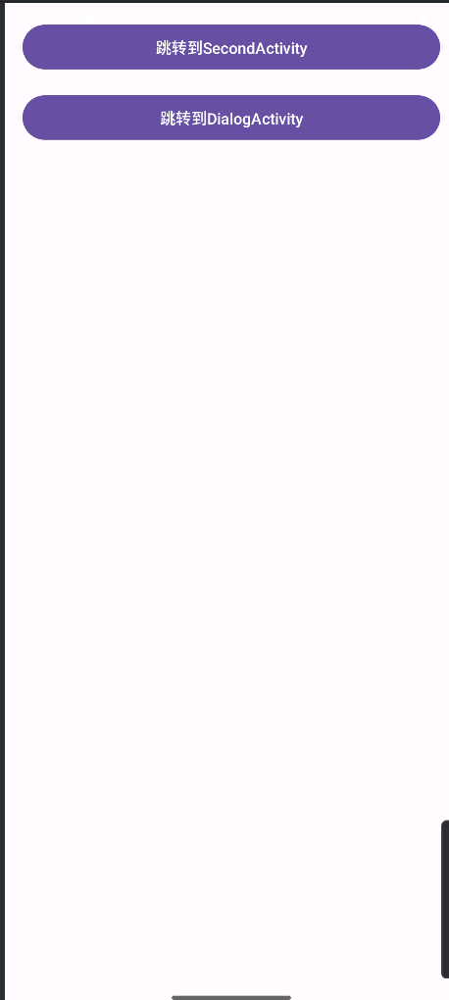
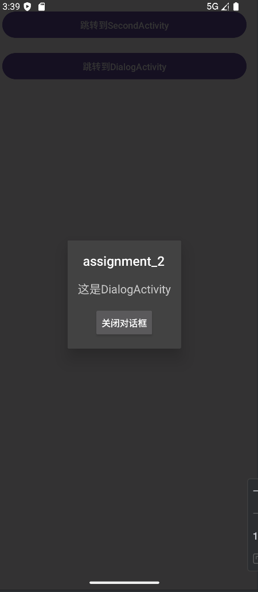
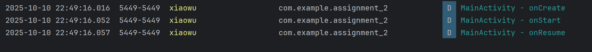
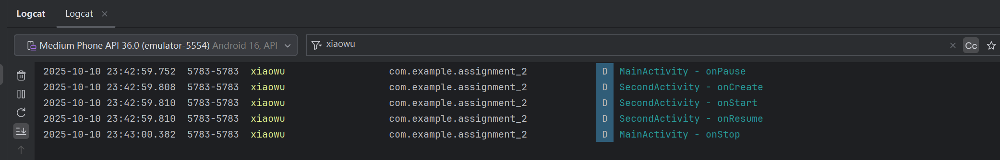
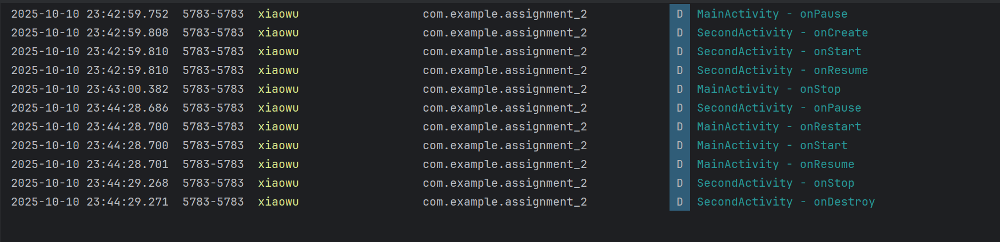
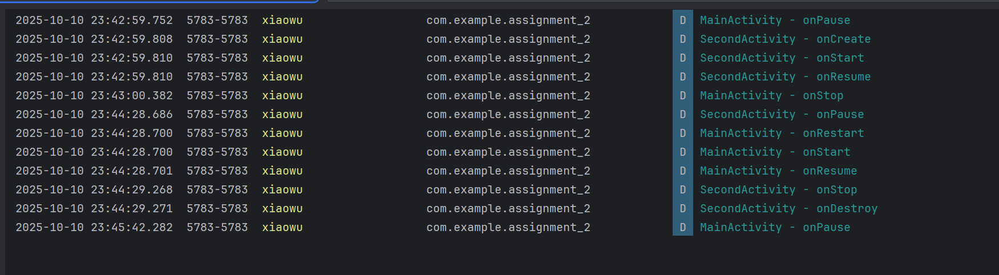
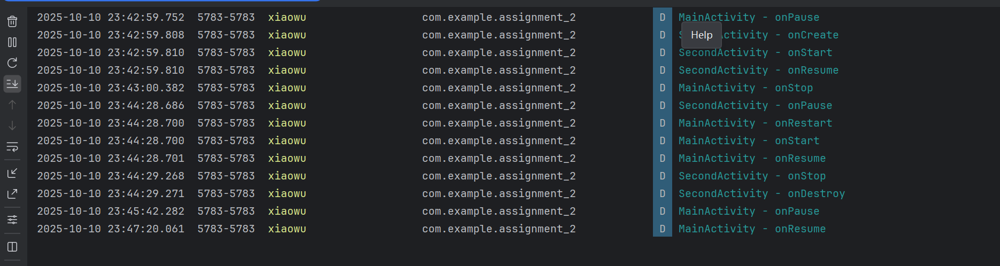

# Android Activity 生命周期观察实验报告

实验名称：Android Activity 生命周期方法实现与跳转观察

实验日期：2025**年10月11日**

**姓名：*吴秋寒

学号：42312260

## 一、实验目的


1. 掌握 Activity 核心生命周期方法（`onCreate`、`onStart`、`onResume`、`onPause`、`onStop`、`onRestart`、`onDestroy`）的重写方式

2. 观察并记录 “应用启动”“普通 Activity 跳转”“对话框样式 Activity 跳转” 场景下的生命周期调用顺序

3. 学会通过 Logcat 筛选日志，分析不同场景下 Activity 的状态变化

## 二、实验环境


| 环境项           | 具体配置                |
| ---------------- | ----------------------- |
| 开发工具         | Android Studio          |
| Android SDK 版本 | API 36.0（Android 14）  |
| 运行设备         | 模拟器（Pixel 8）/ 真机 |
| 开发语言         | Java + XML              |
| 日志筛选标签     | xiaowu（自定义标签）    |

## 三、实验内容与步骤

### （一）第一部分：创建 3 个 Activity（含生命周期 Log）

#### 步骤 1：配置 AndroidManifest.xml（注册 Activity+Dialog 主题）

功能：注册 MainActivity（入口）、SecondActivity（普通）、DialogActivity（对话框样式），为 DialogActivity 设置对话框主题。


```xml
<?xml version="1.0" encoding="utf-8"?>
<manifest xmlns:android="http://schemas.android.com/apk/res/android">

    <application
        android:allowBackup="true"
        android:icon="@mipmap/ic_launcher"
        android:label="@string/app_name"
        android:roundIcon="@mipmap/ic_launcher_round"
        android:supportsRtl="true"
        android:theme="@style/Theme.HelloWrold">
        <activity
            android:name=".DialogActivity"
            android:exported="false"
            android:theme="@style/Theme.AppCompat.Dialog" /> <!-- 关键：设置对话框主题 -->
        <activity
            android:name=".SecondActivity"
            android:exported="false" />
        <activity
            android:name=".MainActivity"
            android:exported="true">
            <intent-filter>
                <action android:name="android.intent.action.MAIN" />

                <category android:name="android.intent.category.LAUNCHER" />
            </intent-filter>
        </activity>
    </application>

</manifest
```

#### 步骤 2：创建 MainActivity（含跳转按钮 + 生命周期 Log）

##### （1）MainActivity 布局（activity\_main.xml）


```xml
<?xml version="1.0" encoding="utf-8"?>
<LinearLayout xmlns:android="http://schemas.android.com/apk/res/android"
    android:layout_width="match_parent"
    android:layout_height="match_parent"
    android:orientation="vertical"
    android:padding="16dp">

    <!-- 跳转到普通SecondActivity的按钮 -->
    <Button
        android:id="@+id/to_second"
        android:layout_width="match_parent"
        android:layout_height="wrap_content"
        android:text="跳转到SecondActivity" />

    <!-- 跳转到对话框Activity的按钮 -->
    <Button
        android:id="@+id/to_dialog"
        android:layout_width="match_parent"
        android:layout_height="wrap_content"
        android:layout_marginTop="16dp"
        android:text="跳转到DialogActivity" />

</LinearLayout>
```



##### （2）MainActivity 代码（重写生命周期 + 跳转逻辑）


```java
package com.example.assignment_2;

import androidx.appcompat.app.AppCompatActivity;
import android.content.Intent;
import android.os.Bundle;
import android.util.Log;
import android.view.View;
import android.widget.Button;

public class MainActivity extends AppCompatActivity {

    // 日志标签，用于过滤Logcat
    private static final String TAG = "xiaowu";

    @Override
    protected void onCreate(Bundle savedInstanceState) {
        super.onCreate(savedInstanceState);
        setContentView(R.layout.activity_main);
        Log.d(TAG, "MainActivity - onCreate");
        Button b1 = findViewById(R.id.to_second);
        Button b2 = findViewById(R.id.to_dialog);

        // 跳转到SecondActivity
        b1.setOnClickListener(v -> {
            Intent intent = new Intent(MainActivity.this, SecondActivity.class);
            startActivity(intent);
        });
        // 跳转到DialogActivity
        b2.setOnClickListener(v -> {
            Intent intent = new Intent(MainActivity.this, DialogActivity.class);
            startActivity(intent);
        });
    }
    // Activity可见但未交互时调用（启动过程）
    @Override
    protected void onStart() {
        super.onStart();
        Log.d(TAG, "MainActivity - onStart");
    }
    // Activity可见且可交互时调用（获取焦点）
    @Override
    protected void onResume() {
        super.onResume();
        Log.d(TAG, "MainActivity - onResume");
    }
    // 其他Activity覆盖当前Activity时调用（失去焦点但可见）
    @Override
    protected void onPause() {
        super.onPause();
        Log.d(TAG, "MainActivity - onPause");
    }
    // 其他Activity完全覆盖当前Activity时调用（不可见）
    @Override
    protected void onStop() {
        super.onStop();
        Log.d(TAG, "MainActivity - onStop");
    }
    // Activity从停止状态重新启动时调用（如返回当前Activity）
    @Override
    protected void onRestart() {
        super.onRestart();
        Log.d(TAG, "MainActivity - onRestart");
    }
    // Activity销毁时调用（如finish()或系统回收）
    @Override
    protected void onDestroy() {
        super.onDestroy();
        Log.d(TAG, "MainActivity - onDestroy");
    }
}
```

#### 步骤 3：创建普通 SecondActivity（同生命周期 Log）

##### （1）SecondActivity 布局（activity\_second.xml）


```xml
<?xml version="1.0" encoding="utf-8"?>
<LinearLayout xmlns:android="http://schemas.android.com/apk/res/android"
    android:layout_width="match_parent"
    android:layout_height="match_parent"
    android:gravity="center"
    android:orientation="vertical">

    <TextView
        android:layout_width="wrap_content"
        android:layout_height="wrap_content"
        android:text="这是SecondActivity"
        android:textSize="18sp" />

    <!-- 返回按钮 -->
    <Button
        android:id="@+id/back"
        android:layout_width="wrap_content"
        android:layout_height="wrap_content"
        android:layout_marginTop="16dp"
        android:text="返回MainActivity" />

</LinearLayout>
```


```xml
<?xml version="1.0" encoding="utf-8"?>
<LinearLayout xmlns:android="http://schemas.android.com/apk/res/android"
    android:layout_width="match_parent"
    android:layout_height="match_parent"
    android:gravity="center"
    android:orientation="vertical">

    <TextView
        android:layout_width="wrap_content"
        android:layout_height="wrap_content"
        android:text="这是SecondActivity"
        android:textSize="18sp" />

    <!-- 返回按钮 -->
    <Button
        android:id="@+id/back"
        android:layout_width="wrap_content"
        android:layout_height="wrap_content"
        android:layout_marginTop="16dp"
        android:text="返回MainActivity" />

</LinearLayout>
```


##### （2）SecondActivity 代码（重写生命周期 + 返回逻辑）


```java
package com.example.assignment_2;

import androidx.appcompat.app.AppCompatActivity;
import android.os.Bundle;
import android.util.Log;
import android.view.View;
import android.widget.Button;

public class SecondActivity extends AppCompatActivity {

    private static final String TAG = "xiaowu";

    @Override
    protected void onCreate(Bundle savedInstanceState) {
        super.onCreate(savedInstanceState);
        setContentView(R.layout.activity_second);
        Log.d(TAG, "SecondActivity - onCreate");

        // 返回按钮逻辑：关闭当前Activity
        Button backBtn = findViewById(R.id.back);
        backBtn.setOnClickListener(v -> finish()); // 调用finish()销毁当前Activity
    }
    @Override
    protected void onStart() {
        super.onStart();
        Log.d(TAG, "SecondActivity - onStart");
    }

    @Override
    protected void onResume() {
        super.onResume();
        Log.d(TAG, "SecondActivity - onResume");
    }

    @Override
    protected void onPause() {
        super.onPause();
        Log.d(TAG, "SecondActivity - onPause");
    }

    @Override
    protected void onStop() {
        super.onStop();
        Log.d(TAG, "SecondActivity - onStop");
    }

    @Override
    protected void onRestart() {
        super.onRestart();
        Log.d(TAG, "SecondActivity - onRestart");
    }

    @Override
    protected void onDestroy() {
        super.onDestroy();
        Log.d(TAG, "SecondActivity - onDestroy");
    }
}
```

#### 步骤 4：创建对话框样式 DialogActivity（同生命周期 Log）

##### （1）DialogActivity 布局（activity\_dialog.xml）


```xml
<?xml version="1.0" encoding="utf-8"?>
<LinearLayout xmlns:android="http://schemas.android.com/apk/res/android"
    android:layout_width="wrap_content"
    android:layout_height="wrap_content"
    android:gravity="center"
    android:orientation="vertical"
    android:padding="16dp">

    <TextView
        android:layout_width="wrap_content"
        android:layout_height="wrap_content"
        android:layout_gravity="center"
        android:text="这是DialogActivity"
        android:textSize="18sp" />
    
    <Button
        android:id="@+id/btn_back"
        android:layout_width="wrap_content"
        android:layout_height="wrap_content"
        android:layout_gravity="center"
        android:layout_marginTop="16dp"
        android:text="关闭对话框" />

</LinearLayout>
```



##### （2）DialogActivity 代码（重写生命周期 + 关闭逻辑）


```java
package com.example.assignment_2;
import androidx.appcompat.app.AppCompatActivity;
import android.os.Bundle;
import android.util.Log;
import android.view.View;
import android.widget.Button;

public class DialogActivity extends AppCompatActivity {

    private static final String TAG = "小吴";

    @Override
    protected void onCreate(Bundle savedInstanceState) {
        super.onCreate(savedInstanceState);
        setContentView(R.layout.activity_dialog);
        Log.d(TAG, "DialogActivity - onCreate");

        // 关闭对话框按钮逻辑
        Button backBtn = findViewById(R.id.btn_back);
        backBtn.setOnClickListener(v -> finish());
    }

    @Override
    protected void onStart() {
        super.onStart();
        Log.d(TAG, "DialogActivity - onStart");
    }

    @Override
    protected void onResume() {
        super.onResume();
        Log.d(TAG, "DialogActivity - onResume");
    }

    @Override
    protected void onPause() {
        super.onPause();
        Log.d(TAG, "DialogActivity - onPause");
    }

    @Override
    protected void onStop() {
        super.onStop();
        Log.d(TAG, "DialogActivity - onStop");
    }

    @Override
    protected void onRestart() {
        super.onRestart();
        Log.d(TAG, "DialogActivity - onRestart");
    }

    @Override
    protected void onDestroy() {
        super.onDestroy();
        Log.d(TAG, "DialogActivity - onDestroy");
    }
}
```


### （二）第二部分：生命周期观察与日志记录

#### 步骤 1：应用启动观察

应用启动时的Logcat日志界面，标注MainActivity的生命周期顺序)



#### 步骤 2：普通 Activity 跳转观察


1. **从 Main→Second**：点击 MainActivity 的 “跳转到 SecondActivity” 按钮

* 观察：MainActivity 与 SecondActivity 的生命周期变化



Main跳转Second时的Logcat日志界面

1. **从 Second→Main**：点击 SecondActivity 的 “返回 MainActivity” 按钮

* 观察：SecondActivity 销毁、MainActivity 恢复的生命周期变化
* 

#### 步骤 3：Dialog Activity 跳转观察


1. **从 Main→Dialog**：点击 MainActivity 的 “跳转到 DialogActivity” 按钮

* 观察：MainActivity 是否进入停止状态（对比普通跳转）



1. **从 Dialog→Main**：点击 DialogActivity 的 “关闭对话框” 按钮

* 观察：DialogActivity 销毁、MainActivity 恢复的生命周期变化
* 

Dialog返回Main时的Logcat日志界面

#### 步骤 4：数据记录与分析（填写下表）


| 场景                  | MainActivity 生命周期顺序                                    | 目标 Activity 生命周期顺序                                   |
| --------------------- | ------------------------------------------------------------ | ------------------------------------------------------------ |
| 应用启动              | onCreate: FirstActivity<br/>onStart: FirstActivity<br/>onResume: FirstActivity | -（无目标 Activity）                                         |
| Main → SecondActivity | onPause: FirstActivity<br/>onStop: FirstActivity             | onCreate: SecondActivity<br/>onStart: SecondActivity<br/>onResume: SecondActivity |
| SecondActivity 返回   | onRestart: FirstActivity<br/>onStart: FirstActivity<br/>onResume: FirstActivity | onPause: SecondActivity<br/>onStop: SecondActivity<br/>onDestroy: SecondActivity |
| Main → DialogActivity | onPause: FirstActivity                                       | onCreate: DialogActivity<br/>onStart: DialogActivity<br/>onResume: DialogActivity |
| DialogActivity 返回   | onResume: FirstActivity                                      | onPause: DialogActivity<br/>onStop: DialogActivity<br/>onDestroy: DialogActivity |

