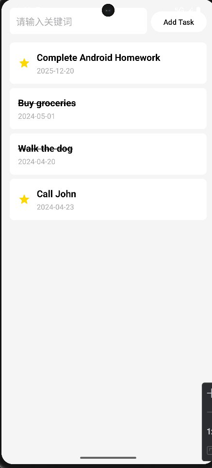
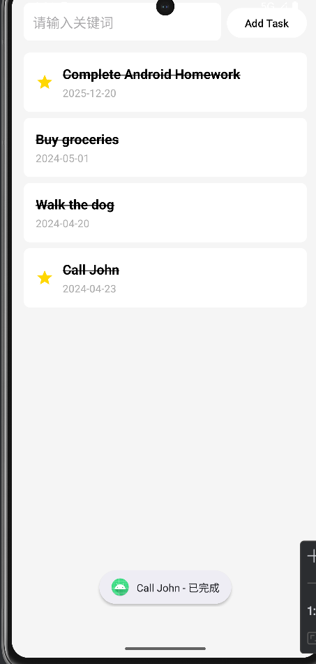

# TODO List实验报告


- **姓名**: 吴秋寒
- **学号**: 42312260
- **实验日期**: 2025年12月7日

---

## 一、实验目的

1. 掌握 Android ListView 的基本使用方法
2. 学会创建自定义 ArrayAdapter 适配器
3. 理解数据模型类的设计和使用
4. 掌握 ViewHolder 模式优化列表性能

---

## 二、实验内容

### 2.1 数据模型类 TaskItem

#### 功能描述
创建待办事项数据模型，包含任务名称和截止日期两个属性。

#### 核心代码

```java
public class TaskItem {
    private String taskName;  // 任务名称
    private String dueDate;   // 截止日期

    // 构造方法
    public TaskItem(String taskName, String dueDate) {
        this.taskName = taskName;
        this.dueDate = dueDate;
    }

    // Getter 方法
    public String getTaskName() {
        return taskName;
    }

    public String getDueDate() {
        return dueDate;
    }

    // Setter 方法
    public void setTaskName(String taskName) {
        this.taskName = taskName;
    }

    public void setDueDate(String dueDate) {
        this.dueDate = dueDate;
    }
}
```

---

### 2.2 自定义适配器 TaskAdapter

#### 功能描述
继承 ArrayAdapter，实现自定义列表项布局和数据绑定，使用 ViewHolder 模式优化性能。

#### 核心代码

```java
public class TaskAdapter extends ArrayAdapter<TaskItem> {
    private Context context;
    private List<TaskItem> taskList;

    public TaskAdapter(@NonNull Context context, @NonNull List<TaskItem> tasks) {
        super(context, R.layout.item_task, tasks);
        this.context = context;
        this.taskList = tasks;
    }

    @NonNull
    @Override
    public View getView(int position, @Nullable View convertView, @NonNull ViewGroup parent) {
        ViewHolder holder;

        if (convertView == null) {
            // 加载列表项布局
            convertView = LayoutInflater.from(context).inflate(R.layout.item_task, parent, false);

            // 创建 ViewHolder 并缓存视图引用
            holder = new ViewHolder();
            holder.tvTaskName = convertView.findViewById(R.id.tvTaskName);
            holder.tvDueDate = convertView.findViewById(R.id.tvDueDate);
            convertView.setTag(holder);
        } else {
            // 从缓存中获取 ViewHolder
            holder = (ViewHolder) convertView.getTag();
        }

        // 获取当前位置的数据
        TaskItem currentTask = taskList.get(position);

        // 将数据绑定到视图
        holder.tvTaskName.setText(currentTask.getTaskName());
        holder.tvDueDate.setText("截止日期: " + currentTask.getDueDate());

        return convertView;
    }

    // ViewHolder 模式：缓存视图引用，避免重复 findViewById
    private static class ViewHolder {
        TextView tvTaskName;
        TextView tvDueDate;
    }
}
```

---

### 2.3 列表项布局 item_task.xml

#### 功能描述
自定义列表项布局，包含两个 TextView 分别显示任务名称和截止日期。

#### 布局代码

```xml
<?xml version="1.0" encoding="utf-8"?>
<LinearLayout xmlns:android="http://schemas.android.com/apk/res/android"
    android:layout_width="match_parent"
    android:layout_height="wrap_content"
    android:orientation="vertical"
    android:padding="16dp"
    android:background="?android:attr/selectableItemBackground">

    <!-- 任务名称 -->
    <TextView
        android:id="@+id/tvTaskName"
        android:layout_width="match_parent"
        android:layout_height="wrap_content"
        android:text="任务名称"
        android:textSize="18sp"
        android:textColor="@android:color/black"
        android:textStyle="bold" />

    <!-- 截止日期 -->
    <TextView
        android:id="@+id/tvDueDate"
        android:layout_width="match_parent"
        android:layout_height="wrap_content"
        android:layout_marginTop="4dp"
        android:text="截止日期"
        android:textSize="14sp"
        android:textColor="@android:color/darker_gray" />

</LinearLayout>
```

---

### 2.4 主界面 MainActivity

#### 功能描述
初始化 ListView，创建示例数据，设置适配器，并添加列表项点击事件。

#### 核心代码

```java
public class MainActivity extends AppCompatActivity {
    private ListView lvTasks;
    private ArrayList<TaskItem> taskList;
    private TaskAdapter adapter;

    @Override
    protected void onCreate(Bundle savedInstanceState) {
        super.onCreate(savedInstanceState);
        setContentView(R.layout.activity_main);

        // 初始化 ListView
        lvTasks = findViewById(R.id.lvTasks);

        // 初始化任务数据
        initTaskData();

        // 创建适配器并设置给 ListView
        adapter = new TaskAdapter(this, taskList);
        lvTasks.setAdapter(adapter);

        // 设置列表项点击事件
        lvTasks.setOnItemClickListener((parent, view, position, id) -> {
            TaskItem task = taskList.get(position);
            Toast.makeText(this, "点击了: " + task.getTaskName(), Toast.LENGTH_SHORT).show();
        });
    }

    // 初始化任务数据（使用作业要求的示例数据）
    private void initTaskData() {
        taskList = new ArrayList<>();
        taskList.add(new TaskItem("Complete Android Homework", "2025-12-20"));
        taskList.add(new TaskItem("Buy groceries", "2024-05-01"));
        taskList.add(new TaskItem("Walk the dog", "2024-04-20"));
        taskList.add(new TaskItem("Call John", "2024-04-23"));
    }
}
```

---

### 2.5 主界面布局 activity_main.xml

#### 布局代码

```xml
<?xml version="1.0" encoding="utf-8"?>
<LinearLayout xmlns:android="http://schemas.android.com/apk/res/android"
    xmlns:tools="http://schemas.android.com/tools"
    android:id="@+id/main"
    android:layout_width="match_parent"
    android:layout_height="match_parent"
    android:orientation="vertical"
    android:background="#F5F5F5"
    tools:context=".MainActivity">

    <!-- 标题栏 -->
    <TextView
        android:id="@+id/tvTitle"
        android:layout_width="match_parent"
        android:layout_height="wrap_content"
        android:text="待办事项清单"
        android:textSize="24sp"
        android:textColor="@android:color/white"
        android:textStyle="bold"
        android:gravity="center"
        android:padding="16dp"
        android:background="#6200EE" />

    <!-- 任务列表 ListView -->
    <ListView
        android:id="@+id/lvTasks"
        android:layout_width="match_parent"
        android:layout_height="match_parent"
        android:divider="#CCCCCC"
        android:dividerHeight="1dp"
        android:background="@android:color/white"
        android:layout_margin="8dp" />

</LinearLayout>
```

---

## 三、运行截图

### 3.1 主界面 - 待办事项列表



- 显示4条待办事项
- 每条显示任务名称和截止日期
- 列表项之间有清晰分隔线

### 3.2 点击交互



- 点击列表项弹出 Toast 提示

---

## 四、实验总结

### 4.1 ListView 使用要点

| 组件 | 作用 | 关键方法 |
|------|------|----------|
| ListView | 列表容器 | setAdapter() |
| Adapter | 数据与视图桥梁 | getView() |
| ViewHolder | 优化性能 | 缓存 findViewById 结果 |

### 4.2 学习收获

1. **ListView 基础**: 学会使用 ListView 展示列表数据
2. **自定义 Adapter**: 掌握继承 ArrayAdapter 实现自定义列表项
3. **ViewHolder 模式**: 理解 ViewHolder 模式避免重复 findViewById 提升性能
4. **数据绑定**: 学会将数据模型绑定到视图控件

### 4.3 关键知识点

- **convertView 复用**: 列表滚动时复用已创建的视图，减少内存消耗
- **ViewHolder 模式**: 缓存视图引用，避免每次 getView 都调用 findViewById
- **自定义布局**: 使用 LayoutInflater 加载自定义列表项布局

---

## 五、完整项目结构

```
app/
├── src/main/java/com/example/myapplication/
│   ├── MainActivity.java       # 主界面Activity
│   ├── TaskItem.java        # 任务数据模型
│   └── TaskAdapter.java     # 自定义列表适配器
├── src/main/res/layout/
│   ├── activity_main.xml       # 主界面布局
│   └── item_task.xml       # 列表项布局
└── AndroidManifest.xml
```
