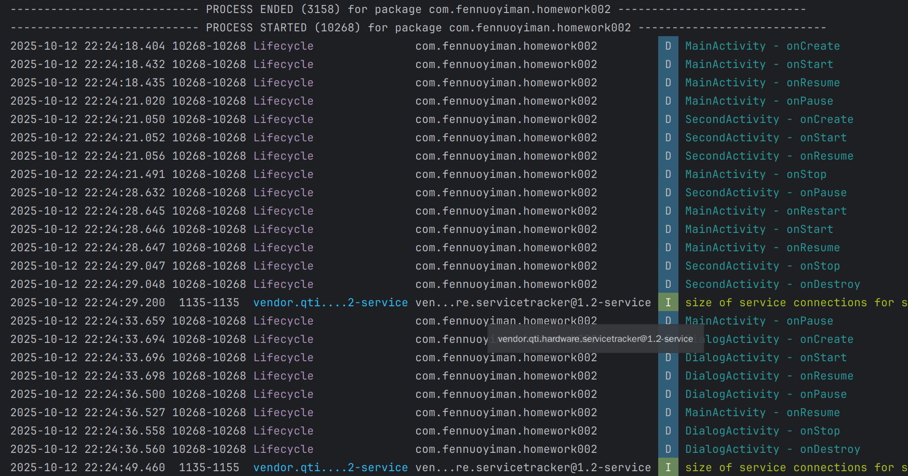

# 第二次安卓开发作业说明

   **进入程序如图所示,点击对应按钮进入对应页面，然后观察Logcat输出内容**

**下图展示的是启动程序后，执行先点击按钮1然后返回，再点击按钮2然后再返回，后的Logcat输出的日志**

**可以得出如下表格中的结论：**

| 场景                         | **MainActivity 生命周期顺序**              | **目标 Activity 生命周期顺序**              | **关键分析点**                      |
| -------------------------- | ------------------------------------ | ----------------------------------- | ------------------------------ |
| **应用启动**                   | `onCreate` → `onStart` → `onResume`  | -                                   | 完整启动流程                         |
| **Main → SecondActivity**  | `onPause` → `onStop`                 | `onCreate` → `onStart` → `onResume` | **普通 Activity** 完全遮盖了 Main     |
| **SecondActivity 返回**      | `onRestart` → `onStart` → `onResume` | `onPause` → `onStop` → `onDestroy`  | `onRestart` 证明 Main 被 Stopped  |
| **Main → Dialog Activity** | `onPause` → **?**                    | `onCreate` → `onStart` → `onResume` | **Dialog Activity** 不完全遮盖 Main |
| **Dialog Activity 返回**     | **?** → `onResume`                   | `onPause` → `onStop` → `onDestroy`  | 恢复时 Main 从 Paused 状态返回         |

