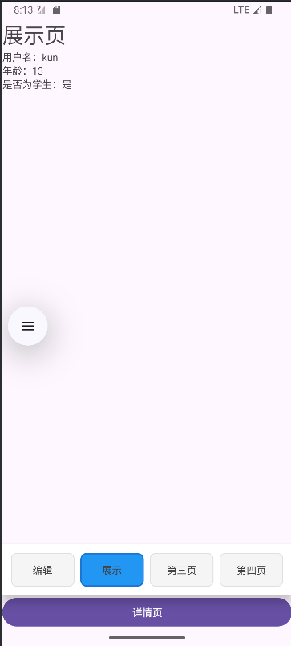
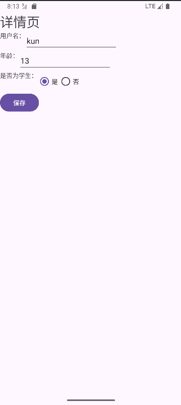
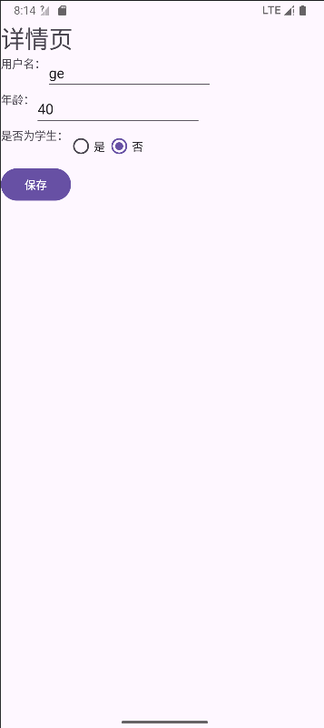

# 实验报告：Android Fragment切换与数据传输实现

姓名：张明玉
学号：42312196


## 一、实验目的

1. 掌握使用RadioGroup控制Fragment切换的方法
2. 实现不同组件间的数据传输（Activity→Activity、Activity↔Fragment、Fragment→Fragment）
3. 理解并应用onSaveInstanceState方法保存和恢复应用状态
4. 学习使用选择器和样式统一UI组件风格

## 二、实验环境

- 操作系统：Android
- 开发工具：Android Studio
- 编程语言：Java
- 最低SDK版本：Android 7.0 (API 24)

## 三、实验内容与实现

### 3.1 RadioGroup控制Fragment切换

#### 3.1.1 布局文件实现

1. 创建radio_button_selector.xml选择器文件，定义RadioButton的选中和未选中状态：

```xml
<?xml version="1.0" encoding="utf-8"?>
<selector xmlns:android="http://schemas.android.com/apk/res/android">
    <item android:drawable="@color/blue" android:state_checked="true"/>
    <item android:drawable="@color/gray" android:state_checked="false"/>
</selector>
```

2. 在styles.xml中定义RadioButton的统一样式：

```xml
<style name="RadioButtonStyle" parent="Widget.AppCompat.CompoundButton.RadioButton">
    <item name="android:layout_width">wrap_content</item>
    <item name="android:layout_height">wrap_content</item>
    <item name="android:background">@drawable/radio_button_selector</item>
    <item name="android:padding">10dp</item>
    <item name="android:textSize">16sp</item>
</style>
```

3. 在activity_main.xml中实现包含4个RadioButton的RadioGroup：

```xml
<RadioGroup
    android:id="@+id/radio_group"
    android:layout_width="match_parent"
    android:layout_height="wrap_content"
    android:orientation="horizontal">

    <RadioButton
        android:id="@+id/radio_first"
        android:layout_width="wrap_content"
        android:layout_height="wrap_content"
        android:text="第一页"
        style="@style/RadioButtonStyle"
        android:checked="true"/>

    <RadioButton
        android:id="@+id/radio_second"
        android:layout_width="wrap_content"
        android:layout_height="wrap_content"
        android:text="第二页"
        style="@style/RadioButtonStyle"/>

    <RadioButton
        android:id="@+id/radio_third"
        android:layout_width="wrap_content"
        android:layout_height="wrap_content"
        android:text="第三页"
        style="@style/RadioButtonStyle"/>

    <RadioButton
        android:id="@+id/radio_forth"
        android:layout_width="wrap_content"
        android:layout_height="wrap_content"
        android:text="第四页"
        style="@style/RadioButtonStyle"/>
</RadioGroup>

<FrameLayout
    android:id="@+id/fragment_container"
    android:layout_width="match_parent"
    android:layout_height="match_parent"/>
```

#### 3.1.2 Java代码实现

在MainActivity中实现Fragment的初始化和切换逻辑：

```java
private void initFragments() {
    firstFragment = new FirstFragment();
    secondFragment = new SecondFragment();
    thirdFragment = new ThirdFragment();
    forthFragment = new ForthFragment();

    selectedFragment = firstFragment;
    getSupportFragmentManager().beginTransaction()
            .add(R.id.fragment_container, firstFragment, "first")
            .add(R.id.fragment_container, secondFragment, "second")
            .add(R.id.fragment_container, thirdFragment, "third")
            .add(R.id.fragment_container, forthFragment, "forth")
            .hide(secondFragment)
            .hide(thirdFragment)
            .hide(forthFragment)
            .show(selectedFragment)
            .commit();
}

private void setupRadioGroup() {
    radioGroup.setOnCheckedChangeListener((group, checkedId) -> {
        if (checkedId == R.id.radio_first) {
            switchFragment(firstFragment);
        } else if (checkedId == R.id.radio_second) {
            secondFragment.setMessage(firstFragment.getMessage());
            switchFragment(secondFragment);
        } else if (checkedId == R.id.radio_third) {
            switchFragment(thirdFragment);
        } else if (checkedId == R.id.radio_forth) {
            switchFragment(forthFragment);
        }
    });
}

private void switchFragment(Fragment fragment) {
    getSupportFragmentManager().beginTransaction()
            .hide(selectedFragment)
            .show(fragment)
            .commit();
    selectedFragment = fragment;
}
```

### 3.2 Bundle数据传输实现

#### 3.2.1 场景A: Activity → Activity

从MainActivity传递数据到DetailActivity：

```java
// MainActivity中
private void onClick(View v) {
    Intent intent = new Intent(MainActivity.this, DetailActivity.class);
    Bundle bundle = firstFragment.getMessage();
    intent.putExtras(bundle);
    startActivityForResult(intent, 0, bundle);
}

// DetailActivity中接收数据
@Override
protected void onCreate(Bundle savedInstanceState) {
    // ...其他代码
    Bundle bundle = getIntent().getExtras();
    if (bundle != null){
        userName.setText(bundle.getString("user_name"));
        age.setText(Integer.toString(bundle.getInt("age")));
        if (bundle.getBoolean("is_student")) {
            isStudent.check(R.id.yes);
        }
        else {
            isStudent.check(R.id.no);
        }
    }
}
```

#### 3.2.2 场景B: Activity ↔ Fragment

MainActivity与Fragment之间的数据传递：

```java
// FirstFragment中提供数据获取和设置方法
public Bundle getMessage() {
    Bundle bundle = new Bundle();
    bundle.putString("user_name", userName.getText().toString());
    String ageStr = age.getText().toString();
    if (ageStr.chars().allMatch(Character::isDigit)) {
        bundle.putInt("age", Integer.parseInt(ageStr));
    }
    else {
        bundle.putInt("age", 0);
    }
    bundle.putBoolean("is_student", flag);
    return bundle;
}

public void setMassage(Bundle bundle) {
    userName.setText(bundle.getString("user_name"));
    age.setText(Integer.toString(bundle.getInt("age")));
    if (bundle.getBoolean("is_student")) {
        isStudent.check(R.id.yes);
    }
    else {
        isStudent.check(R.id.no);
    }
}

// MainActivity中处理返回数据
@Override
protected void onActivityResult(int requestCode, int resultCode, @Nullable Intent data) {
    super.onActivityResult(requestCode, resultCode, data);
    if (resultCode == Activity.RESULT_OK && data != null) {
        Bundle bundle = data.getExtras();
        if (bundle != null) {
            firstFragment.setMassage(bundle);
        }
    }
}
```

#### 3.2.3 场景C: Fragment → Fragment

通过Activity中转实现Fragment间数据传递：

```java
// 在MainActivity的RadioGroup切换事件中，通过Activity中转数据
radioGroup.setOnCheckedChangeListener((group, checkedId) -> {
    // ...其他代码
    } else if (checkedId == R.id.radio_second) {
        // 从FirstFragment获取数据传递到SecondFragment
        secondFragment.setMessage(firstFragment.getMessage());
        switchFragment(secondFragment);
    // ...其他代码
});

// SecondFragment接收数据并展示
public void setMessage(Bundle bundle) {
    userName.setText(bundle.getString("user_name"));
    age.setText(Integer.toString(bundle.getInt("age")));
    if (bundle.getBoolean("is_student")) {
        isStudent.setText("是");
    }
    else {
        isStudent.setText("否");
    }
}
```

### 3.3 屏幕旋转与状态保存

在DetailActivity中实现onSaveInstanceState方法保存状态：

```java
@Override
protected void onSaveInstanceState(@NonNull Bundle outState) {
    super.onSaveInstanceState(outState);
    // 保存EditText内容
    outState.putString("user_name", userName.getText().toString());
    String ageStr = age.getText().toString();
    if (ageStr.chars().allMatch(Character::isDigit)) {
        outState.putInt("age", Integer.parseInt(ageStr));
    }
    else {
        outState.putInt("age", 0);
    }
    outState.putBoolean("is_student", flag);
    
    // 打印日志，记录onSaveInstanceState调用时机
    Log.d("DetailActivity", "onSaveInstanceState called");
}
```

在onCreate中恢复状态：

```java
@Override
protected void onCreate(Bundle savedInstanceState) {
    super.onCreate(savedInstanceState);
    // ...其他初始化代码
    
    // 恢复保存的状态
    if (savedInstanceState != null) {
        userName.setText(savedInstanceState.getString("user_name"));
        age.setText(Integer.toString(savedInstanceState.getInt("age")));
        flag = savedInstanceState.getBoolean("is_student");
        if (flag) {
            isStudent.check(R.id.yes);
        } else {
            isStudent.check(R.id.no);
        }
    } else {
        // 从Intent获取数据
        Bundle bundle = getIntent().getExtras();
        if (bundle != null){
            // ...处理代码
        }
    }
}
```

## 四、实验结果与分析

1. **RadioGroup与Fragment切换**：实现了4个Fragment的创建和切换功能，点击不同的RadioButton能正确显示对应的Fragment，UI风格统一。

2. **数据传输功能**：
   - 成功实现了MainActivity到DetailActivity的数据传递
   - 实现了MainActivity与FirstFragment之间的数据双向传递
   - 通过MainActivity中转，成功实现了FirstFragment到SecondFragment的数据传递

3. **状态保存与恢复**：
   - 日志显示onSaveInstanceState在屏幕旋转时被调用，处于onPause之后、onStop之前
   - 屏幕旋转后，EditText中的内容能正确恢复
   - 单选按钮的状态也能正确保存和恢复

## 五、实验总结

通过本次实验，深入理解了Android中Fragment的管理与切换机制，掌握了使用RadioGroup控制Fragment切换的方法。同时，熟练运用Bundle和Intent实现了不同组件间的数据传输，包括Activity之间、Activity与Fragment之间以及Fragment之间的数据传递。

此外，通过实现onSaveInstanceState方法，理解了Android生命周期中状态保存的机制，学会了在配置变更（如屏幕旋转）时保存和恢复应用状态，保证了用户体验的一致性。

实验中也遇到了一些问题，例如Fragment切换时的数据同步问题，通过在切换时机手动传递数据得到了解决。另外，对于onSaveInstanceState的调用时机有了更清晰的认识，它并非只在屏幕旋转时调用，而是在Activity可能被销毁前都会调用。

总的来说，本次实验帮助我们掌握了Android应用开发中的一些核心技术，为构建更复杂的应用打下了基础。

## 六、实验截图





