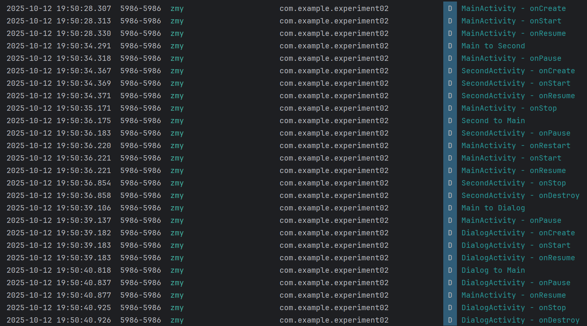

# Android Activity 生命周期观察实验

---

姓名：张明玉	学号：42312196	班级：软件2301班	实验日期：2025-10-10	实验内容：Android Activity 生命周期观察实验

---

## 实验目的

1. 掌握 Android Activity 生命周期的基本概念
2. 通过 Log 观察 Activity 在不同场景下的生命周期变化
3. 理解 Activity 跳转和返回时的生命周期调用顺序
4. 分析普通 Activity 与 Dialog Activity 在生命周期上的差异

## 实验要求

### 基础任务

1. **创建主 Activity**
   - 创建 MainActivity，重写所有生命周期方法
   - 在每个生命周期方法中添加 Log 输出，格式：`Log.d("Lifecycle", "MainActivity - onCreate")`

2. **创建普通 SecondActivity**
   - 创建第二个普通 Activity
   - 同样重写所有生命周期方法并添加 Log 输出

3. **创建 Dialog Activity**
   - 创建第三个 Activity，设置为主题为对话框样式
   - 重写所有生命周期方法并添加 Log 输出

### 实验步骤

#### 第一部分：基础生命周期观察

1. **启动应用观察**
   - 启动应用，观察 MainActivity 的生命周期调用顺序
   - 记录 Logcat 中的输出

2. **普通 Activity 跳转**
   - 从 MainActivity 跳转到 SecondActivity
   - 观察两个 Activity 的生命周期变化
   - 从 SecondActivity 返回 MainActivity
   - 再次观察生命周期变化

3. **Dialog Activity 跳转**
   - 从 MainActivity 跳转到 Dialog Activity
   - 观察生命周期变化
   - 从 Dialog Activity 返回
   - 观察生命周期变化

#### 第二部分：数据记录与分析

记录以下场景的 Log 输出：

| 场景 | MainActivity 生命周期顺序 | 目标Activity 生命周期顺序 |
|------|--------------------------|--------------------------|
| 应用启动 | MainActivity - onCreate <br/> MainActivity - onStart <br/> MainActivity - onResume | / |
| Main → SecondActivity | MainActivity - onPause <br/> MainActivity - onStop | SecondActivity - onCreate <br/> SecondActivity - onStart <br/> SecondActivity - onResume |
| SecondActivity 返回 | MainActivity - onRestart <br/> MainActivity - onStart <br/> MainActivity - onResume | SecondActivity - onPause <br/> SecondActivity - onStop <br/> SecondActivity - onDestroy |
| Main → Dialog Activity | MainActivity - onPause | DialogActivity - onCreate <br/> DialogActivity - onStart <br/> DialogActivity - onResume |
| Dialog Activity 返回 | MainActivity - onResume | DialogActivity - onPause <br/> DialogActivity - onStop <br/> DialogActivity - onDestroy |

### 代码截图

#### MainActivity

```Java
public class MainActivity extends AppCompatActivity {

    @Override
    protected void onCreate(Bundle savedInstanceState) {
        super.onCreate(savedInstanceState);
        EdgeToEdge.enable(this);
        setContentView(R.layout.activity_main);
        ViewCompat.setOnApplyWindowInsetsListener(findViewById(R.id.main), (v, insets) -> {
            Insets systemBars = insets.getInsets(WindowInsetsCompat.Type.systemBars());
            v.setPadding(systemBars.left, systemBars.top, systemBars.right, systemBars.bottom);
            return insets;
        });
        printLog("onCreate");
        btn = findViewById(R.id.btnToSecondActivity);
        btn.setOnClickListener((v) ->{
            Log.d("zmy","Main to Second");
            startActivity(new Intent(MainActivity.this, SecondActivity.class));
        });
        btnCreateDialog = findViewById(R.id.btnCreateDialog);
        btnCreateDialog.setOnClickListener((v) ->{
            Log.d("zmy","Main to Dialog");
            startActivity(new Intent(MainActivity.this, DialogActivity.class));
        });
    }

    @Override
    protected void onStart() {
        super.onStart();
        printLog("onStart");
    }

    @Override
    protected void onStop() {
        super.onStop();
        printLog("onStop");
    }

    @Override
    protected void onPause() {
        super.onPause();
        printLog("onPause");
    }

    @Override
    protected void onResume() {
        super.onResume();
        printLog("onResume");
    }

    @Override
    protected void onRestart() {
        super.onRestart();
        printLog("onRestart");
    }

    @Override
    protected void onDestroy() {
        super.onDestroy();
        printLog("onDestroy");
    }

    private void printLog(String content) {
        Log.d("zmy", activityName + " - " + content);
    }
    public static final String activityName = "MainActivity";
    private Button btn, btnCreateDialog;
}
```

#### SecondActivity

```java
public class SecondActivity extends AppCompatActivity {

    @Override
    protected void onCreate(Bundle savedInstanceState) {
        super.onCreate(savedInstanceState);
        EdgeToEdge.enable(this);
        setContentView(R.layout.activity_second);
        ViewCompat.setOnApplyWindowInsetsListener(findViewById(R.id.main), (v, insets) -> {
            Insets systemBars = insets.getInsets(WindowInsetsCompat.Type.systemBars());
            v.setPadding(systemBars.left, systemBars.top, systemBars.right, systemBars.bottom);
            return insets;
        });
        printLog("onCreate");
        btn = findViewById(R.id.btnToMainActivity);
        btn.setOnClickListener((v) -> {
            Log.d("wrz", "Second to Main");
            finish();
        });
    }
    @Override
    protected void onStart() {
        super.onStart();
        printLog("onStart");
    }

    @Override
    protected void onStop() {
        super.onStop();
        printLog("onStop");
    }

    @Override
    protected void onPause() {
        super.onPause();
        printLog("onPause");
    }

    @Override
    protected void onResume() {
        super.onResume();
        printLog("onResume");
    }

    @Override
    protected void onRestart() {
        super.onRestart();
        printLog("onRestart");
    }

    @Override
    protected void onDestroy() {
        super.onDestroy();
        printLog("onDestroy");
    }

    private void printLog(String content) {
        Log.d("wrz", activityName + " - " + content);
    }
    public static final String activityName = "SecondActivity";
    private Button btn;
}
```

#### DialogActivity

- 改变Activity的Theme

```xml
<activity
            android:name=".DialogActivity"
            android:exported="false"
            android:theme="@style/Theme.AppCompat.Dialog"/>
```

- 逻辑代码

```java
public class DialogActivity extends AppCompatActivity {

    @SuppressLint("MissingInflatedId")
    @Override
    protected void onCreate(Bundle savedInstanceState) {
        super.onCreate(savedInstanceState);
        EdgeToEdge.enable(this);
        setContentView(R.layout.activity_dialog);
        ViewCompat.setOnApplyWindowInsetsListener(findViewById(R.id.main), (v, insets) -> {
            Insets systemBars = insets.getInsets(WindowInsetsCompat.Type.systemBars());
            v.setPadding(systemBars.left, systemBars.top, systemBars.right, systemBars.bottom);
            return insets;
        });
        printLog("onCreate");
        btn = findViewById(R.id.btnDialogToMainActivity);
        btn.setOnClickListener((v) -> {
            Log.d("wr", "Dialog to Main");
            finish();
        });
    }
    @Override
    protected void onStart() {
        super.onStart();
        printLog("onStart");
    }

    @Override
    protected void onStop() {
        super.onStop();
        printLog("onStop");
    }

    @Override
    protected void onPause() {
        super.onPause();
        printLog("onPause");
    }

    @Override
    protected void onResume() {
        super.onResume();
        printLog("onResume");
    }

    @Override
    protected void onRestart() {
        super.onRestart();
        printLog("onRestart");
    }

    @Override
    protected void onDestroy() {
        super.onDestroy();
        printLog("onDestroy");
    }

    private void printLog(String content) {
        Log.d("zmy", activityName + " - " + content);
    }
    public static final String activityName = "DialogActivity";
    private Button btn;
}
```

### 整个过程的截图

