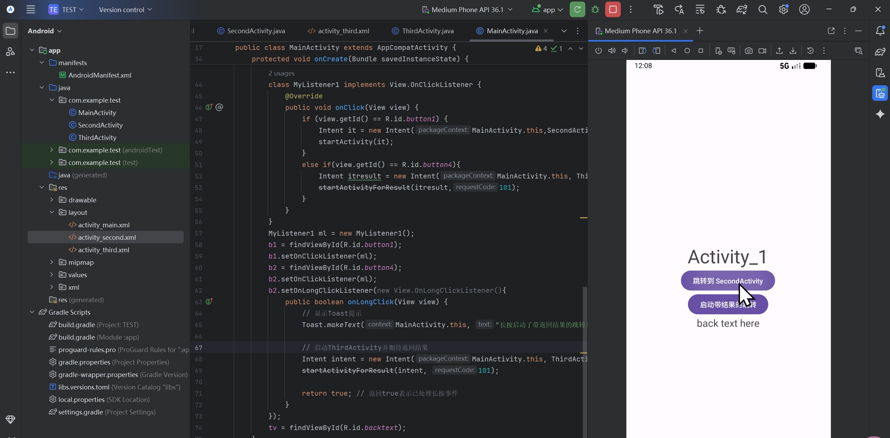
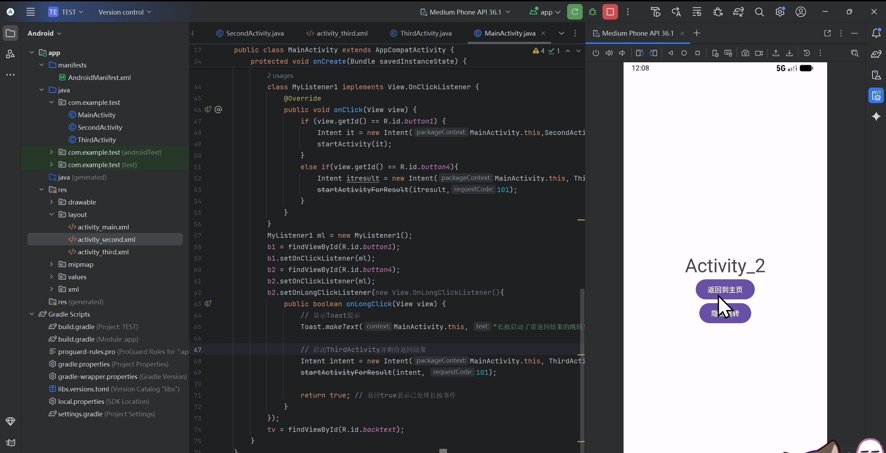
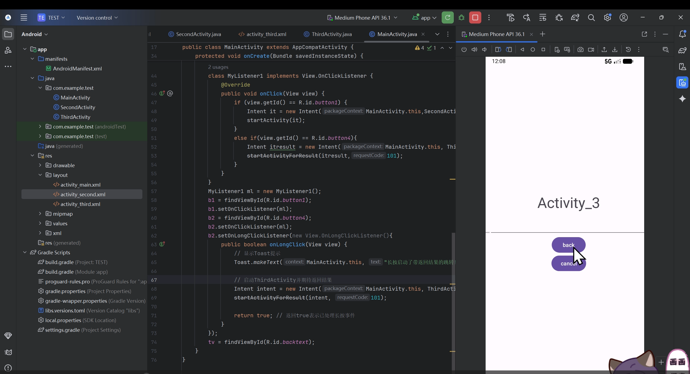
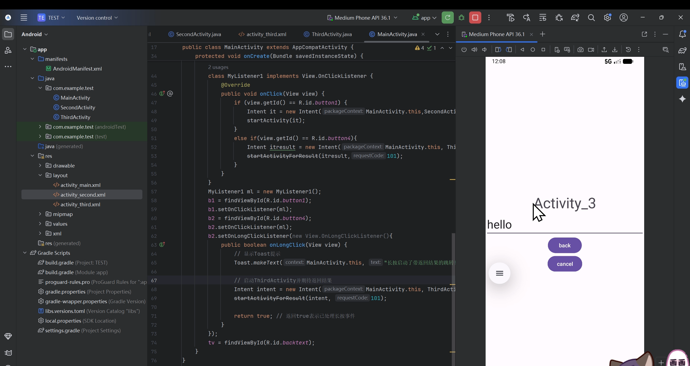
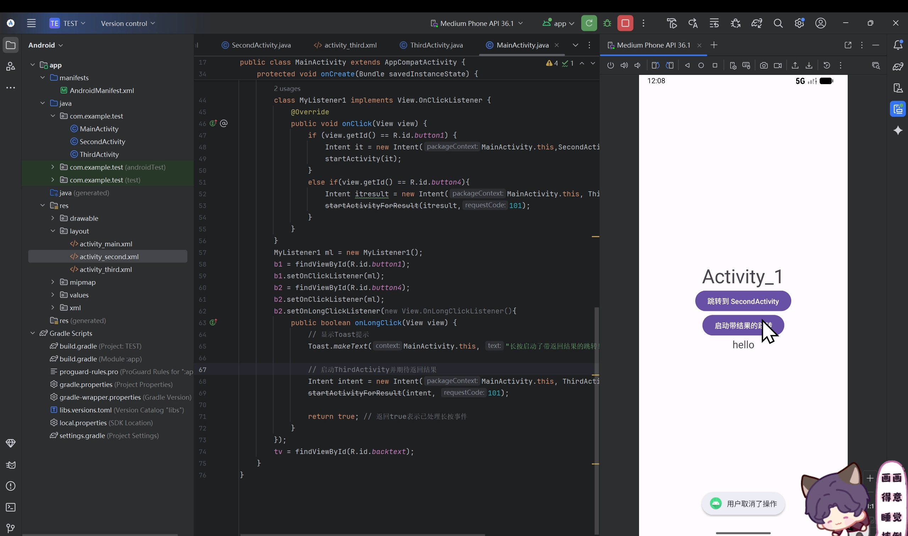
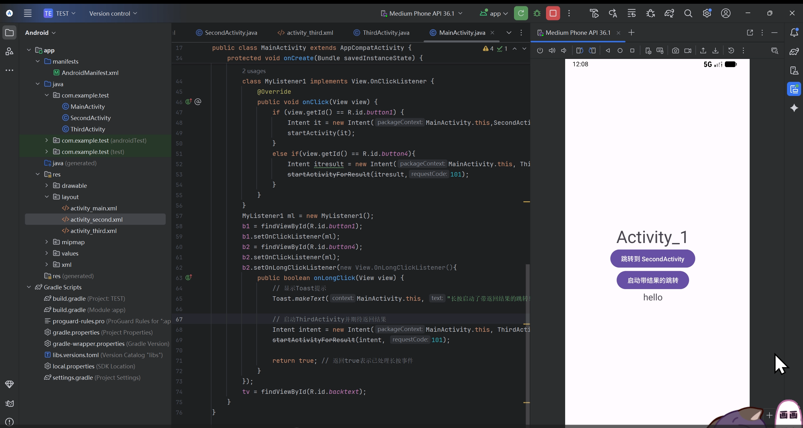
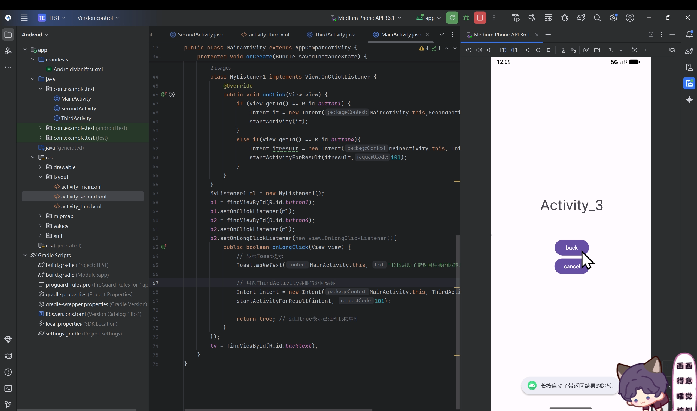

# Android应用开发作业 -  李海怡 42312185

## 项目概述
本项目是一个实现按钮相关功能的Android应用。

## 实现功能

###  主要功能
- [ ] 功能1：按钮显示跳转
- [ ] 功能2：按钮隐式跳转
- [ ] 功能3：待返回结果的跳转
- [ ] 功能4：带结果跳转实现长按监听器
- [ ] 功能5：带结果返回有取消按钮

## 代码结构说明

```
app/
├── java/com.example.test/
│   ├── MainActivity.java           # 主界面
│   ├── SecondActivity.java         # 跳转的界面
│   └── ThirdAcitivity.java         # 实现带返回结果跳转的界面
├── res/
│   ├── layout/              # 界面布局文件
│   ├── values/              # 资源文件
│   └── drawable/            # 图片资源
└── AndroidManifest.xml      # 应用配置文件
```

## 运行截图

### 主界面


### 显示跳转界面  


### 隐式跳转界面  


### 带结果返回界面  


### 取消操作界面  


### 返回界面  


### 长按监听器界面  


## 总结
通过本次作业，我学会了页面跳转的多种方式，自学实现了带监听器的跳转。
