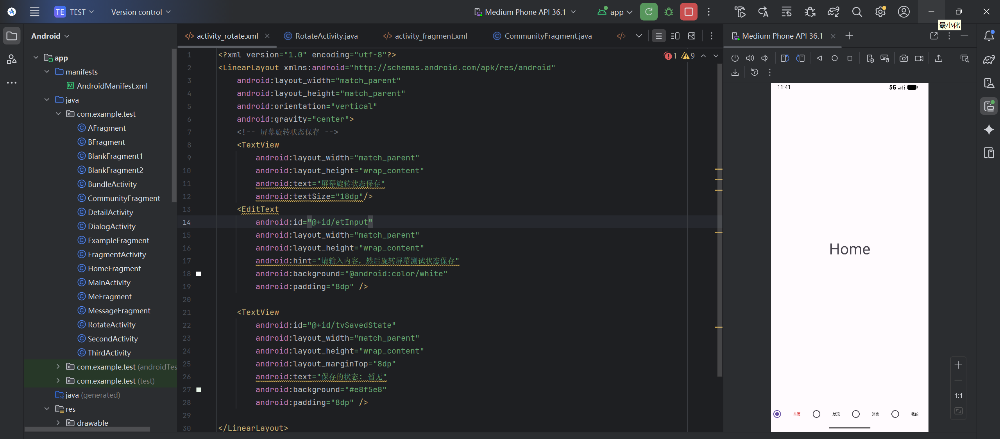
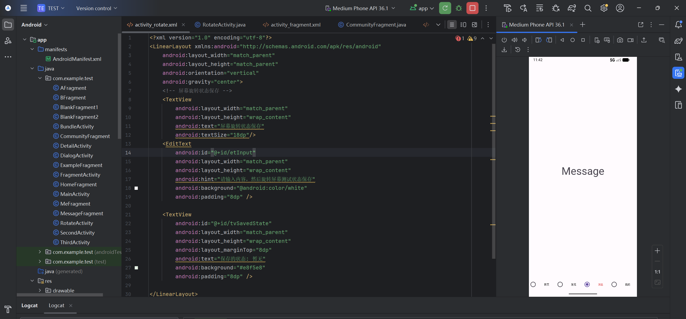
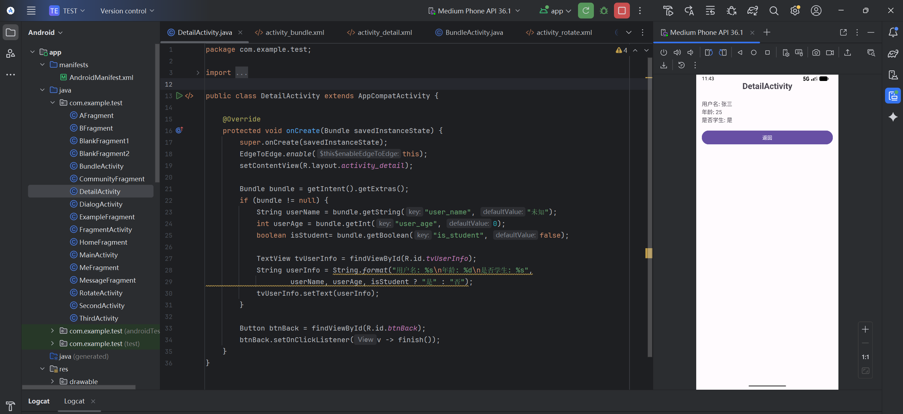
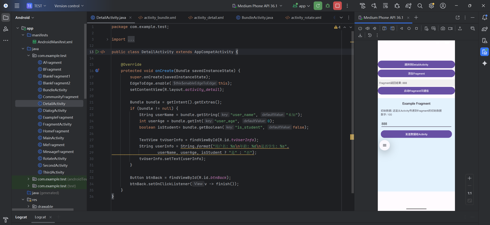
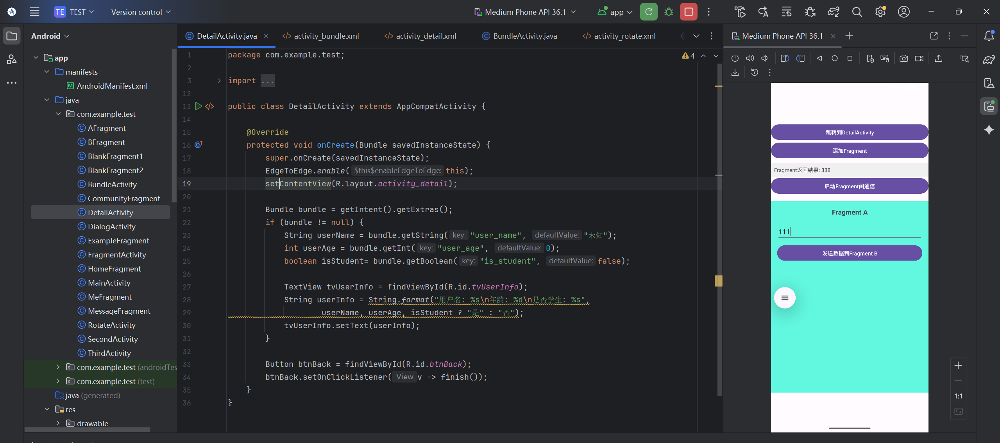
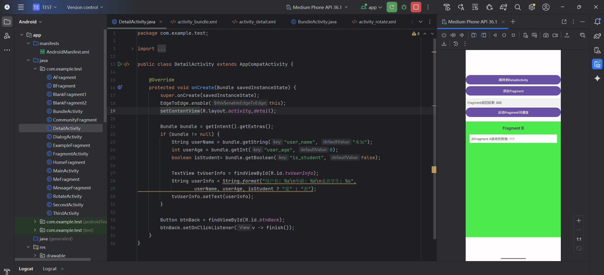
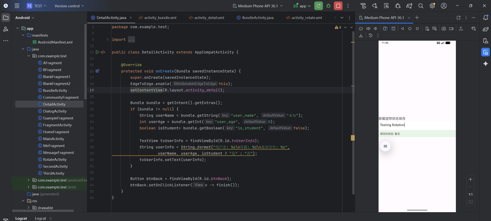
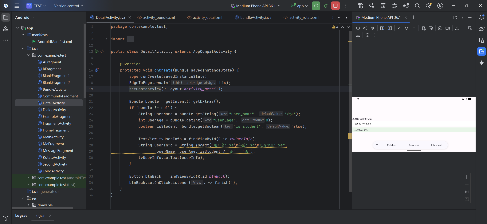

# Android应用开发作业 -  李海怡 42312185

## 实现功能

###  主要功能
- [ ] 功能1：RadioGroup控制Fragment切换
- [ ] 功能2：Bundle数据传输
- [ ] 功能3：屏幕旋转与状态保持

## 运行截图

### 默认打开界面

*图1：RadioGroup切换Fragment默认打开*

### 切换到消息界面  

*图2：切换到消息Fragment*

### 打开Detail界面  

*图3：跳转到DetailActivity界面*

### Activity与Fragment通信  

*图4：Activity与Fragment通信*

### 第一个Fragment

*图5：第一个Fragment*

### 第二个Fragment

*图6：第二个Fragment*

### 正常输入显示

*图7：正常输入显示*

### 旋转屏幕后显示

*图8：旋转屏幕后显示*
