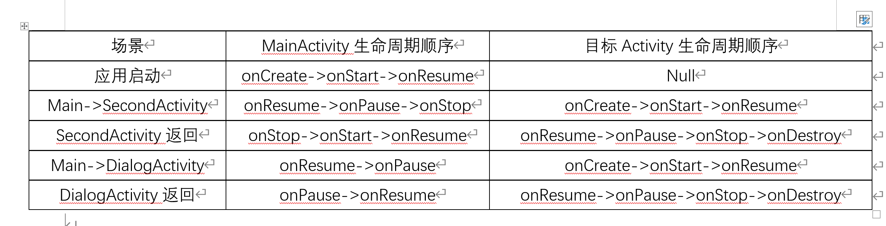
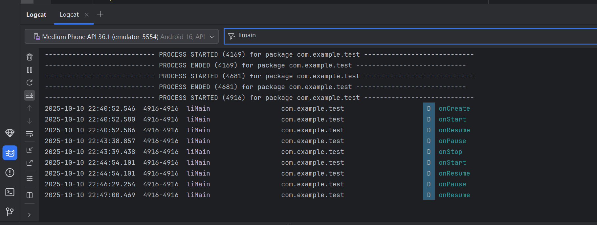
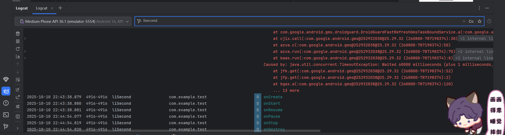
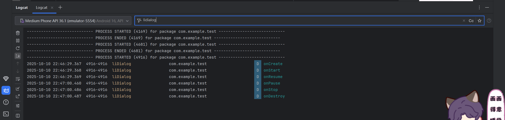

# Android应用开发作业 -  李海怡 42312185

## 项目概述
本次项目主要目的是观察在Activity之间切换时各Activity的生命周期变化

## 运行截图

### 最终结果

### MainActivity

### SecondActivity 

### DialogActivity生命周期

## 总结
通过本次作业，我观察到各Activity切换时会处于不同的生命周期中，对各个生命周期的理解更加深入。
