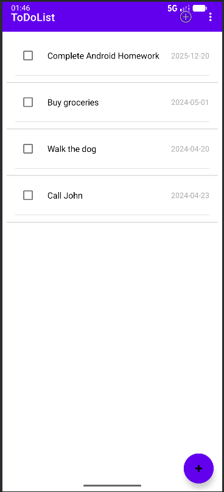
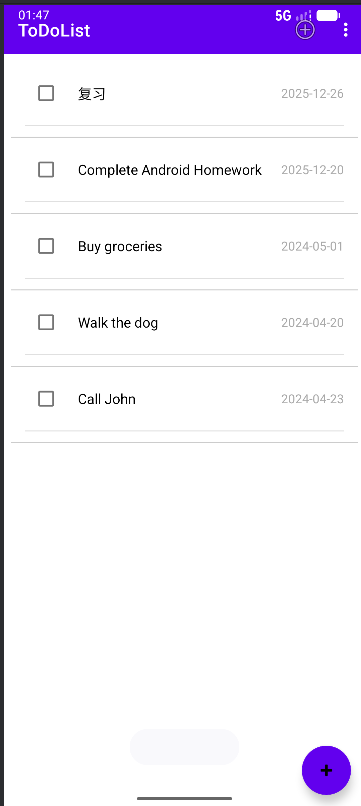
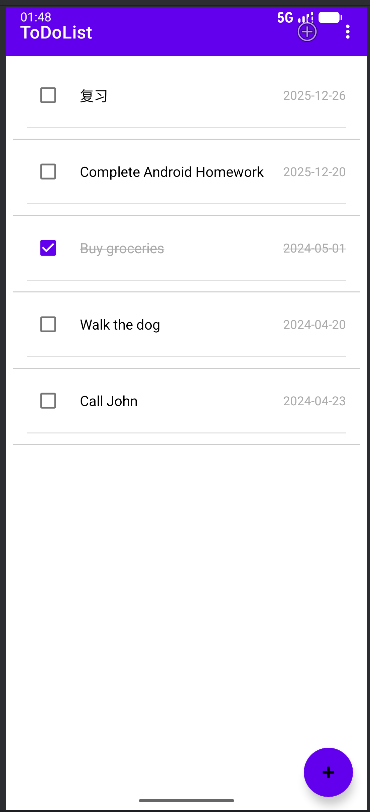
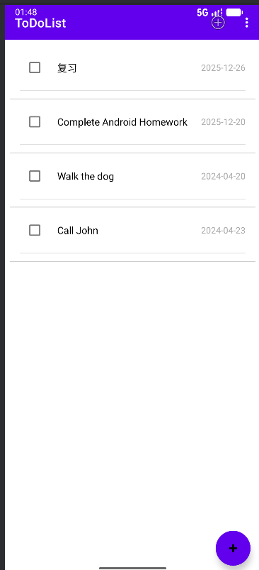

# Android ListView 作业：待办事项清单 (To-Do List App)

## 项目概述
创建一个简单的 Android 待办事项清单应用，使用 `ListView` 展示任务列表。用户可以看到任务列表，包括任务名称和截止日期，并支持基本的交互功能。

## 相关界面

### 1. 主界面布局 (MainActivity)
- 使用 `ListView` 作为任务列表的容器
- 列表中的每一项显示：
  - 任务名称（如："Complete Android Homework"）
  - 截止日期（如："2025-12-20"）
- 列表项之间应有清晰的分隔
- 主界面
  - 

### 2. 数据模型
创建一个 `TaskItem` 类，包含以下属性：
- `taskName`：任务名称（String）
- `dueDate`：截止日期（String）
- 相关代码
  ```java
  package com.example.todolist;

  public class TaskItem {
      private String taskName;
      private String dueDate;
      private boolean isCompleted;
      private int id;
      private static int counter = 0;

      public TaskItem(String taskName, String dueDate) {
          this.taskName = taskName;
          this.dueDate = dueDate;
          this.isCompleted = false;
          this.id = counter++;
      }

      public TaskItem(String taskName, String dueDate, boolean isCompleted) {
          this(taskName, dueDate);
          this.isCompleted = isCompleted;
      }

      public String getTaskName() {
          return taskName;
      }

      public void setTaskName(String taskName) {
          this.taskName = taskName;
      }

      public String getDueDate() {
          return dueDate;
      }

      public void setDueDate(String dueDate) {
          this.dueDate = dueDate;
      }

      public boolean isCompleted() {
          return isCompleted;
      }

      public void setCompleted(boolean completed) {
          isCompleted = completed;
      }

      public int getId() {
          return id;
      }
    }
   ```

### 3. 列表适配器
创建自定义 `TaskAdapter`：
- 自定义列表项布局
- 正确地将数据绑定到列表项的视图上
- 相关代码
  ```java
  package com.example.todolist;

  import android.content.Context;
  import android.os.Handler;
  import android.view.LayoutInflater;
  import android.view.View;
  import android.view.ViewGroup;
  import android.widget.ArrayAdapter;
  import android.widget.CheckBox;
  import android.widget.CompoundButton;
  import android.widget.TextView;
  import androidx.core.content.ContextCompat;

  import java.util.ArrayList;

  public class TaskAdapter extends ArrayAdapter<TaskItem> {

    public interface OnTaskStatusChangedListener {
        void onTaskStatusChanged(int position, boolean isCompleted);
    }

    private OnTaskStatusChangedListener listener;
    private Handler handler = new Handler();

    public TaskAdapter(Context context, ArrayList<TaskItem> tasks) {
        super(context, 0, tasks);
    }

    public void setOnTaskStatusChangedListener(OnTaskStatusChangedListener listener) {
        this.listener = listener;
    }

    @Override
    public View getView(int position, View convertView, ViewGroup parent) {
        // 获取数据项
        final TaskItem task = getItem(position);
        final int taskPosition = position;

        // 检查是否已有可复用的视图
        if (convertView == null) {
            convertView = LayoutInflater.from(getContext()).inflate(R.layout.item_task, parent, false);
        }

        // 获取视图中的控件
        final TextView tvTaskName = convertView.findViewById(R.id.tvTaskName);
        final TextView tvDueDate = convertView.findViewById(R.id.tvDueDate);
        final CheckBox cbTaskStatus = convertView.findViewById(R.id.cbTaskStatus);

        // 移除之前的监听器，避免重复触发
        cbTaskStatus.setOnCheckedChangeListener(null);

        // 设置数据
        if (task != null) {
            tvTaskName.setText(task.getTaskName());
            tvDueDate.setText(task.getDueDate());
            cbTaskStatus.setChecked(task.isCompleted());

            // 根据完成状态设置文本样式
            updateTaskTextStyle(tvTaskName, tvDueDate, task.isCompleted());

            // 设置复选框监听器
            cbTaskStatus.setOnCheckedChangeListener(new CompoundButton.OnCheckedChangeListener() {
                @Override
                public void onCheckedChanged(CompoundButton buttonView, boolean isChecked) {
                    // 更新任务状态
                    task.setCompleted(isChecked);

                    // 通知监听器
                    if (listener != null) {
                        listener.onTaskStatusChanged(taskPosition, isChecked);
                    }

                    // 立即更新文本样式
                    updateTaskTextStyle(tvTaskName, tvDueDate, isChecked);

                    // 如果是选中状态，3秒后删除
                    if (isChecked) {
                        handler.postDelayed(new Runnable() {
                            @Override
                            public void run() {
                                // 从数据源中移除
                                remove(task);
                                // 刷新列表
                                notifyDataSetChanged();
                            }
                        }, 3000); // 3秒延迟
                    }
                }
            });
        }

        return convertView;
    }

    // 更新任务文本样式的方法
    private void updateTaskTextStyle(TextView tvTaskName, TextView tvDueDate, boolean isCompleted) {
        if (isCompleted) {
            // 设置灰色字体和删除线
            tvTaskName.setTextColor(ContextCompat.getColor(getContext(), android.R.color.darker_gray));
            tvTaskName.setPaintFlags(tvTaskName.getPaintFlags() | android.graphics.Paint.STRIKE_THRU_TEXT_FLAG);
            tvDueDate.setTextColor(ContextCompat.getColor(getContext(), android.R.color.darker_gray));
            tvDueDate.setPaintFlags(tvDueDate.getPaintFlags() | android.graphics.Paint.STRIKE_THRU_TEXT_FLAG);
        } else {
            // 恢复原始样式
            tvTaskName.setTextColor(ContextCompat.getColor(getContext(), android.R.color.black));
            tvTaskName.setPaintFlags(tvTaskName.getPaintFlags() & ~android.graphics.Paint.STRIKE_THRU_TEXT_FLAG);
            tvDueDate.setTextColor(ContextCompat.getColor(getContext(), android.R.color.darker_gray));
            tvDueDate.setPaintFlags(tvDueDate.getPaintFlags() & ~android.graphics.Paint.STRIKE_THRU_TEXT_FLAG);
        }
    }
  }
  ```

## 运行效果

### 1. 用户添加任务
- 用户添加任务
  - 

### 2. 添加成功
- 添加成功
  - 

### 3. 勾选完成
- 勾选完成
  - 

### 4. 完成的任务从列表消失
- 完成的任务从列表消失
  - 
