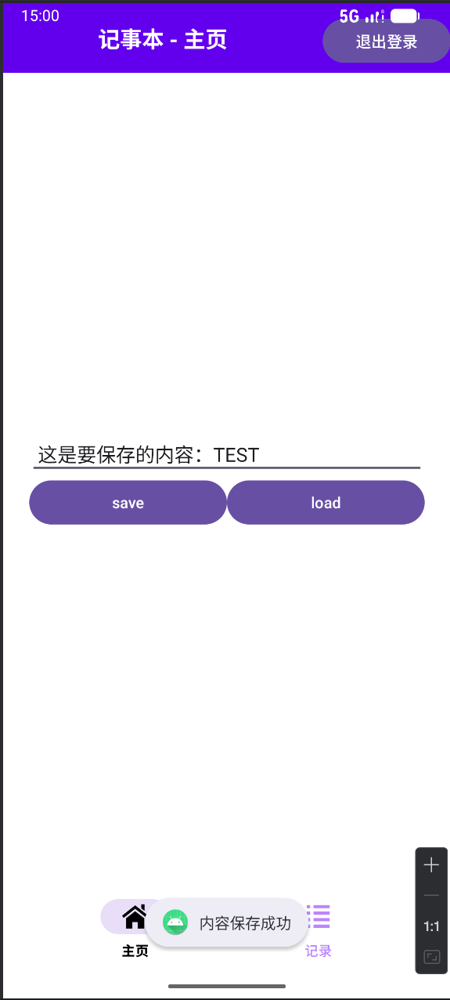
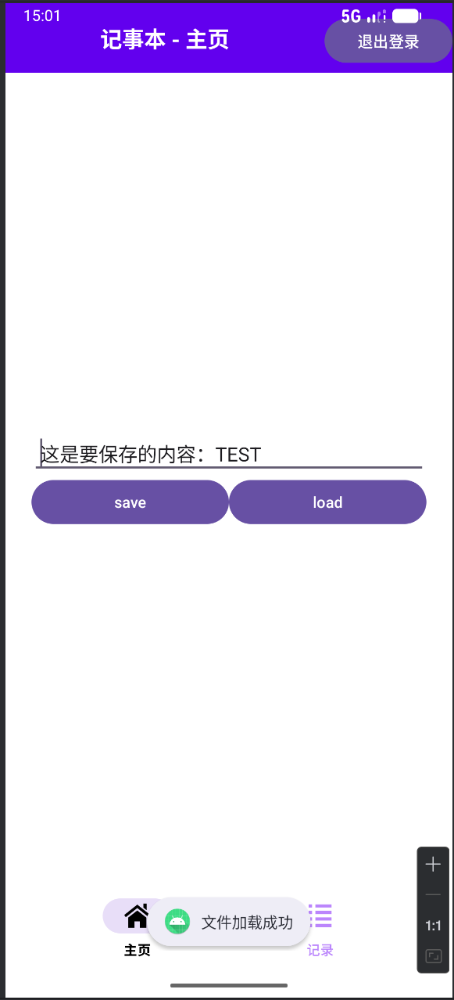
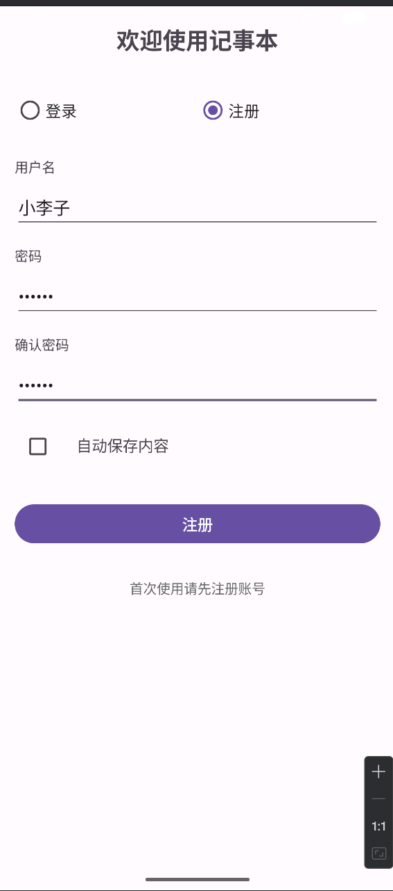
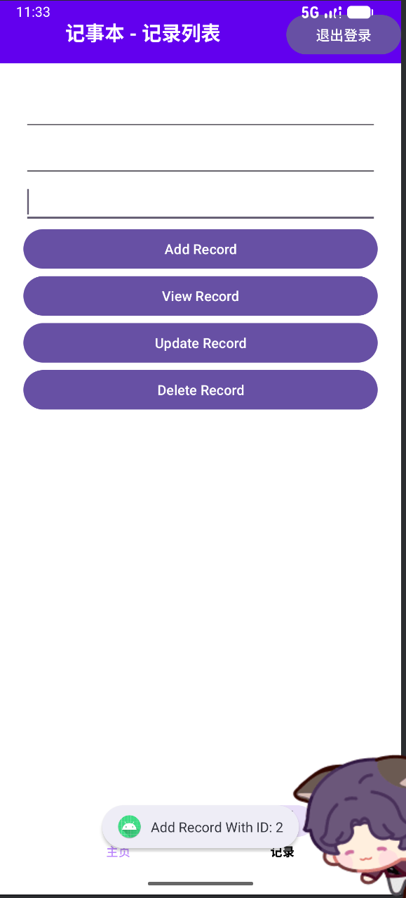
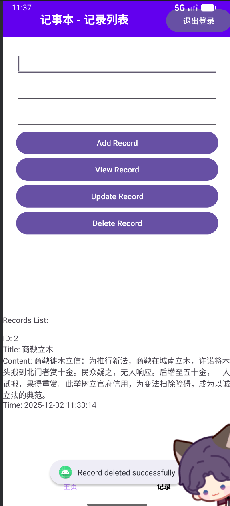
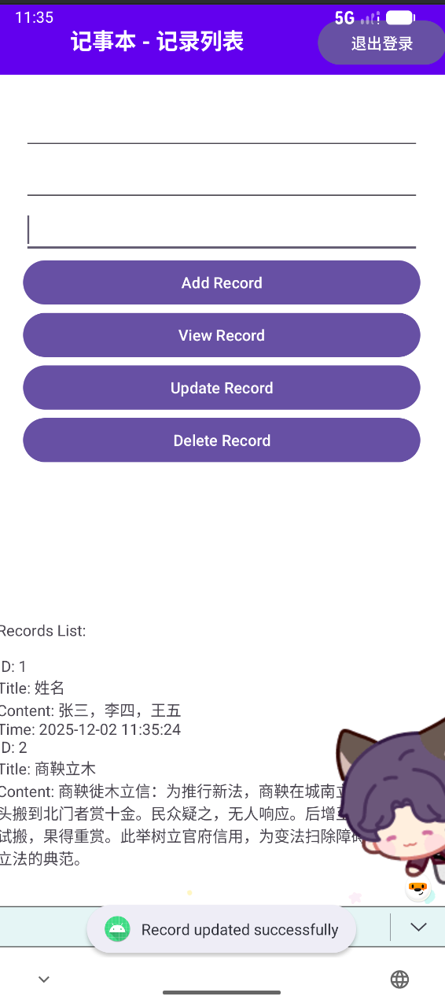
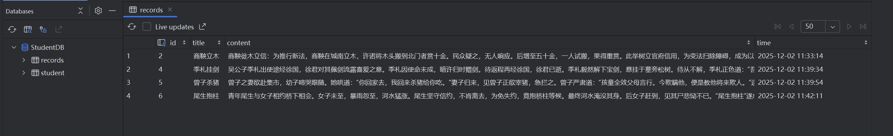

# Android 本地数据持久化综合实验（Java）

## 一、实验目标

通过本实验，学生需要掌握 Android 中三种常用本地数据存储方式：

1. **文件（File）读写：** 使用 `FileInputStream` / `FileOutputStream` 或 `openFileInput` / `openFileOutput` 进行文本文件的保存与加载。
2. **SharedPreferences：** 使用 `getSharedPreferences()` 保存和读取简单的键值对配置数据（实现账户，密码的自动保存和读取）。
3. **SQLite 数据库：** 使用 `SQLiteOpenHelper` 管理数据库，完成基本的增删改查（CRUD）操作。

---

## 二、实验结果

### 1. 文件读写模块（File：Load / Save）

- 保存相关代码
  ```java
  private void saveToFile(){
        String text = editText.getText().toString().trim();

        if(text.isEmpty()){
            Toast.makeText(this, "请输入要保存的内容", Toast.LENGTH_LONG).show();
            return;
        }

        FileOutputStream fileOutputStream = null;
        try{
            fileOutputStream = openFileOutput(FILE_NAME, MODE_PRIVATE);
            fileOutputStream.write(text.getBytes());
            Toast.makeText(this, "内容保存成功", Toast.LENGTH_LONG).show();
        } catch (FileNotFoundException e) {
            e.printStackTrace();
        } catch (IOException e) {
            e.printStackTrace();
        } finally {
            if(fileOutputStream != null){
                try{
                    fileOutputStream.close();
                } catch (IOException e){
                    e.printStackTrace();
                }
            }
        }
    }
  ```

- 保存
  

- 读取相关代码
 ```java
 private void loadFromfile() {
        FileInputStream fileInputStream = null;
        InputStreamReader inputStreamReader = null;
        BufferedReader bufferedReader = null;
        try{
            fileInputStream = openFileInput(FILE_NAME);
            inputStreamReader = new InputStreamReader(fileInputStream);
            bufferedReader = new BufferedReader(inputStreamReader);

            StringBuilder stringBuilder = new StringBuilder();
            String line;
            while((line = bufferedReader.readLine()) != null){
                stringBuilder.append(line)
                        .append("\n");
            }
            if(stringBuilder.length() > 0){
                stringBuilder.setLength(stringBuilder.length()-1);
            }
            editText.setText(stringBuilder.toString());
            Toast.makeText(this, "文件加载成功", Toast.LENGTH_SHORT).show();
        } catch (FileNotFoundException e) {
            e.printStackTrace();
        } catch (IOException e) {
            e.printStackTrace();
            if (e instanceof java.io.FileNotFoundException) {
                Toast.makeText(this, "文件不存在，请先保存文件", Toast.LENGTH_LONG).show();
            } else {
                Toast.makeText(this, "读取文件时发生错误：" + e.getMessage(), Toast.LENGTH_LONG).show();
            }
            e.printStackTrace();
        } finally {
            try{
                if(bufferedReader != null) bufferedReader.close();
                if(inputStreamReader != null) inputStreamReader.close();
                if(fileInputStream != null) fileInputStream.close();
            } catch (IOException e) {
                e.printStackTrace();
            }
        }
    }
```

- 读取
  - 

### 2. 设置模块（SharedPreferences：getSharedPreferences）

- 注册相关代码
  ```java
   private void register(){
        String username = etUserName.getText().toString().trim();
        String password = etPassword.getText().toString().trim();
        String confirmPassword = etConfirmPassword.getText().toString().trim();
        if (username.isEmpty() || password.isEmpty()) {
            Toast.makeText(this, "请输入用户名和密码", Toast.LENGTH_SHORT).show();
            return;
        }

        String savedUsername = sharedPreferences.getString(KEY_USERNAME, "");
        if (username.equals(savedUsername)) {
            Toast.makeText(this, "用户名已存在", Toast.LENGTH_SHORT).show();
            return;
        }

        if (!password.equals(confirmPassword)) {
            Toast.makeText(this, "两次输入的密码不一致", Toast.LENGTH_SHORT).show();
            return;
        }

        if (password.length() < 6) {
            Toast.makeText(this, "密码长度至少6位", Toast.LENGTH_SHORT).show();
            return;
        }

        SharedPreferences.Editor editor = sharedPreferences.edit();
        editor.putString(KEY_USERNAME, username);
        editor.putString(KEY_PASSWORD, password);
        editor.apply();

        saveAutoSaveSetting();

        rbLogin.setChecked(true);
        updateUIForLogin();

        Toast.makeText(this, "注册成功！请使用新账号登录", Toast.LENGTH_SHORT).show();
    }
  ```

- 注册成功
  - 
  
- 登录相关代码
  ```java
   private void login(){
        String username = etUserName.getText().toString().trim();
        String password = etPassword.getText().toString().trim();

        if(username.isEmpty() || password.isEmpty()){
            Toast.makeText(this, "请输入用户名和密码", Toast.LENGTH_LONG).show();
            return;
        }
        String savedUsername = sharedPreferences.getString(KEY_USERNAME, "");
        String savedPassword = sharedPreferences.getString(KEY_PASSWORD, "");

        if(username.equals(savedUsername) && password.equals(savedPassword)){
            saveLoginState(true);
            saveAutoSaveSetting();
            goToMainActivity();
            Toast.makeText(this, "登录成功！", Toast.LENGTH_LONG).show();
        } else {
            Toast.makeText(this, "用户名或密码错误", Toast.LENGTH_SHORT).show();
        }
    }
  ```
  
- 登录成功
  - 

### 3. 数据库模块（SQLite）

- 新建一个“记录列表”界面，用来展示用户保存的多条记录。
- 核心代码(编写一个继承自 `SQLiteOpenHelper` 的帮助类)
     ```java
    public class MyDBHelper  extends SQLiteOpenHelper {
    private static final String DATABASE_NAME = "StudentDB";
    private static final int DATABASE_VERSION = 2;
    private static final String TABLE_NAME = "records";
    private static final String COLUMN_ID = "id";
    private static final String COLUMN_TITLE = "title";
    private static final String COLUMN_CONTENT = "content";
    private static final String COLUMN_TIME = "time";

    public MyDBHelper(Context context){
        super(context, DATABASE_NAME, null, DATABASE_VERSION);
    }

    public void onCreate(SQLiteDatabase db){
        String CREATE_TABLE = "CREATE TABLE " + TABLE_NAME +" ( " +
                COLUMN_ID + " INTEGER PRIMARY KEY AUTOINCREMENT, " +
                COLUMN_TITLE + " TEXT, "+
                COLUMN_CONTENT + " TEXT, "+
                COLUMN_TIME + " TEXT) ";
        db.execSQL(CREATE_TABLE);
    }
    public Cursor getRecordById(int id){
        SQLiteDatabase db = this.getReadableDatabase();
        return db.rawQuery("SELECT * FROM " + TABLE_NAME + " WHERE " +
                COLUMN_ID + " = ?", new String[]{String.valueOf(id)});
    }
    public long addRecord(String title, String content){
        SQLiteDatabase db =this.getWritableDatabase();
        ContentValues values = new ContentValues();
        Long timeStamp = System.currentTimeMillis();
        String time = formatTime(timeStamp);
        values.put(COLUMN_TITLE, title);
        values.put(COLUMN_CONTENT, content);
        values.put(COLUMN_TIME, time);
        return  db.insert(TABLE_NAME, null, values);
    }
    private String formatTime(long timeStamp){
        try{
            SimpleDateFormat simpleDateFormat = new SimpleDateFormat("yyyy-MM-dd HH:mm:ss", Locale.getDefault());
            return simpleDateFormat.format(new Date(timeStamp));
        } catch (Exception e) {
            return "Invalid Time";
        }
    }
    public Cursor getAllRecord(){
        SQLiteDatabase db = this.getReadableDatabase();
        return db.rawQuery("SELECT * FROM " + TABLE_NAME, null);
    }
    public int updateStudent(int id, String title, String content){
        SQLiteDatabase db = this.getWritableDatabase();
        ContentValues values = new ContentValues();
        Long timeStamp = System.currentTimeMillis();
        String time = formatTime(timeStamp);
        values.put(COLUMN_TITLE, title);
        values.put(COLUMN_CONTENT, content);
        values.put(COLUMN_TIME, time);
        return db.update(TABLE_NAME, values,
                COLUMN_ID + " = ?", new String[]{String.valueOf(id)});
    }

    public int deleteRecord(int id){
        SQLiteDatabase db = this.getWritableDatabase();
        return db.delete(TABLE_NAME,
                COLUMN_ID + " = ?", new String[]{String.valueOf(id)});
    }
    @Override
    public void onUpgrade(SQLiteDatabase db, int oldVersion, int newVersion) {
        // 创建新表
        onCreate(db);
    }
}
     ```
- 实验截图
  - 

  - 

  - 

  - .png)

  - .png)

  - 
  
---

## 三、实验总结

- 通过本次实验，初步掌握在AndroidStudio中对数据库进行操作的方法
- 提供本次实验，初步掌握了在本机文件中写入数据，并从指定文件读取文件的方法


