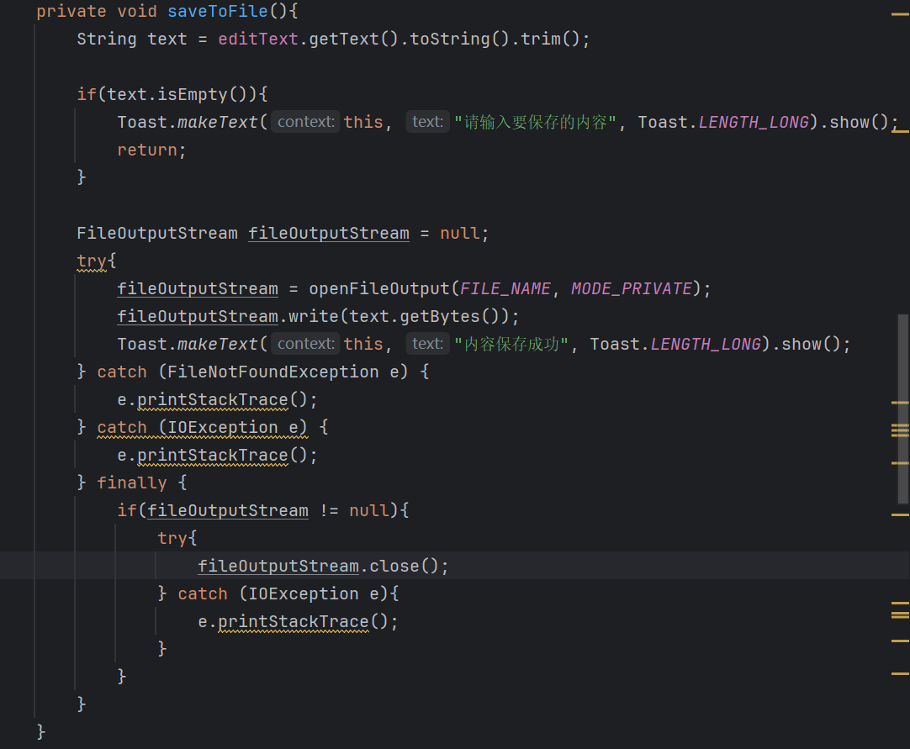
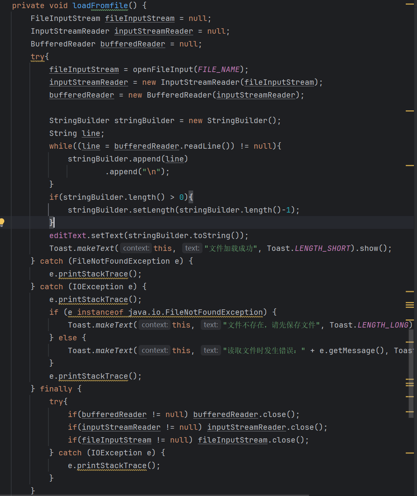
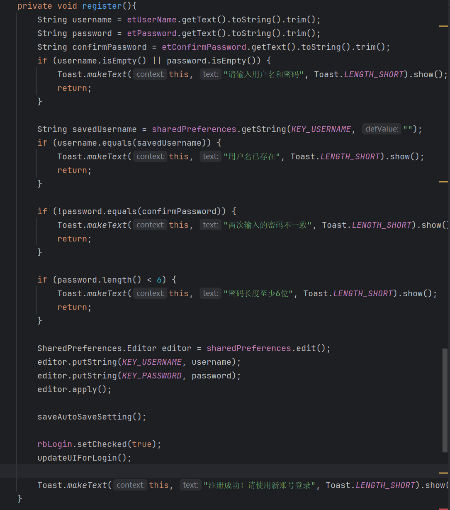
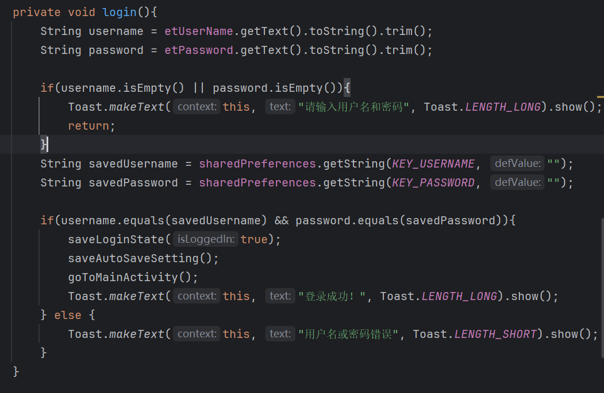

# Android 本地数据持久化综合实验（Java）

## 一、实验目标

通过本实验，学生需要掌握 Android 中三种常用本地数据存储方式：

1. **文件（File）读写：** 使用 `FileInputStream` / `FileOutputStream` 或 `openFileInput` / `openFileOutput` 进行文本文件的保存与加载。
2. **SharedPreferences：** 使用 `getSharedPreferences()` 保存和读取简单的键值对配置数据（实现账户，密码的自动保存和读取）。
3. **SQLite 数据库：** 使用 `SQLiteOpenHelper` 管理数据库，完成基本的增删改查（CRUD）操作。

---

## 二、实验结果

### 1. 文件读写模块（File：Load / Save）

- 保存相关代码
  

- 保存
  

- 读取相关代码
  

- 读取
  

### 2. 设置模块（SharedPreferences：getSharedPreferences）

- 注册相关代码
  

- 注册成功
  
  
- 登录相关代码
  
  
- 登录成功
  

### 3. 数据库模块（SQLite）

- 新建一个“记录列表”界面，用来展示用户保存的多条记录。
- 核心代码(编写一个继承自 `SQLiteOpenHelper` 的帮助类)
     ```java
    public class MyDBHelper  extends SQLiteOpenHelper {
    private static final String DATABASE_NAME = "StudentDB";
    private static final int DATABASE_VERSION = 2;
    private static final String TABLE_NAME = "records";
    private static final String COLUMN_ID = "id";
    private static final String COLUMN_TITLE = "title";
    private static final String COLUMN_CONTENT = "content";
    private static final String COLUMN_TIME = "time";

    public MyDBHelper(Context context){
        super(context, DATABASE_NAME, null, DATABASE_VERSION);
    }

    public void onCreate(SQLiteDatabase db){
        String CREATE_TABLE = "CREATE TABLE " + TABLE_NAME +" ( " +
                COLUMN_ID + " INTEGER PRIMARY KEY AUTOINCREMENT, " +
                COLUMN_TITLE + " TEXT, "+
                COLUMN_CONTENT + " TEXT, "+
                COLUMN_TIME + " TEXT) ";
        db.execSQL(CREATE_TABLE);
    }
    public Cursor getRecordById(int id){
        SQLiteDatabase db = this.getReadableDatabase();
        return db.rawQuery("SELECT * FROM " + TABLE_NAME + " WHERE " +
                COLUMN_ID + " = ?", new String[]{String.valueOf(id)});
    }
    public long addRecord(String title, String content){
        SQLiteDatabase db =this.getWritableDatabase();
        ContentValues values = new ContentValues();
        Long timeStamp = System.currentTimeMillis();
        String time = formatTime(timeStamp);
        values.put(COLUMN_TITLE, title);
        values.put(COLUMN_CONTENT, content);
        values.put(COLUMN_TIME, time);
        return  db.insert(TABLE_NAME, null, values);
    }
    private String formatTime(long timeStamp){
        try{
            SimpleDateFormat simpleDateFormat = new SimpleDateFormat("yyyy-MM-dd HH:mm:ss", Locale.getDefault());
            return simpleDateFormat.format(new Date(timeStamp));
        } catch (Exception e) {
            return "Invalid Time";
        }
    }
    public Cursor getAllRecord(){
        SQLiteDatabase db = this.getReadableDatabase();
        return db.rawQuery("SELECT * FROM " + TABLE_NAME, null);
    }
    public int updateStudent(int id, String title, String content){
        SQLiteDatabase db = this.getWritableDatabase();
        ContentValues values = new ContentValues();
        Long timeStamp = System.currentTimeMillis();
        String time = formatTime(timeStamp);
        values.put(COLUMN_TITLE, title);
        values.put(COLUMN_CONTENT, content);
        values.put(COLUMN_TIME, time);
        return db.update(TABLE_NAME, values,
                COLUMN_ID + " = ?", new String[]{String.valueOf(id)});
    }

    public int deleteRecord(int id){
        SQLiteDatabase db = this.getWritableDatabase();
        return db.delete(TABLE_NAME,
                COLUMN_ID + " = ?", new String[]{String.valueOf(id)});
    }
    @Override
    public void onUpgrade(SQLiteDatabase db, int oldVersion, int newVersion) {
        // 创建新表
        onCreate(db);
    }
}
     ```
- 实验截图
  
   

---

## 三、界面与交互设计建议

- 至少包含 3 个 Activity（或使用 Fragment）：
  1. **MainActivity**：文本编辑 + 文件读写 + “保存为记录”按钮。
  2. **SettingsActivity**：应用设置界面（使用 SharedPreferences）。
  3. **RecordListActivity**：显示 SQLite 中的记录列表，可点击进入详情。
- 在主界面中通过菜单（`OptionsMenu` 或 `Toolbar`）跳转到“设置”和“记录列表”。

---

## 四、实现提示（关键代码片段示例）

### 1. SharedPreferences 读写示例

```java
// 写入
SharedPreferences sp = getSharedPreferences("settings", MODE_PRIVATE);
SharedPreferences.Editor editor = sp.edit();
editor.putBoolean("auto_save", switchAutoSave.isChecked());
editor.putString("user_name", editUserName.getText().toString());
editor.apply();

// 读取
SharedPreferences sp = getSharedPreferences("settings", MODE_PRIVATE);
boolean autoSave = sp.getBoolean("auto_save", false);
String userName = sp.getString("user_name", "Guest");
