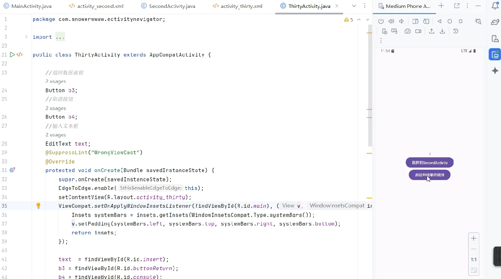

# Activity Navigator2页面间跳转

## 项目概述
本项目是一个名为"Activity Navigator2"的Android应用，旨在演示Android中Activity之间的三种基本跳转方式：显式跳转、隐式跳转和带返回结果的跳转。应用包含三个核心Activity：MainActivity、SecondActivity和ThirdActivity。

## 功能特性
- **显式跳转**：从MainActivity直接跳转到SecondActivity
- **隐式跳转**：通过自定义Action从SecondActivity跳转到MainActivity  
- **带返回结果的跳转**：从ThirdActivity返回数据到MainActivity
- **附加功能**：长按提示和取消操作处理

## 实现详情

### 1. 显式跳转实现
**布局文件**：在MainActivity的布局中添加跳转按钮
**代码实现**：使用显式Intent启动SecondActivity
```
if(v.getId() == R.id.button1){
                    Toast.makeText(MainActivity.this, "触发成功", Toast.LENGTH_SHORT).show();
                    Intent it = new Intent(MainActivity.this,SecondActivity.class);
                    startActivity(it);
                }
```
**返回实现**：SecondActivity中通过finish()方法返回
```
if(v.getId() == R.id.button2){
                    Intent it = new Intent(SecondActivity.this,MainActivity.class);
                    startActivity(it);
                }
```

### 2. 隐式跳转实现
**Intent配置**：在SecondActivity中设置自定义Action和Category
```
// SecondActivity.java
 if(v.getId() == R.id.button3){
                    Toast.makeText(SecondActivity.this, "已点击", Toast.LENGTH_SHORT).show();
                    Intent it = new Intent();
                    it.setAction(action);
                    it.addCategory(category);
                    startActivity(it);

                }
```
**Manifest配置**：为MainActivity添加intent-filter
```
<activity
        android:name=".MainActivity"
        android:exported="true">
        <intent-filter>
            <action android:name="android.intent.action.MAIN" />
            <category android:name="android.intent.category.LAUNCHER" />
        </intent-filter>
    </activity>
```
### 3. 带返回结果的跳转
**启动Activity**：使用startActivityForResult方法

**长按功能**：实现长按监听器显示Toast提示
```
resultButton.setOnLongClickListener(v -> {
Toast.makeText(MainActivity.this, "长按启动了带返回结果的跳转！",
Toast.LENGTH_SHORT).show();
return true;
});
```
**返回结果处理**：在ThirdActivity中设置返回数据
```
// ThirdActivity.java
b3.setOnClickListener(new View.OnClickListener() {
                @Override
                public void onClick(View v) {
                    Intent it = new Intent();
                    it.putExtra("result" , text.getText().toString());
                    setResult(1,it);
                    finish();
                }
            });

        
```
**结果接收**：在MainActivity中重写onActivityResult
```
// MainActivity.java
 @Override
    protected void onActivityResult(int requestCode , int resultCode , @Nullable Intent data){
        super.onActivityResult(requestCode, resultCode, data);
        if(resultCode == 1){
            if(requestCode == 1){
                String result = data.getStringExtra("result");
                text.setText(result);
                System.out.println("返回结果");
            }if(requestCode == 2){
                System.out.println("返回取消");
            }
        }
    }
```
**取消功能**：ThirdActivity中的取消操作
```
//取消返回，返回码为2
        b4.setOnClickListener(new View.OnClickListener() {
            @Override
            public void onClick(View v) {
                Intent it = new Intent();
                setResult(2,it);
                finish();
            }
        });
```
## 运行截图
*

1. **MainActivity界面截图**  
   *主界面包含跳转到SecondActivity和启动带结果跳转的按钮*
2. **SecondActivity界面截图**  
2.   
   *显示显式跳转和隐式跳转按钮*
3. **ThirdActivity界面截图**  
     
   *包含输入框和返回结果按钮*
4. **长按效果展示**  
   
5. **返回效果展示**  
    


