## 
课程作业1

### **第一部分：显式跳转**

1. 在 `MainActivity` 的布局文件中，添加一个名为 **"跳转到 SecondActivity"** 的按钮。
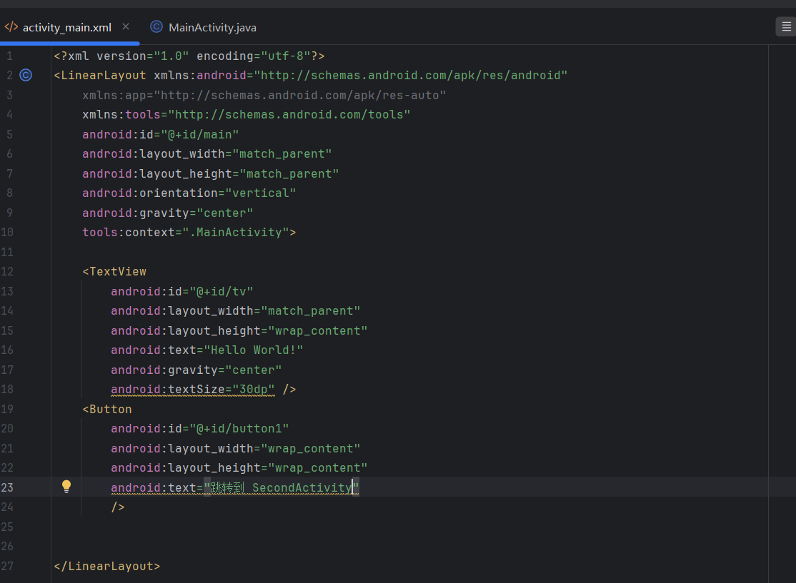
2. 在 `MainActivity` 的代码中，为该按钮设置点击事件监听器。

3. 在点击事件中，使用**显式Intent**（`Intent(Context packageContext, Class<?> cls)`）启动 `SecondActivity`。
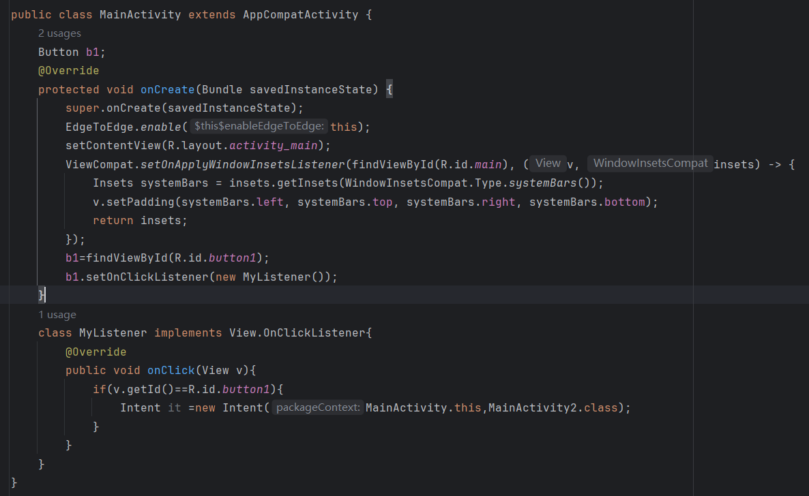
4. 在 `SecondActivity` 的布局文件中，添加一个名为 **"返回到主页"** 的按钮。
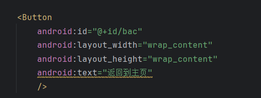
5. 在 `SecondActivity` 的代码中，为该按钮设置点击事件，并使用 `finish()` 方法结束当前Activity，返回到 `MainActivity`。
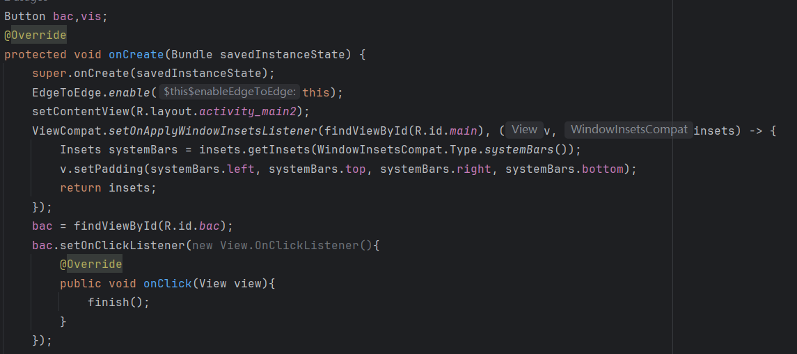

### **第二部分：隐式跳转**

1. 在 `SecondActivity` 的布局文件中，添加一个名为 **"隐式跳转"** 的按钮。
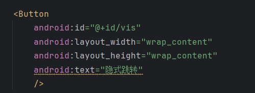
2. 在 `SecondActivity` 的代码中，为该按钮设置点击事件监听器。
3. 在点击事件中，创建一个**隐式Intent**。
    - **Action:** 自定义一个字符串常量，例如 `"com.example.action.VIEW_THIRD_ACTIVITY"`。
    - **Category:** `Intent.CATEGORY_DEFAULT`。
    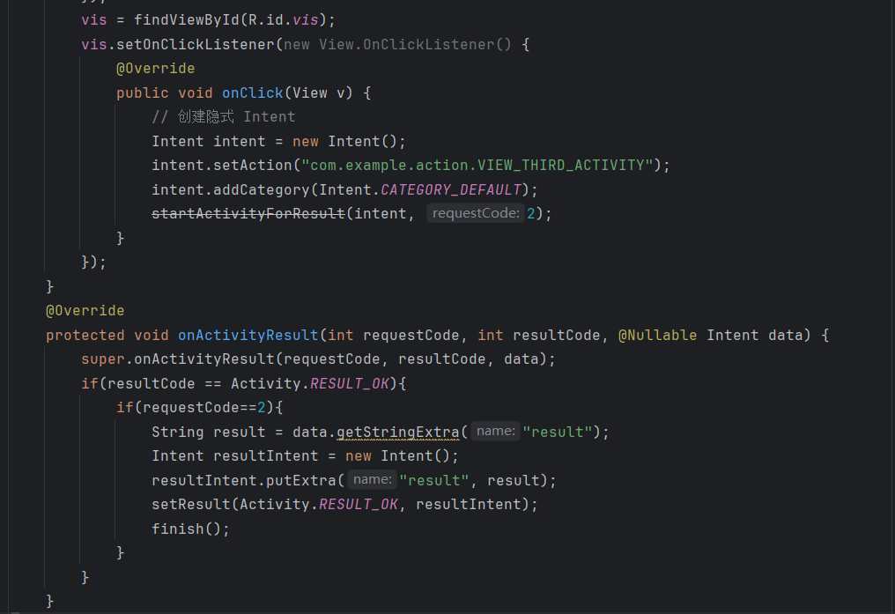
4. 在 `AndroidManifest.xml` 文件中，为 `ThirdActivity` 的 `<activity>` 标签添加一个 `<intent-filter>`。
    - `action` 标签的 `android:name` 属性设置为你在上一步中定义的 Action。
    - `category` 标签的 `android:name` 属性设置为 `android.intent.category.DEFAULT`。
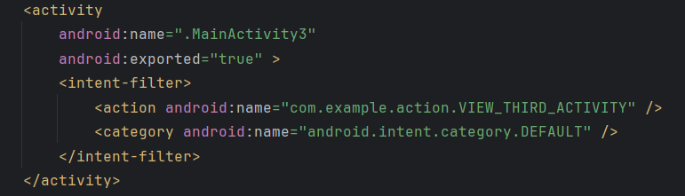
5. 运行应用，点击“隐式跳转”按钮，确认可以成功启动 `ThirdActivity`。

### **第三部分：带返回结果的跳转**

1. 在 `MainActivity` 的布局文件中，添加一个名为 **"启动带结果的跳转"** 的按钮，以及一个用于显示返回结果的 `TextView`。
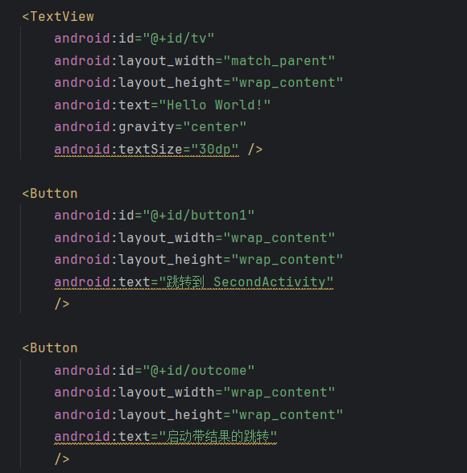
2. 在 `MainActivity` 的代码中，为该按钮设置点击事件监听器。
3. 在点击事件中，使用 **`startActivityForResult()`** 方法启动 `ThirdActivity`。
    - 为这个跳转设置一个唯一的请求码（`requestCode`），例如 `101`。
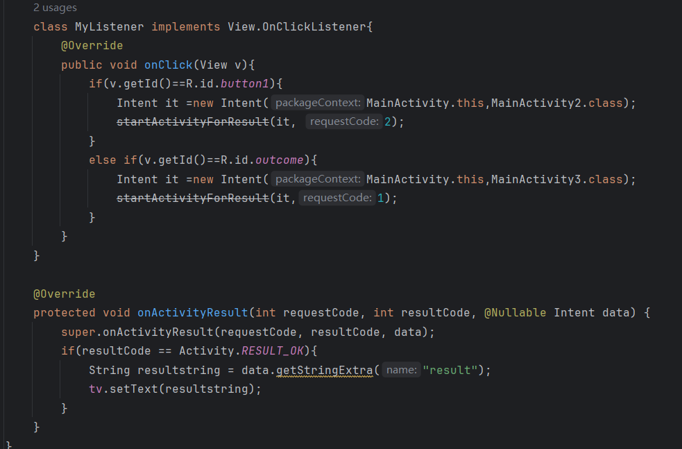
4. 在 `ThirdActivity` 的布局文件中，添加一个 `EditText` 和一个名为 **"返回结果"** 的按钮。
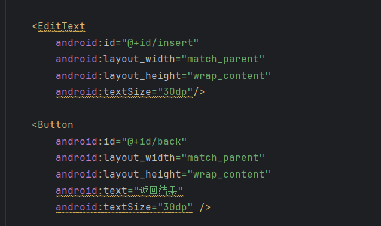
5. 在 `ThirdActivity` 的代码中，为**“返回结果”**按钮设置点击事件。
6. 在点击事件中，创建一个新的 `Intent` 对象，并将 `EditText` 中的文本作为额外数据（Extra）放入Intent中。
    - 例如：`intent.putExtra("result_data", "你输入的文本")`。
7. 使用 **`setResult(int resultCode, Intent data)`** 方法设置返回结果。
    - `resultCode` 设置为 `Activity.RESULT_OK`。
8. 调用 `finish()` 方法结束 `ThirdActivity`。
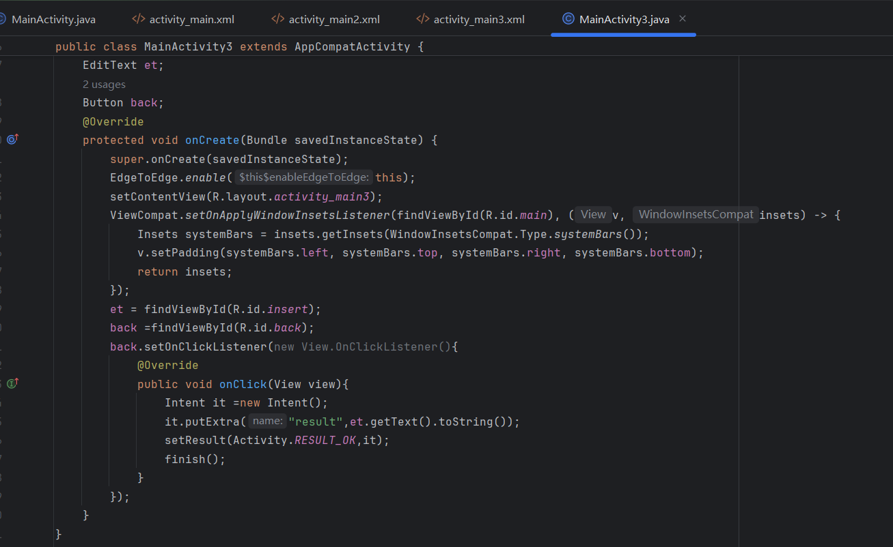
9. 回到 `MainActivity`，重写 **`onActivityResult(int requestCode, int resultCode, Intent data)`** 方法。
10. 在 `onActivityResult` 方法中，根据 `requestCode` 和 `resultCode` 判断是否为预期的返回结果。如果是，从 `data` Intent 中获取返回的文本数据，并更新 `MainActivity` 的 `TextView`。
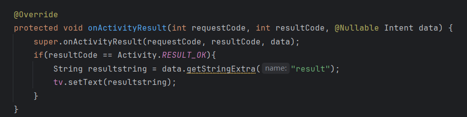
### **加分项**

- 在 `MainActivity` 中，为 “启动带结果的跳转” 按钮添加一个长按监听器。
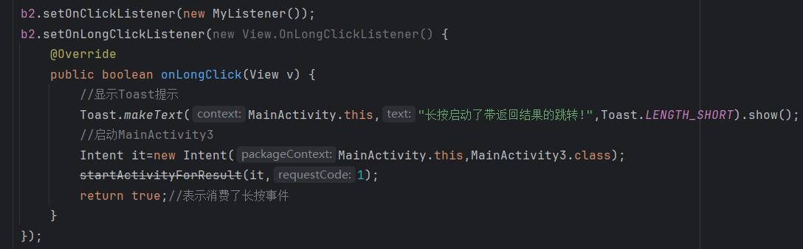
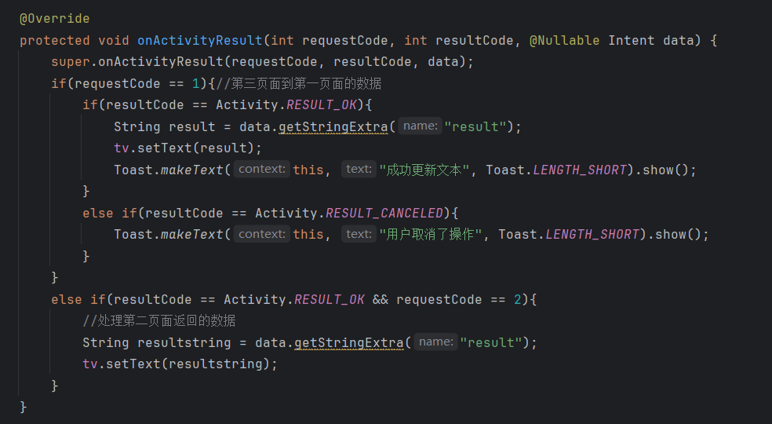
- 长按按钮时，弹出一个 `Toast` 提示用户“长按启动了带返回结果的跳转！”。
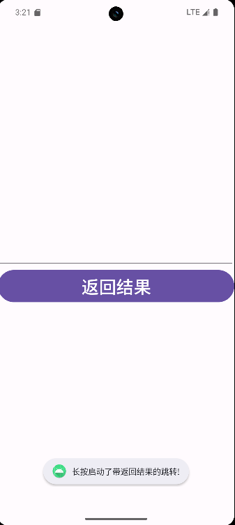
- 在 `ThirdActivity` 中，添加一个名为 **"返回取消"** 的按钮。点击后，使用 `setResult(Activity.RESULT_CANCELED)` 并 `finish()`，在 `MainActivity` 的 `onActivityResult` 中处理这个取消操作。
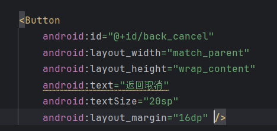
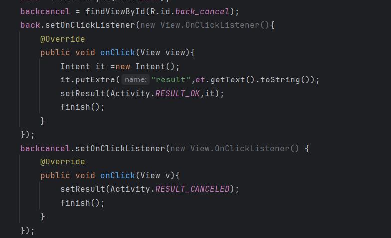
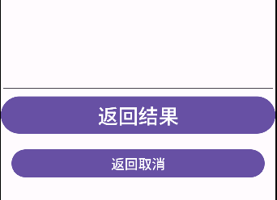

