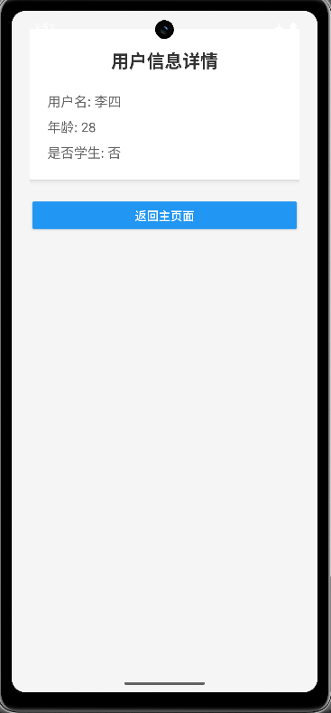
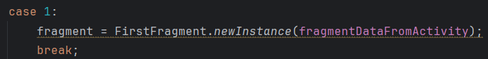
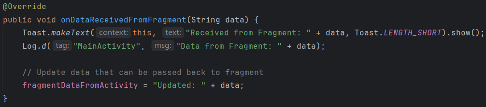
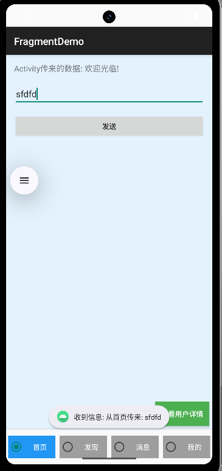
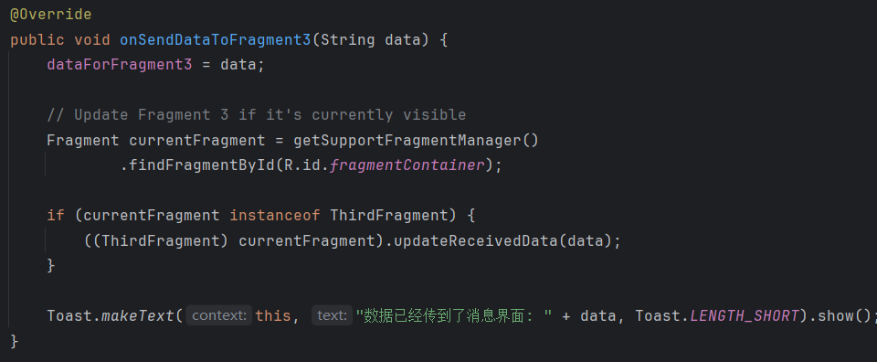
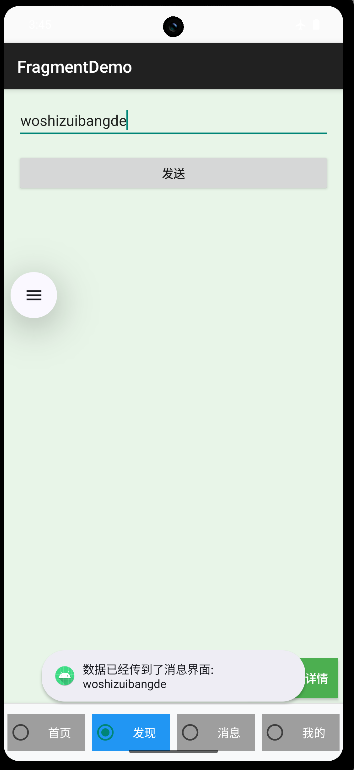
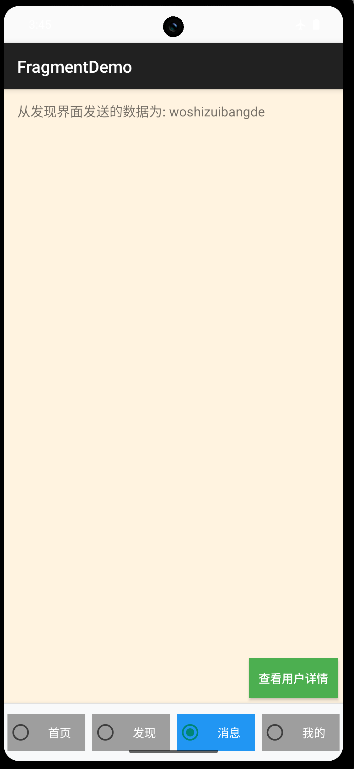
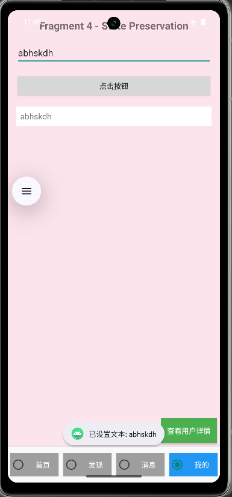
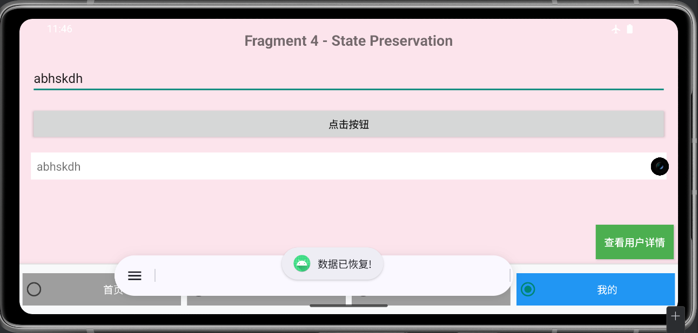

## 功能要求

### 1. RadioGroup 控制 Fragment 切换
**要求：**
- 创建包含 4 个 RadioButton 的 RadioGroup
- 每个 RadioButton 对应一个不同的 Fragment
- 点击 RadioButton 时切换到对应的 Fragment
- 每个 Fragment 要有独特的UI和功能区分
```xml
<RadioGroup
            android:id="@+id/radioGroup"
            android:layout_width="match_parent"
            android:layout_height="wrap_content"
            android:orientation="horizontal"
            android:gravity="center"
            android:paddingVertical="8dp">

            <RadioButton
                android:id="@+id/radioFragment1"
                android:layout_width="0dp"
                android:layout_height="wrap_content"
                android:layout_weight="1"
                android:background="@drawable/radio_button_selector"
                android:padding="12dp"
                android:textColor="@color/white"
                android:gravity="center"
                android:layout_margin="4dp"
                android:text="首页"
                android:textSize="14sp" />

            <RadioButton
                android:id="@+id/radioFragment2"
                android:layout_width="0dp"
                android:layout_height="wrap_content"
                android:layout_weight="1"
                android:background="@drawable/radio_button_selector"
                android:padding="12dp"
                android:textColor="@color/white"
                android:gravity="center"
                android:layout_margin="4dp"
                android:text="发现"
                android:textSize="14sp" />

            <RadioButton
                android:id="@+id/radioFragment3"
                android:layout_width="0dp"
                android:layout_height="wrap_content"
                android:layout_weight="1"
                android:background="@drawable/radio_button_selector"
                android:padding="12dp"
                android:textColor="@color/white"
                android:gravity="center"
                android:layout_margin="4dp"
                android:text="消息"
                android:textSize="14sp" />

            <RadioButton
                android:id="@+id/radioFragment4"
                android:layout_width="0dp"
                android:layout_height="wrap_content"
                android:layout_weight="1"
                android:background="@drawable/radio_button_selector"
                android:padding="12dp"
                android:textColor="@color/white"
                android:gravity="center"
                android:layout_margin="4dp"
                android:text="我的"
                android:textSize="14sp" />

        </RadioGroup>
```

- res/drawable/radio_button_selector.xml 定义背景选择器,定义radiobutton是否check的状态
- 在style中定义radiobutton统一样式
```xml
<?xml version="1.0" encoding="utf-8"?>
<selector xmlns:android="http://schemas.android.com/apk/res/android">
    <item android:drawable="@color/selected_color" android:state_checked="true" />
    <item android:drawable="@color/normal_color" android:state_checked="false" />
</selector>
```


### 2. Bundle 数据传输
**要求实现三种场景：**

**场景 A: Activity → Activity**
从 MainActivity 传递用户数据到 DetailActivity，包含：用户名、年龄、是否学生等信息
```cpp
 private void addTestButton() {
        FrameLayout fragmentContainer = findViewById(R.id.fragmentContainer);

        Button btnTest = new Button(this);
        btnTest.setText("查看用户详情");
        btnTest.setBackgroundColor(Color.parseColor("#4CAF50"));
        btnTest.setTextColor(Color.WHITE);

        FrameLayout.LayoutParams params = new FrameLayout.LayoutParams(
                FrameLayout.LayoutParams.WRAP_CONTENT,
                FrameLayout.LayoutParams.WRAP_CONTENT
        );
        params.gravity = Gravity.BOTTOM | Gravity.END;
        params.setMargins(0, 0, 16, 16);
        btnTest.setLayoutParams(params);

        btnTest.setOnClickListener(v -> {
            Intent intent = new Intent(MainActivity.this, DetailActivity.class);

            Bundle bundle = new Bundle();
            bundle.putString("user_name", "李四"); 
            bundle.putInt("user_age", 28); 
            bundle.putBoolean("is_student", false); 

            intent.putExtras(bundle);
            startActivity(intent);
        });

        fragmentContainer.addView(btnTest);
    }
    
```

**场景 B: Activity ↔ Fragment**
MainActivity 向 Fragment 传递初始数据，Fragment 向 Activity 返回处理结果




**场景 C: Fragment → Fragment**
在两个 Fragment 之间通过 Activity 中转传递数据




### 3. 屏幕旋转与状态保存 onSaveInstanceState
**要求：**
- log onSaveInstanceState的在生命周期的哪个阶段出现

可以看出：出现在Mainactivity的onStart之后，onResume之前
- 在onSaveInstanceState中保存edittext中内容，并在屏幕旋转后实现在textview中进行展示


实现的主要代码在Manifest.xml和FourthFragment.java
给出部分代码
```cpp
    private static final String KEY_DISPLAY_TEXT = "display_text";
    private static final String KEY_INPUT_TEXT = "input_text";

    private EditText etInput;
    private TextView tvDisplay;
    private Button btnShowText;

    @Override
    public View onCreateView(LayoutInflater inflater, ViewGroup container,
                             Bundle savedInstanceState) {
        Log.d("FourthFragment", "onCreateView 开始");

        View view = inflater.inflate(R.layout.fragment_fourth, container, false);
        
        etInput = view.findViewById(R.id.etInput);
        tvDisplay = view.findViewById(R.id.tvDisplay);
        btnShowText = view.findViewById(R.id.btnShowText);

        Log.d("FourthFragment", "视图初始化完成");

        // 恢复保存的状态
        if (savedInstanceState != null) {
            String savedDisplayText = savedInstanceState.getString(KEY_DISPLAY_TEXT, "");
            String savedInputText = savedInstanceState.getString(KEY_INPUT_TEXT, "");

            Log.d("FourthFragment", "从Bundle恢复数据 - Display: '" + savedDisplayText + "', Input: '" + savedInputText + "'");

            tvDisplay.setText(savedDisplayText);
            etInput.setText(savedInputText);

            Toast.makeText(getActivity(), "数据已恢复!", Toast.LENGTH_LONG).show();
        } else {
            Log.d("FourthFragment", "没有保存的数据需要恢复");
        }

        // 按钮点击事件
        btnShowText.setOnClickListener(v -> {
            String inputText = etInput.getText().toString();
            tvDisplay.setText(inputText);
            Log.d("FourthFragment", "按钮点击 - 设置TextView: '" + inputText + "'");
            Toast.makeText(getActivity(), "已设置文本: " + inputText, Toast.LENGTH_SHORT).show();
        });

        Log.d("FourthFragment", "onCreateView 完成");
        return view;
    }

    @Override
    public void onSaveInstanceState(@NonNull Bundle outState) {
        super.onSaveInstanceState(outState);

        String displayText = tvDisplay.getText().toString();
        String inputText = etInput.getText().toString();

        Log.d("FourthFragment", "保存数据到Bundle - Display: '" + displayText + "', Input: '" + inputText + "'");

        outState.putString(KEY_DISPLAY_TEXT, displayText);
        outState.putString(KEY_INPUT_TEXT, inputText);

        Toast.makeText(getActivity(), "数据已保存!", Toast.LENGTH_SHORT).show();
    }
    ```
