# Android Activity 生命周期观察实验

## 实验目的

1. 掌握 Android Activity 生命周期的基本概念
2. 通过 Log 观察 Activity 在不同场景下的生命周期变化
3. 理解 Activity 跳转和返回时的生命周期调用顺序
4. 分析普通 Activity 与 Dialog Activity 在生命周期上的差异

## 实验要求

### 基础任务

1. **创建主 Activity**
   - 创建 MainActivity，重写所有生命周期方法
   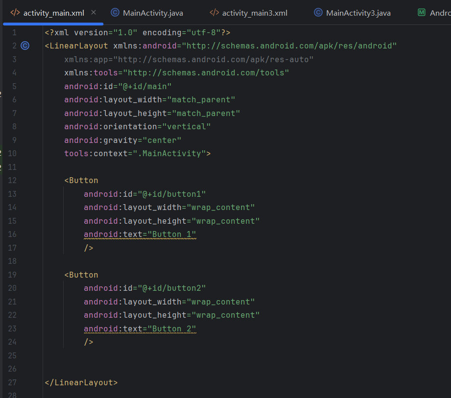
   - 在每个生命周期方法中添加 Log 输出，格式：`Log.d("Lifecycle", "MainActivity - onCreate")`
   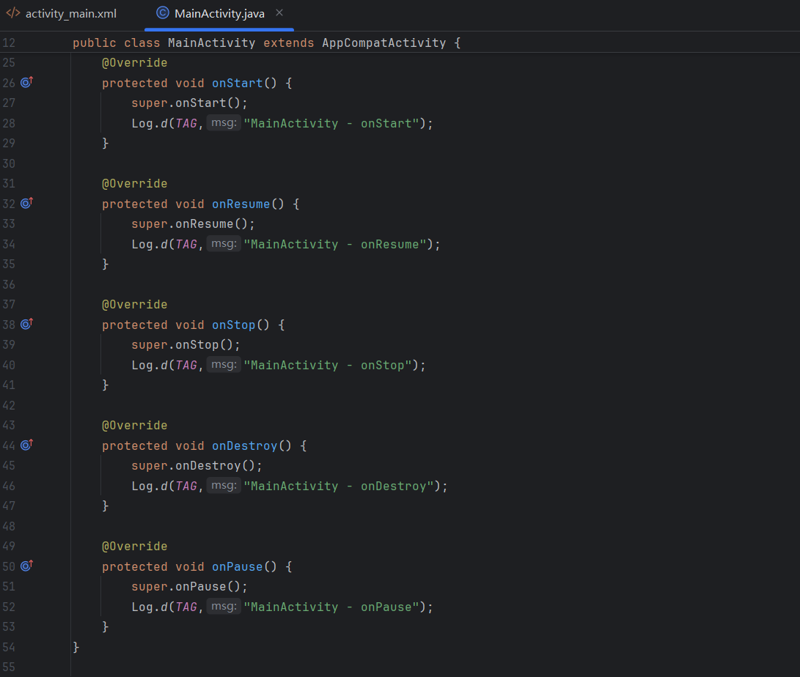

2. **创建普通 SecondActivity**
   - 创建第二个普通 Activity
   - 同样重写所有生命周期方法并添加 Log 输出
   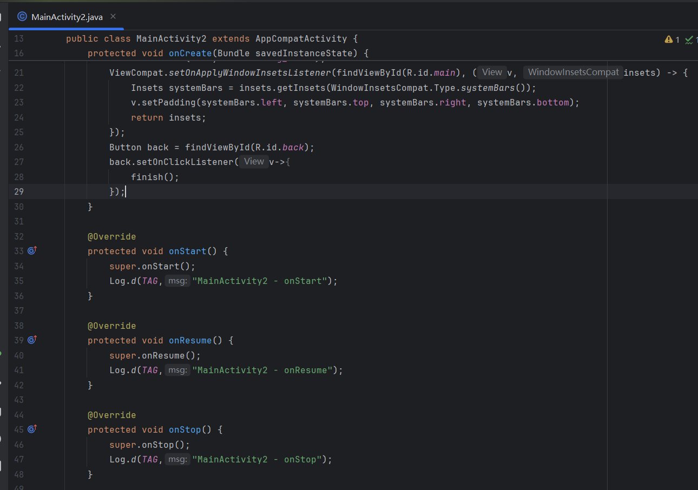

3. **创建 Dialog Activity**
   - 创建第三个 Activity，设置为主题为对话框样式
   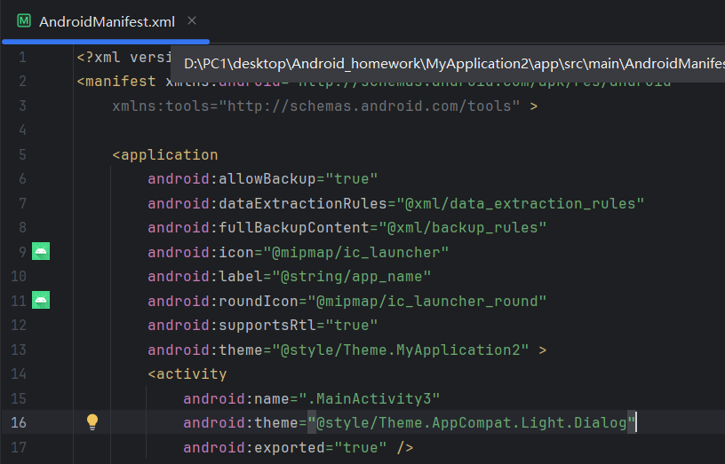
   - 重写所有生命周期方法并添加 Log 输出
   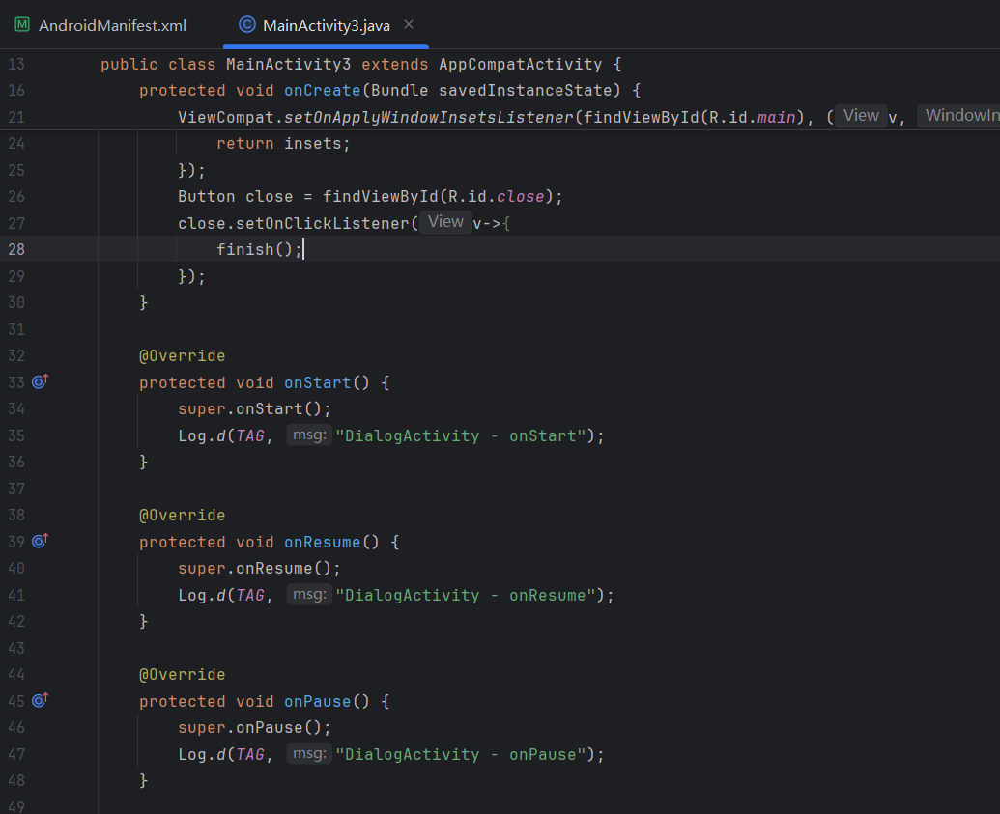

### 实验步骤

#### 第一部分：基础生命周期观察

1. **启动应用观察**
   - 启动应用，观察 MainActivity 的生命周期调用顺序
     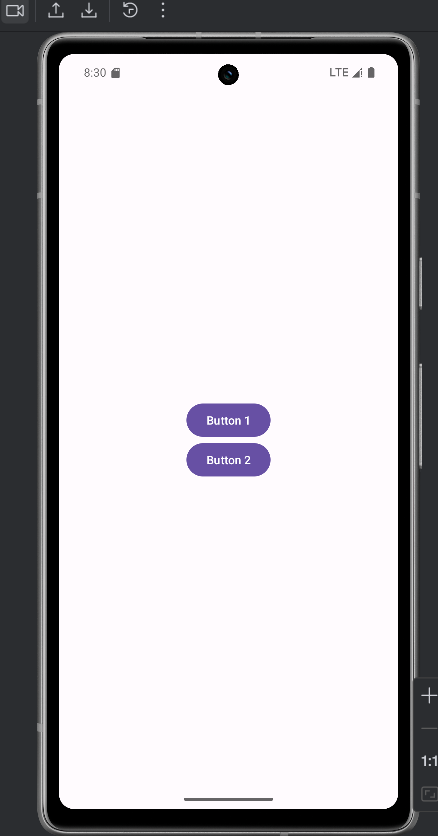
   - 记录 Logcat 中的输出
   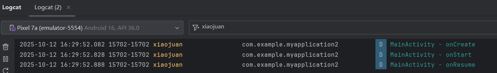

2. **普通 Activity 跳转**
   - 从 MainActivity 跳转到 SecondActivity
   - 观察两个 Activity 的生命周期变化
   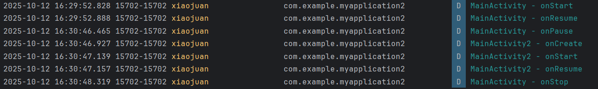
   - 从 SecondActivity 返回 MainActivity
   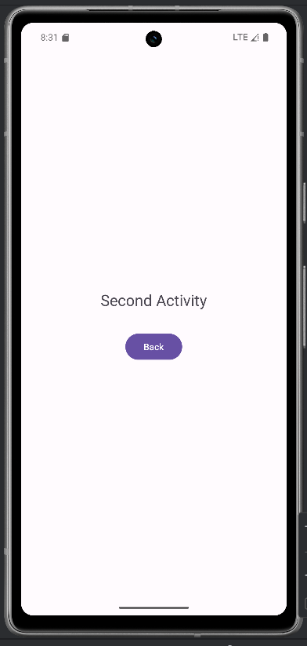
   - 再次观察生命周期变化
 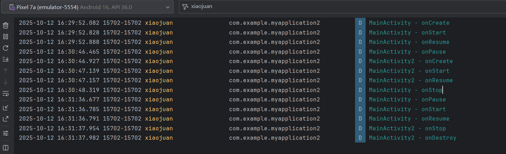

3. **Dialog Activity 跳转**
   - 从 MainActivity 跳转到 Dialog Activity
   - 观察生命周期变化
     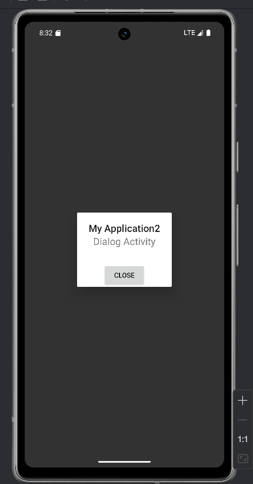
   - 从 Dialog Activity 返回
   - 观察生命周期变化
   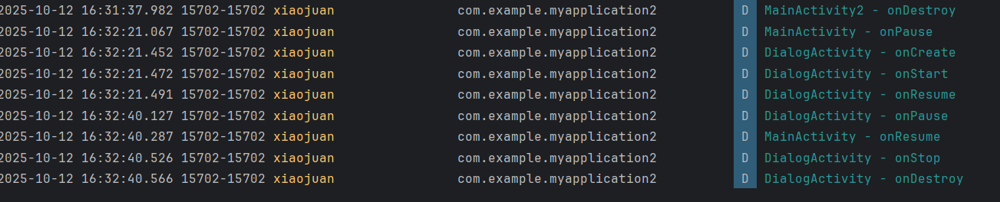

#### 第二部分：数据记录与分析

记录以下场景的 Log 输出：
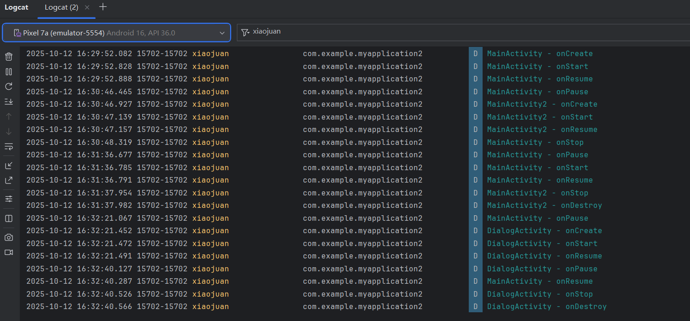

| 场景 | MainActivity 生命周期顺序 | 目标Activity 生命周期顺序 |
|------|--------------------------|--------------------------|
| 应用启动 | onCreate → onStart →onResume |无  |
| Main → SecondActivity | onPause → onStop | onCreate → onStart → onResume |
| SecondActivity 返回 |onRestart → onStart → onResume  |  onPause → onStop → onDestroy|
| Main → Dialog Activity |onPause  |onCreate → onStart → onResume  |
| Dialog Activity 返回 |onResume  |  onPause → onStop → onDestroy |
##### 普通Activity vs Dialog Activity：
普通Activity跳转：原Activity会经历onPause → onStop
Dialog Activity跳转：原Activity只经历onPause，不经历onStop
##### 生命周期差异原因：
Dialog Activity只是部分覆盖屏幕，原Activity仍然部分可见
普通Activity完全覆盖原Activity，所以原Activity需要停止

