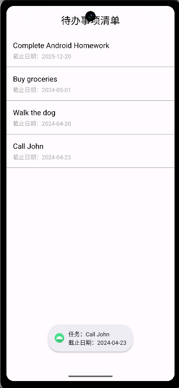
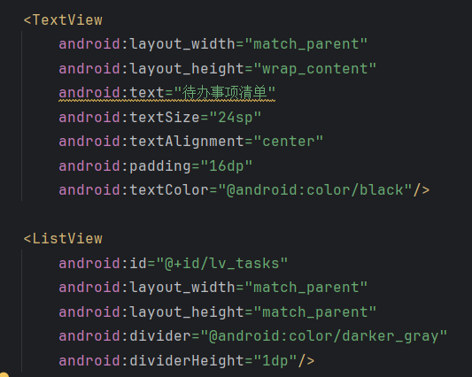
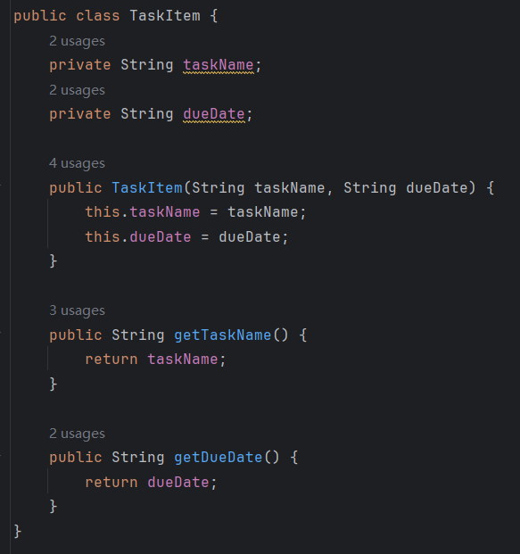
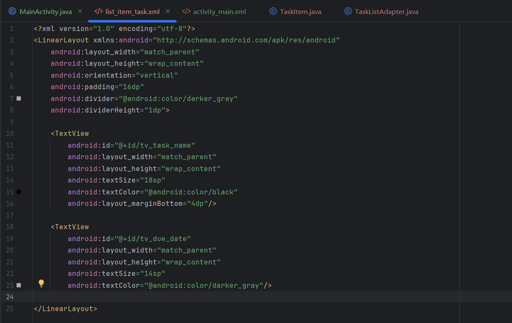
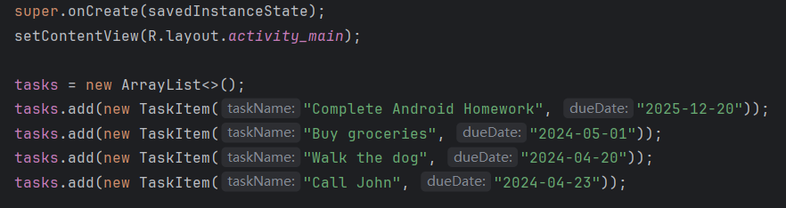

# Android ListView 作业：待办事项清单 (To-Do List App)

## 项目概述
创建一个简单的 Android 待办事项清单应用，使用 `ListView` 展示任务列表。用户可以看到任务列表，包括任务名称和截止日期，并支持基本的交互功能。
##### 我所扩展的交互功能是：
1、**点击交互**：点击任意任务项，弹出 Toast 显示「任务名称 + 截止日期」，清晰反馈点击结果；
2、**长按交互**：长按任务项弹出确认删除对话框，确认后删除该任务，列表自动刷新，符合待办清单的核心操作逻辑。

#### 核心代码：
```java
lvTasks.setOnItemClickListener(new AdapterView.OnItemClickListener() {
            @Override
            public void onItemClick(AdapterView<?> parent, View view, int position, long id) {
                TaskItem clickedTask = tasks.get(position);
                Toast.makeText(MainActivity.this,
                        "任务：" + clickedTask.getTaskName() + "\n截止日期：" + clickedTask.getDueDate(),
                        Toast.LENGTH_LONG).show();
            }
        });

        lvTasks.setOnItemLongClickListener(new AdapterView.OnItemLongClickListener() {
            @Override
            public boolean onItemLongClick(AdapterView<?> parent, View view, int position, long id) {
                new AlertDialog.Builder(MainActivity.this)
                        .setTitle("删除确认")
                        .setMessage("确定要删除「" + tasks.get(position).getTaskName() + "」吗？")
                        .setPositiveButton("删除", (dialog, which) -> {
                            tasks.remove(position);
                            adapter.notifyDataSetChanged();
                            Toast.makeText(MainActivity.this, "任务已删除", Toast.LENGTH_SHORT).show();
                        })
                        .setNegativeButton("取消", null)
                        .show();
                return true;
            }
        });
```
## 功能要求

### 1. 主界面布局 (MainActivity)
- 使用 `ListView` 作为任务列表的容器
- 列表中的每一项显示：
  - 任务名称（如："Complete Android Homework"）
  - 截止日期（如："2025-12-20"）
- 列表项之间应有清晰的分隔


### 2. 数据模型
创建一个 `TaskItem` 类，包含以下属性：
- `taskName`：任务名称（String）
- `dueDate`：截止日期（String）


### 3. 列表适配器
创建自定义 `ArrayAdapter` 或 `BaseAdapter`：
- 自定义列表项布局（至少包含两个 TextView）

- 正确地将数据绑定到列表项的视图上
```java
public class TaskListAdapter extends ArrayAdapter<TaskItem> {

    public TaskListAdapter(Context context, int resource, ArrayList<TaskItem> tasks) {
        super(context, resource, tasks);
    }

    @NonNull
    @Override
    public View getView(int position, @Nullable View convertView, @NonNull ViewGroup parent) {
        if (convertView == null) {
            convertView = LayoutInflater.from(getContext()).inflate(R.layout.list_item_task, parent, false);
        }

        TaskItem currentTask = getItem(position);

        TextView tvTaskName = convertView.findViewById(R.id.tv_task_name);
        TextView tvDueDate = convertView.findViewById(R.id.tv_due_date);

        if (currentTask != null) {
            tvTaskName.setText(currentTask.getTaskName());
            tvDueDate.setText("截止日期：" + currentTask.getDueDate());
        }

        return convertView;
    }
}
```

### 4. 示例数据
使用以下数据初始化列表（来自图片中的内容）：

```java
ArrayList<TaskItem> tasks = new ArrayList<>();
tasks.add(new TaskItem("Complete Android Homework", "2025-12-20"));
tasks.add(new TaskItem("Buy groceries", "2024-05-01"));
tasks.add(new TaskItem("Walk the dog", "2024-04-20"));
tasks.add(new TaskItem("Call John", "2024-04-23"));
```
初始化如下直接放入MainActivity中

