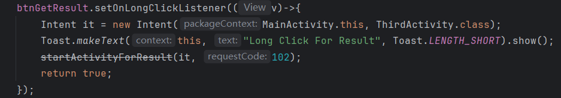

# Android Activity 跳转实验报告

---

姓名：王润梓	学号：42312162	班级：软件2301班	实验日期：2025-9-28	实验内容：Android Activity 跳转实验

---

## 一、实验名称

Activity Navigator 应用开发 ——Activity 跳转功能实现

## 二、实验目的

1. 掌握显式跳转的用法，能够从一个 Activity 启动另一个指定的 Activity。
2. 掌握隐式跳转的用法，能够通过 Action 和 Category 启动符合条件的 Activity。
3. 掌握带返回结果的跳转（Start Activity for Result），能够从子 Activity 返回数据给父 Activity。
4. 熟悉 AndroidManifest.xml 中 Activity 的配置方式及 IntentFilter 的使用。

## 三、实验环境

1. 开发工具：Android Studio 版本（请填写具体版本，如 Android Studio Giraffe 2022.3.1）
2. 运行环境：
   - 真机：Vivo V2284A API 35 
3. 开发语言：Java

## 四、实验内容与实现说明

### 1.MainActivity界面

界面展示

代码展示

### 2.SecondActivity界面

界面展示

代码展示

### 3.ThirdActivity界面

界面展示

代码展示

### 4.返回结果功能展示

### 5.加分项功能实现

长按代码与功能展示

没有返回文本的代码及功能展示
