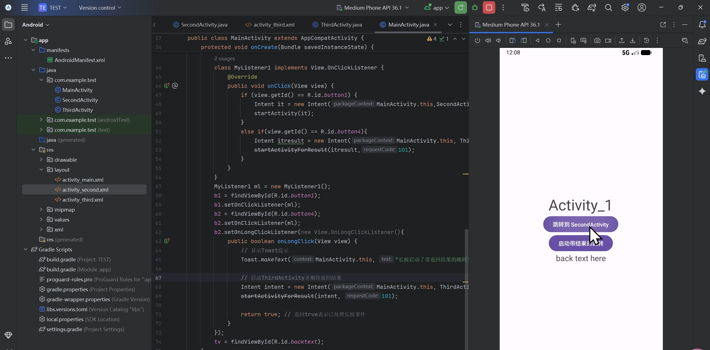
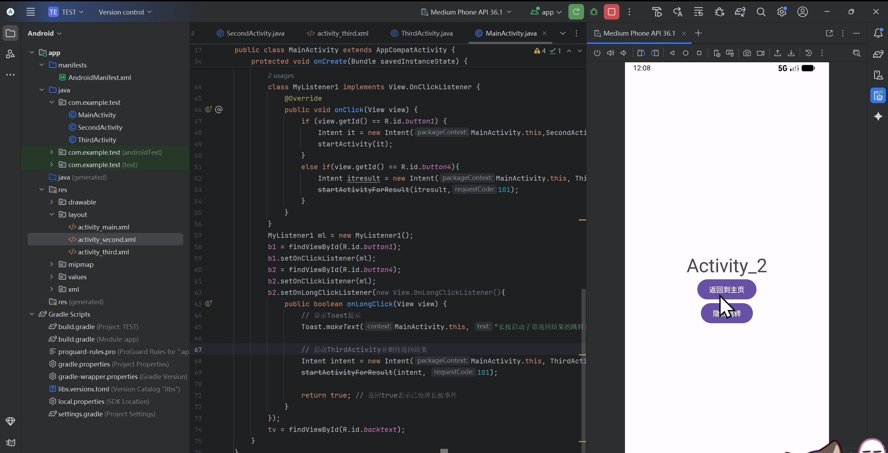
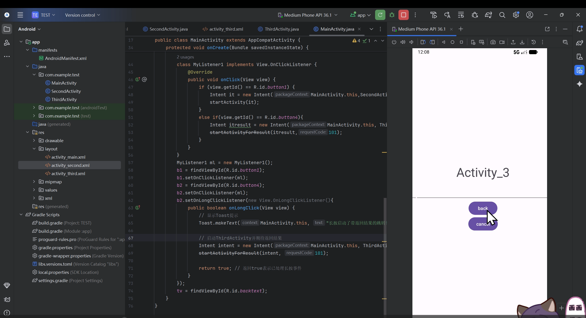
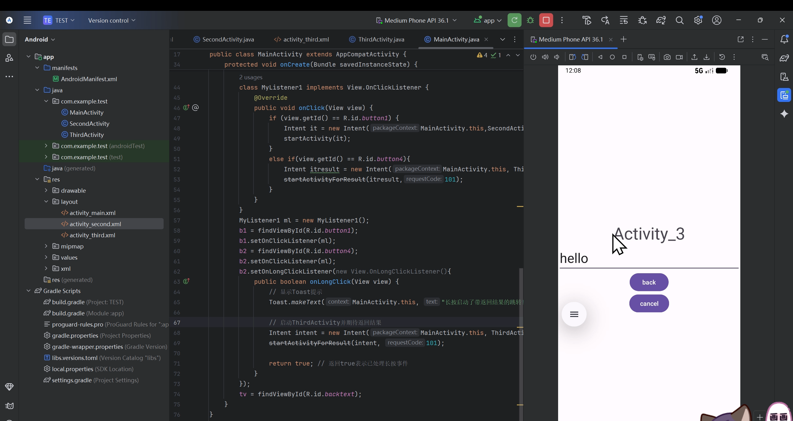
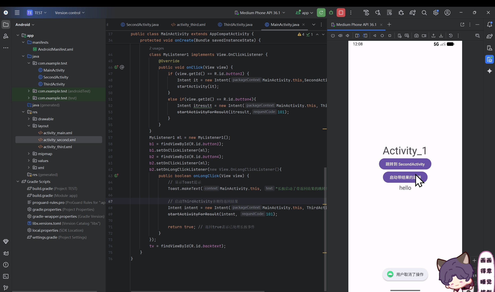
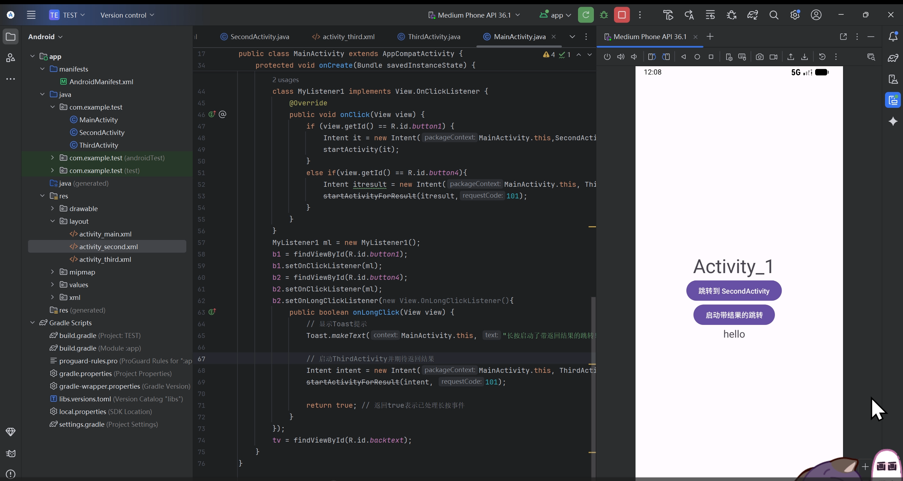
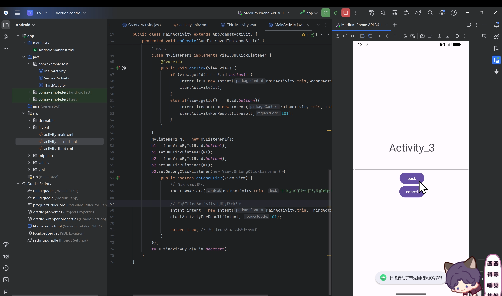

# Android应用开发作业 -  韦思盈

## 项目概述
本项目是一个实现按钮相关功能的Android应用。

## 运行截图

### 主界面

### 显示跳转界面  

### 隐式跳转界面  

### 带结果返回界面  

### 取消操作界面  

### 返回界面  

### 长按监听器界面  

## 总结
通过本次作业，我学会了跳转的多种方式，自学实现了带监听器的跳转。
