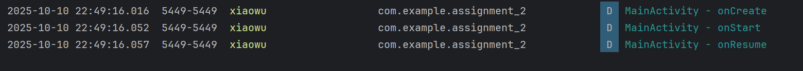

# Android Activity 生命周期观察实验报告

实验名称：Android Activity 生命周期方法实现与跳转观察

实验日期：2025**年10月11日**

**姓名：*吴秋寒

学号：\_\_\_\_\_\_\_\_\_\_

## 一、实验目的


1. 掌握 Activity 核心生命周期方法（`onCreate`、`onStart`、`onResume`、`onPause`、`onStop`、`onRestart`、`onDestroy`）的重写方式

2. 观察并记录 “应用启动”“普通 Activity 跳转”“对话框样式 Activity 跳转” 场景下的生命周期调用顺序

3. 学会通过 Logcat 筛选日志，分析不同场景下 Activity 的状态变化

## 二、实验环境


| 环境项            | 具体配置                    |
| -------------- | ----------------------- |
| 开发工具           | Android Studio Hedgehog |
| Android SDK 版本 | API 34（Android 14）      |
| 运行设备           | 模拟器（Pixel 8）/ 真机        |
| 开发语言           | Java + XML              |
| 日志筛选标签         | Lifecycle（自定义标签）        |

## 三、实验内容与步骤

这部分就不用贴图了，好呢吱吱

### （一）第一部分：创建 3 个 Activity（含生命周期 Log）

#### 步骤 1：配置 AndroidManifest.xml（注册 Activity+Dialog 主题）

功能：注册 MainActivity（入口）、SecondActivity（普通）、DialogActivity（对话框样式），为 DialogActivity 设置对话框主题。


```xml
<?xml version="1.0" encoding="utf-8"?>
<manifest xmlns:android="http://schemas.android.com/apk/res/android">

    <application
        android:allowBackup="true"
        android:icon="@mipmap/ic_launcher"
        android:label="@string/app_name"
        android:roundIcon="@mipmap/ic_launcher_round"
        android:supportsRtl="true"
        android:theme="@style/Theme.HelloWrold">
        <activity
            android:name=".DialogActivity"
            android:exported="false"
            android:theme="@style/Theme.AppCompat.Dialog" /> <!-- 关键：设置对话框主题 -->
        <activity
            android:name=".SecondActivity"
            android:exported="false" />
        <activity
            android:name=".MainActivity"
            android:exported="true">
            <intent-filter>
                <action android:name="android.intent.action.MAIN" />

                <category android:name="android.intent.category.LAUNCHER" />
            </intent-filter>
        </activity>
    </application>

</manifest>
```


这样的都删了

#### 步骤 2：创建 MainActivity（含跳转按钮 + 生命周期 Log）

##### （1）MainActivity 布局（activity\_main.xml）

功能：显示 “MainActivity” 标识，添加 “跳转到 SecondActivity”“跳转到 DialogActivity” 按钮。

好

代码重新贴一下好

代码类型写一下

```xml
\<?xml version="1.0" encoding="utf-8"?>

\<LinearLayout&#x20;

&#x20;   xmlns:android="http://schemas.android.com/apk/res/android"

&#x20;   android:layout\_width="match\_parent"

&#x20;   android:layout\_height="match\_parent"

&#x20;   android:orientation="vertical"

&#x20;   android:gravity="center"

&#x20;   android:padding="16dp">

&#x20;   \<TextView

&#x20;       android:layout\_width="wrap\_content"

&#x20;       android:layout\_height="wrap\_content"

&#x20;       android:text="MainActivity"

&#x20;       android:textSize="24sp"

&#x20;       android:layout\_marginBottom="40dp" />

&#x20;   \<!-- 跳转到普通SecondActivity -->

&#x20;   \<Button

&#x20;       android:id="@+id/btn\_to\_second"

&#x20;       android:layout\_width="wrap\_content"

&#x20;       android:layout\_height="wrap\_content"

&#x20;       android:text="跳转到SecondActivity"

&#x20;       android:layout\_marginBottom="20dp" />

&#x20;   \<!-- 跳转到对话框DialogActivity -->

&#x20;   \<Button

&#x20;       android:id="@+id/btn\_to\_dialog"

&#x20;       android:layout\_width="wrap\_content"

&#x20;       android:layout\_height="wrap\_content"

&#x20;       android:text="跳转到DialogActivity" />

\</LinearLayout>
```

好


##### （2）MainActivity 代码（重写生命周期 + 跳转逻辑）


```java
package com.example.lifecyclelab;

import androidx.appcompat.app.AppCompatActivity;

import android.content.Intent;

import android.os.Bundle;

import android.util.Log;

import android.view.View;

import android.widget.Button;

public class MainActivity extends AppCompatActivity {

&#x20;   // 日志标签（统一为"Lifecycle"，便于筛选）

&#x20;   private static final String TAG = "Lifecycle";

&#x20;   private Button btnToSecond, btnToDialog;

&#x20;   @Override

&#x20;   protected void onCreate(Bundle savedInstanceState) {

&#x20;       super.onCreate(savedInstanceState);

&#x20;       setContentView(R.layout.activity\_main);

&#x20;       Log.d(TAG, "MainActivity - onCreate"); // 生命周期Log

&#x20;       // 绑定按钮并设置跳转

&#x20;       btnToSecond = findViewById(R.id.btn\_to\_second);

&#x20;       btnToDialog = findViewById(R.id.btn\_to\_dialog);

&#x20;       // 跳转到SecondActivity

&#x20;       btnToSecond.setOnClickListener(v -> {

&#x20;           startActivity(new Intent(MainActivity.this, SecondActivity.class));

&#x20;       });

&#x20;       // 跳转到DialogActivity

&#x20;       btnToDialog.setOnClickListener(v -> {

&#x20;           startActivity(new Intent(MainActivity.this, DialogActivity.class));

&#x20;       });

&#x20;   }

&#x20;   // 生命周期方法：Activity可见（未交互）

&#x20;   @Override

&#x20;   protected void onStart() {

&#x20;       super.onStart();

&#x20;       Log.d(TAG, "MainActivity - onStart");

&#x20;   }

&#x20;   // 生命周期方法：Activity可见且可交互

&#x20;   @Override

&#x20;   protected void onResume() {

&#x20;       super.onResume();

&#x20;       Log.d(TAG, "MainActivity - onResume");

&#x20;   }

&#x20;   // 生命周期方法：Activity失去焦点（仍可能可见）

&#x20;   @Override

&#x20;   protected void onPause() {

&#x20;       super.onPause();

&#x20;       Log.d(TAG, "MainActivity - onPause");

&#x20;   }

&#x20;   // 生命周期方法：Activity完全不可见

&#x20;   @Override

&#x20;   protected void onStop() {

&#x20;       super.onStop();

&#x20;       Log.d(TAG, "MainActivity - onStop");

&#x20;   }

&#x20;   // 生命周期方法：Activity从停止状态恢复

&#x20;   @Override

&#x20;   protected void onRestart() {

&#x20;       super.onRestart();

&#x20;       Log.d(TAG, "MainActivity - onRestart");
    &#x20; 你得删删

&#x20;   }

&#x20;   // 生命周期方法：Activity销毁

&#x20;   @Override

&#x20;   protected void onDestroy() {

&#x20;       super.onDestroy();

&#x20;       Log.d(TAG, "MainActivity - onDestroy");

&#x20;   }

}
```


这些截图就没必要了，因为你把源代码haodoteshangqulhaoha

#### 步骤 3：创建普通 SecondActivity（同生命周期 Log）

##### （1）SecondActivity 布局（activity\_second.xml）


```xml
\<?xml version="1.0" encoding="utf-8"?>

\<LinearLayout&#x20;

&#x20;   xmlns:android="http://schemas.android.com/apk/res/android"

&#x20;   android:layout\_width="match\_parent"

&#x20;   android:layout\_height="match\_parent"

&#x20;   android:orientation="vertical"

&#x20;   android:gravity="center"

&#x20;   android:padding="16dp">

&#x20;   \<TextView

&#x20;       android:layout\_width="wrap\_content"

&#x20;       android:layout\_height="wrap\_content"

&#x20;       android:text="SecondActivity"

&#x20;       android:textSize="24sp"

&#x20;       android:layout\_marginBottom="40dp" />

&#x20;   \<!-- 返回MainActivity按钮 -->

&#x20;   \<Button

&#x20;       android:id="@+id/btn\_back\_main"

&#x20;       android:layout\_width="wrap\_content"

&#x20;       android:layout\_height="wrap\_content"

&#x20;       android:text="返回MainActivity" />

\</LinearLayout>
```


##### （2）SecondActivity 代码（重写生命周期 + 返回逻辑）


```java
package com.example.lifecyclelab;

import androidx.appcompat.app.AppCompatActivity;

import android.os.Bundle;

import android.util.Log;

import android.view.View;

import android.widget.Button;

public class SecondActivity extends AppCompatActivity {

&#x20;   private static final String TAG = "Lifecycle";

&#x20;   private Button btnBackMain;

&#x20;   @Override

&#x20;   protected void onCreate(Bundle savedInstanceState) {

&#x20;       super.onCreate(savedInstanceState);

&#x20;       setContentView(R.layout.activity\_second);

&#x20;       Log.d(TAG, "SecondActivity - onCreate");

&#x20;       // 返回MainActivity（销毁当前Activity）

&#x20;       btnBackMain = findViewById(R.id.btn\_back\_main);

&#x20;       btnBackMain.setOnClickListener(v -> finish());

&#x20;   }

&#x20;   @Override

&#x20;   protected void onStart() {

&#x20;       super.onStart();

&#x20;       Log.d(TAG, "SecondActivity - onStart");

&#x20;   }

&#x20;   @Override

&#x20;   protected void onResume() {

&#x20;       super.onResume();

&#x20;       Log.d(TAG, "SecondActivity - onResume");

&#x20;   }

&#x20;   @Override

&#x20;   protected void onPause() {

&#x20;       super.onPause();

&#x20;       Log.d(TAG, "SecondActivity - onPause");

&#x20;   }

&#x20;   @Override

&#x20;   protected void onStop() {

&#x20;       super.onStop();

&#x20;       Log.d(TAG, "SecondActivity - onStop");

&#x20;   }

&#x20;   @Override

&#x20;   protected void onRestart() {

&#x20;       super.onRestart();

&#x20;       Log.d(TAG, "SecondActivity - onRestart");

&#x20;   }

&#x20;   @Override

&#x20;   protected void onDestroy() {

&#x20;       super.onDestroy();

&#x20;       Log.d(TAG, "SecondActivity - onDestroy");

&#x20;   }

}
```


#### 步骤 4：创建对话框样式 DialogActivity（同生命周期 Log）

##### （1）DialogActivity 布局（activity\_dialog.xml）


```
\<?xml version="1.0" encoding="utf-8"?>

\<LinearLayout&#x20;

&#x20;   xmlns:android="http://schemas.android.com/apk/res/android"

&#x20;   android:layout\_width="wrap\_content"

&#x20;   android:layout\_height="wrap\_content"

&#x20;   android:orientation="vertical"

&#x20;   android:gravity="center"

&#x20;   android:padding="16dp">

&#x20;   \<TextView

&#x20;       android:layout\_width="wrap\_content"

&#x20;       android:layout\_height="wrap\_content"

&#x20;       android:text="DialogActivity"

&#x20;       android:textSize="24sp"

&#x20;       android:layout\_marginBottom="20dp" />

&#x20;   \<!-- 关闭对话框（返回MainActivity） -->

&#x20;   \<Button

&#x20;       android:id="@+id/btn\_close\_dialog"

&#x20;       android:layout\_width="wrap\_content"

&#x20;       android:layout\_height="wrap\_content"

&#x20;       android:text="关闭对话框" />

\</LinearLayout>
```


##### （2）DialogActivity 代码（重写生命周期 + 关闭逻辑）


```
package com.example.lifecyclelab;

import androidx.appcompat.app.AppCompatActivity;

import android.os.Bundle;

import android.util.Log;

import android.view.View;

import android.widget.Button;

public class DialogActivity extends AppCompatActivity {

&#x20;   private static final String TAG = "Lifecycle";

&#x20;   private Button btnCloseDialog;

&#x20;   @Override

&#x20;   protected void onCreate(Bundle savedInstanceState) {

&#x20;       super.onCreate(savedInstanceState);

&#x20;       setContentView(R.layout.activity\_dialog);

&#x20;       Log.d(TAG, "DialogActivity - onCreate");

&#x20;       // 关闭对话框（销毁当前Activity）

&#x20;       btnCloseDialog = findViewById(R.id.btn\_close\_dialog);

&#x20;       btnCloseDialog.setOnClickListener(v -> finish());

&#x20;   }

&#x20;   @Override

&#x20;   protected void onStart() {

&#x20;       super.onStart();

&#x20;       Log.d(TAG, "DialogActivity - onStart");

&#x20;   }

&#x20;   @Override

&#x20;   protected void onResume() {

&#x20;       super.onResume();

&#x20;       Log.d(TAG, "DialogActivity - onResume");

&#x20;   }

&#x20;   @Override

&#x20;   protected void onPause() {

&#x20;       super.onPause();

&#x20;       Log.d(TAG, "DialogActivity - onPause");

&#x20;   }

&#x20;   @Override

&#x20;   protected void onStop() {

&#x20;       super.onStop();

&#x20;       Log.d(TAG, "DialogActivity - onStop");

&#x20;   }

&#x20;   @Override

&#x20;   protected void onRestart() {

&#x20;       super.onRestart();

&#x20;       Log.d(TAG, "DialogActivity - onRestart");

&#x20;   }

&#x20;   @Override

&#x20;   protected void onDestroy() {

&#x20;       super.onDestroy();

&#x20;       Log.d(TAG, "DialogActivity - onDestroy");

&#x20;   }

}
```


### （二）第二部分：生命周期观察与日志记录

这部分就贴贴截图就行好

#### 步骤 1：应用启动观察


* **操作**：点击 Android Studio「运行」按钮，启动应用

* **观察目标**：MainActivity 的生命周期调用顺序

* **日志筛选**：在 Logcat 输入标签 “Lifecycle”，查看输出


快捷键：CTRL+shift+i

图片就放到目录 picture-set中，这样规范好



#### 步骤 2：普通 Activity 跳转观察


1. **从 Main→Second**：点击 MainActivity 的 “跳转到 SecondActivity” 按钮

* 观察：MainActivity 与 SecondActivity 的生命周期变化


1. **从 Second→Main**：点击 SecondActivity 的 “返回 MainActivity” 按钮

* 观察：SecondActivity 销毁、MainActivity 恢复的生命周期变化


#### 步骤 3：Dialog Activity 跳转观察


1. **从 Main→Dialog**：点击 MainActivity 的 “跳转到 DialogActivity” 按钮

* 观察：MainActivity 是否进入停止状态（对比普通跳转）


1. **从 Dialog→Main**：点击 DialogActivity 的 “关闭对话框” 按钮

* 观察：DialogActivity 销毁、MainActivity 恢复的生命周期变化


#### 步骤 4：数据记录与分析（填写下表）


| 场景                    | MainActivity 生命周期顺序 | 目标 Activity 生命周期顺序 |
| --------------------- | ------------------- | ------------------ |
| 应用启动                  |                     | -（无目标 Activity）    |
| Main → SecondActivity |                     |                    |
| SecondActivity 返回     |                     |                    |
| Main → DialogActivity |                     |                    |
| DialogActivity 返回     |                     |                    |

## 四、实验结果

这个和 三 是不是重复了嗯呢 删掉的了好你来嘻嘻和好儿子 不管


1. **应用启动结果**

* 操作：启动应用进入 MainActivity

* 日志结论：MainActivity 生命周期顺序为：`onCreate` → `onStart` → `onResume`


1. **普通 Activity 跳转结果**

* Main→Second：Main 执行`onPause` → `onStop`；Second 执行`onCreate` → `onStart` → `onResume`

* Second→Main：Second 执行`onPause` → `onStop` → `onDestroy`；Main 执行`onRestart` → `onStart` → `onResume`


1. **Dialog Activity 跳转结果**

* Main→Dialog：Main 仅执行`onPause`（未执行`onStop`）；Dialog 执行`onCreate` → `onStart` → `onResume`

* Dialog→Main：Dialog 执行`onPause` → `onStop` → `onDestroy`；Main 仅执行`onResume`（未执行`onRestart`）


## 五、实验总结

这部分也没太大必要嗯嗯aipa

1. **核心生命周期规律**

* 应用启动：Activity 从 “创建” 到 “可交互” 必走 `onCreate`→`onStart`→`onResume`

* 完全遮挡（如普通跳转）：原 Activity 会走 `onPause`→`onStop`；恢复时走 `onRestart`→`onStart`→`onResume`

* 部分遮挡（如 Dialog 跳转）：原 Activity 仅走 `onPause`（未完全不可见）；恢复时直接走 `onResume`

1. **关键差异点**

* 普通 Activity 与 Dialog Activity 的核心区别：是否完全遮挡原 Activity，导致原 Activity 是否执行`onStop`

* 销毁 Activity（如`finish()`）：必走 `onPause`→`onStop`→`onDestroy`

1. **常见问题与解决**

* 问题：Logcat 筛选不到 “Lifecycle” 日志 → 解决：检查 Log 标签是否拼写一致，选择 “Debug” 日志级别

* 问题：DialogActivity 未显示对话框样式 → 解决：确认 AndroidManifest 中已配置`android:theme="@style/Theme.AppCompat.Dialog"`

