# Android Activity 跳转实验报告

---

姓名：董一坤	学号：42312240	班级：软件2301班	实验日期：2025-9-28	实验内容：Android Activity 跳转实验

---

## 一、实验名称

Activity Navigator 应用开发 ——Activity 跳转功能实现

## 二、实验目的

1. 掌握显式跳转的用法，能够从一个 Activity 启动另一个指定的 Activity。
2. 掌握隐式跳转的用法，能够通过 Action 和 Category 启动符合条件的 Activity。
3. 掌握带返回结果的跳转（Start Activity for Result），能够从子 Activity 返回数据给父 Activity。
4. 熟悉 AndroidManifest.xml 中 Activity 的配置方式及 IntentFilter 的使用。

## 三、实验环境

1. 开发工具：Android Studio 版本（请填写具体版本，如 Android Studio Giraffe 2022.3.1）
2. 运行环境：
   - 真机：Vivo V2284A API 35 
3. 开发语言：Java

## 四、实验内容与实现说明

### 4.1 显式跳转功能实现

1. 布局设计：在`MainActivity`的布局文件中添加 “跳转到 SecondActivity” 按钮；在`SecondActivity`的布局文件中添加 “返回到主页” 按钮。

   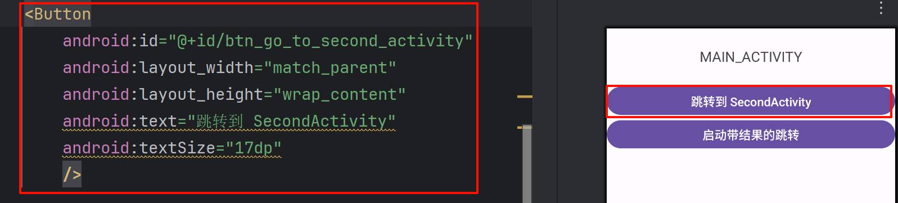

   
MainActivity中跳转到SecondActivity的Button

   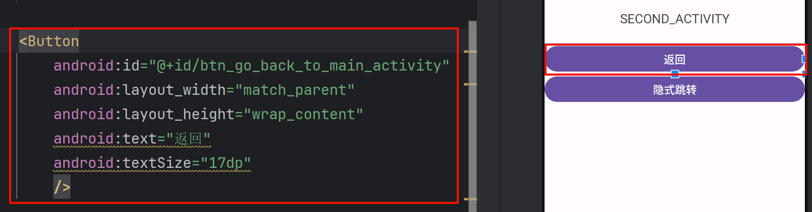

   
SecondActivity中返回到MainActivity的Button

2. 逻辑实现：

   - 在`MainActivity`中为跳转按钮设置点击事件，通过显式 Intent（`Intent(Context, Class)`）启动`SecondActivity`。
   - 在`SecondActivity`中为返回按钮设置点击事件，通过`finish()`方法关闭当前 Activity 并返回`MainActivity`。

   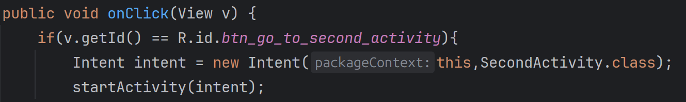

   
MainActivity中通过显示Intent跳转到SecondActivity

   方法返回MainActivity.png)

   
SecondActivity中通过finish()方法返回MainActivity

### 4.2 隐式跳转功能实现

1. 布局设计：在`SecondActivity`的布局文件中添加 “隐式跳转” 按钮。

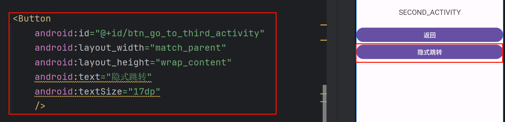

SecondActivity中通过隐式Intent跳转到ThirdActivity的Button

2. 逻辑实现：

- 在`SecondActivity`的点击事件中创建隐式 Intent，设置自定义 Action（如`"com.example.action.VIEW_THIRD_ACTIVITY"`）和默认 Category（`Intent.CATEGORY_DEFAULT`）。
- 在`AndroidManifest.xml`中为`ThirdActivity`配置`<intent-filter>`，关联上述自定义 Action 和默认 Category。

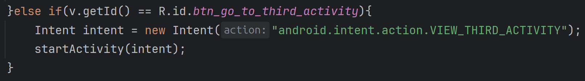

为SecondActivity中隐式Intent跳转的Button添加事件监听

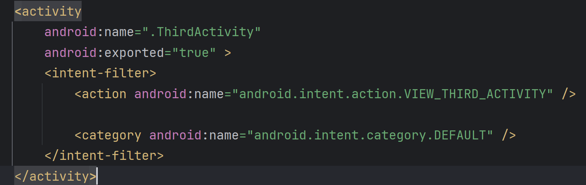

在清单文件中为ThirdActivity添加action与category属性

### 4.3 带返回结果的跳转功能实现

1. 布局设计：
   - 在`MainActivity`中添加 “启动带结果的跳转” 按钮和用于显示结果的`TextView`。
   - 在`ThirdActivity`中添加`EditText`（用于输入数据）和 “返回结果” 按钮。

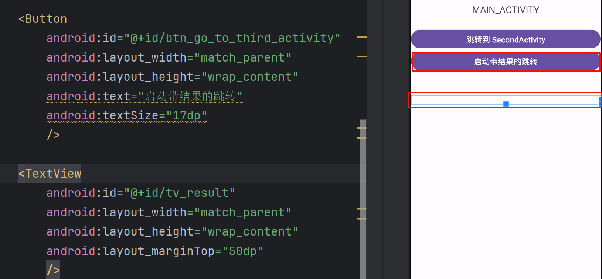

在MainActivity中添加带结果跳转的Button与显示结果的TextView

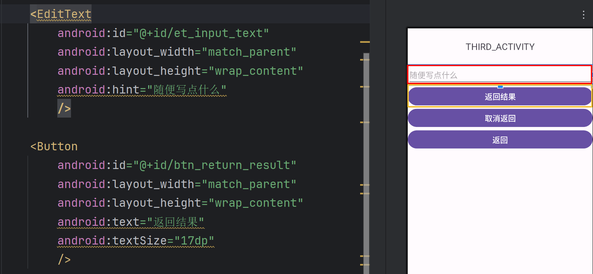

在ThirdActivity中添加用于输入文本的EditText与返回结果的Button

2. 逻辑实现：

- `MainActivity`中通过`startActivityForResult()`启动`ThirdActivity`，并设置唯一请求码（如 101）。
- `ThirdActivity`中为 “返回结果” 按钮设置点击事件，将`EditText`中的内容通过`Intent.putExtra()`存储，调用`setResult(Activity.RESULT_OK, intent)`设置返回结果后，通过`finish()`关闭页面。
- 在`MainActivity`中重写`onActivityResult()`方法，根据请求码和结果码判断返回数据的有效性，获取数据并更新`TextView`。

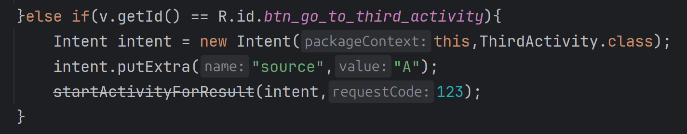

MainActivity中通过startActivityForResult启动ThirdActivity,并设置唯一请求码123

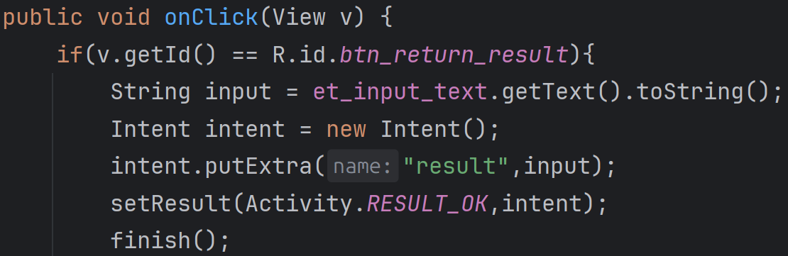

ThirdActivity向MainActivity返回结果

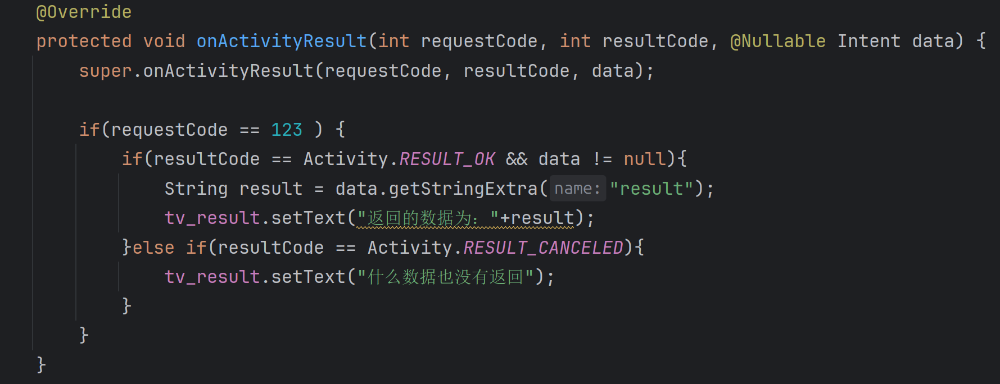

MainActivity中重写onActivityResult方法，并设置文本内容

### 4.4 加分项功能实现

1. 长按事件处理：在`MainActivity`中为 “启动带结果的跳转” 按钮添加长按监听器，长按后通过`Toast`提示 “长按启动了带返回结果的跳转！”。

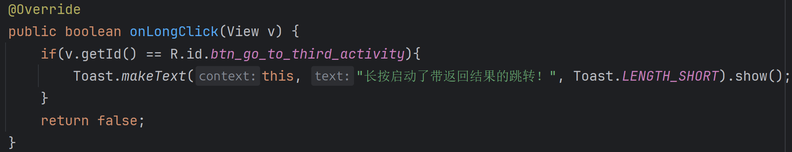

设置长按监听时间

2. 取消返回功能：

- 在`ThirdActivity`中添加 “返回取消” 按钮。
- 点击该按钮时，调用`setResult(Activity.RESULT_CANCELED)`并`finish()`。
- 在`MainActivity`的`onActivityResult()`中处理取消逻辑（如提示 “操作已取消”）。

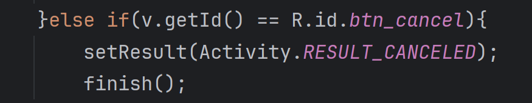

ThirdActivity为取消返回Button设置监听事件

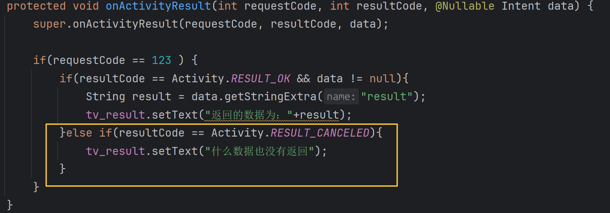

MainActivity中处理取消返回的逻辑代码

## 五、附录

- 效果展示

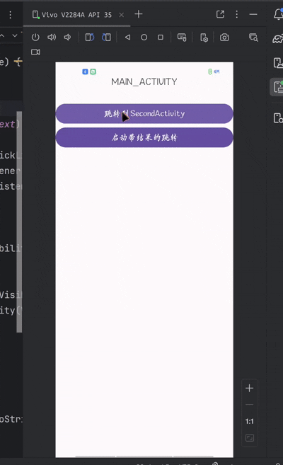