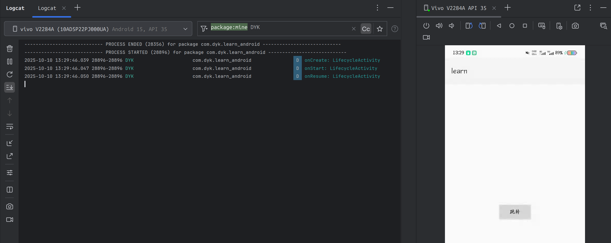
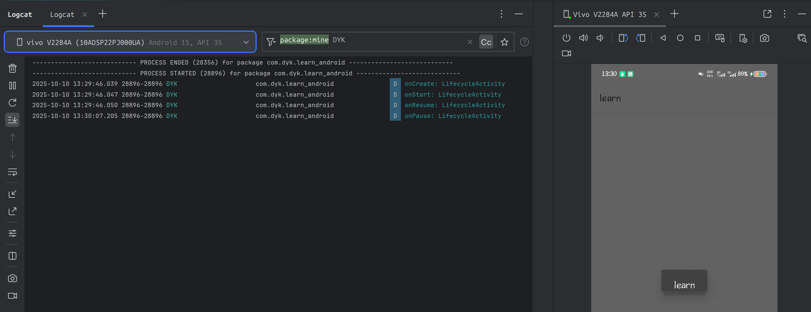
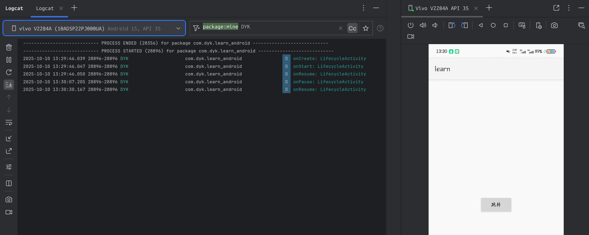

# Android Activity Lifecycle实验报告

| 项目     | 内容                       |
| -------- | -------------------------- |
| 姓名     | 董一坤                     |
| 学号     | 42312240                   |
| 班级     | 软件 2301 班               |
| 实验日期 | 2025-10-10                 |
| 实验内容 | Android Activity Lifecycle |

## 一、实验名称

Android Activity Lifecycle ——Activity 生命周期的了解

## 二、实验目的

了解 Activity 的生命周期 (Lifecycle)

## 三、实验环境

1. 开发工具：Android Studio
2. 运行环境：
   - 真机：Vivo V2284A API 35 
3. 开发语言：Java

## 四、实验内容与实现说明

1. 创建`LifecycleActivity`页面，在 Activity 的各个生命周期对应的回调函数中调用 `Log.d()` 函数，进行日志的打印，观察各个函数调用的时机；
2. 实现从 `LifecycleActivity` 页面到 `DialogActivity` 页面的简单跳转。

```java
package com.dyk.learn_android;

import android.content.Intent;
import android.os.Bundle;
import android.util.Log;
import android.view.View;

import androidx.activity.EdgeToEdge;
import androidx.appcompat.app.AppCompatActivity;

public class LifecycleActivity extends AppCompatActivity implements View.OnClickListener {

    private final String TAG = "DYK";

    @Override
    protected void onCreate(Bundle savedInstanceState) {
        super.onCreate(savedInstanceState);
        EdgeToEdge.enable(this);
        setContentView(R.layout.activity_lifecycle);

        Log.d(TAG, "onCreate: LifecycleActivity");

        findViewById(R.id.btn_switch).setOnClickListener(this);
    }

    @Override
    protected void onStart() {
        super.onStart();

        Log.d(TAG, "onStart: LifecycleActivity");
    }

    @Override
    protected void onStop() {
        super.onStop();

        Log.d(TAG, "onStop: LifecycleActivity");
    }

    @Override
    protected void onDestroy() {
        super.onDestroy();

        Log.d(TAG, "onDestroy: LifecycleActivity");
    }

    @Override
    protected void onResume() {
        super.onResume();

        Log.d(TAG, "onResume: LifecycleActivity");
    }

    @Override
    protected void onPause() {
        super.onPause();

        Log.d(TAG, "onPause: LifecycleActivity");
    }

    @Override
    protected void onRestart() {
        super.onRestart();

        Log.d(TAG, "onRestart: LifecycleActivity");
    }

    @Override
    public void onClick(View v) {
        if(v.getId() == R.id.btn_switch){
            Intent intent = new Intent(this,DialogActivity.class);
            startActivity(intent);
        }
    }
}
```


## 五、实验截图






