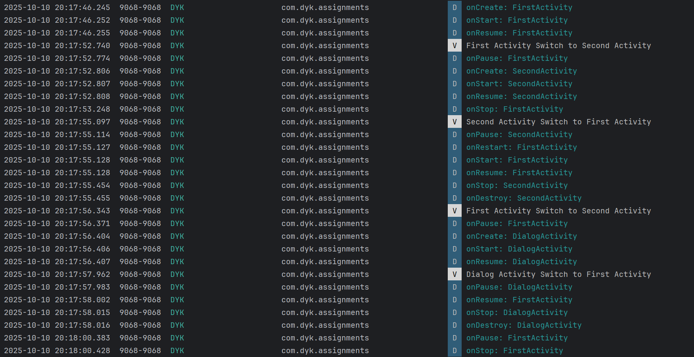

# Android Activity Lifecycle实验报告

| 项目     | 内容                       |
| -------- | -------------------------- |
| 姓名     | 董一坤                     |
| 学号     | 42312240                   |
| 班级     | 软件 2301 班               |
| 实验日期 | 2025-10-10                 |
| 实验内容 | Android Activity Lifecycle |

## 一、实验名称

Android Activity Lifecycle ——Android Activity 生命周期观察实验

## 二、实验目的

了解 Activity 的生命周期 (Lifecycle)

## 三、实验环境

1. 开发工具：Android Studio
2. 运行环境：
   - 真机：Vivo V2284A API 35 
3. 开发语言：Java

## 四、实验内容与实现说明

1. **创建 FirstActivity**
   - 创建 MainActivity，重写所有生命周期方法
   - 在每个生命周期方法中添加 Log 输出，格式：`Log.d("Lifecycle", "MainActivity - onCreate")`

```java
package com.dyk.assignments.assignment_2;

import android.content.Intent;
import android.os.Bundle;
import android.util.Log;
import android.view.View;

import androidx.activity.EdgeToEdge;
import androidx.appcompat.app.AppCompatActivity;
import androidx.core.graphics.Insets;
import androidx.core.view.ViewCompat;
import androidx.core.view.WindowInsetsCompat;

import com.dyk.assignments.R;

public class FirstActivity extends AppCompatActivity implements View.OnClickListener {

    private final String TAG = "DYK";

    @Override
    protected void onCreate(Bundle savedInstanceState) {
        super.onCreate(savedInstanceState);
        EdgeToEdge.enable(this);
        setContentView(R.layout.activity_first);

        findViewById(R.id.btn_switch_2).setOnClickListener(this);
        findViewById(R.id.btn_switch_3).setOnClickListener(this);

        Log.d(TAG, "onCreate: FirstActivity");
    }
    
    @Override
    protected void onStart() {
        super.onStart();
        Log.d(TAG, "onStart: FirstActivity");
    }
    
    @Override
    protected void onResume() {
        super.onResume();
        Log.d(TAG, "onResume: FirstActivity");
    }

    @Override
    protected void onPause() {
        super.onPause();
        Log.d(TAG, "onPause: FirstActivity");
    }

    @Override
    protected void onStop() {
        super.onStop();
        Log.d(TAG, "onStop: FirstActivity");
    }

    @Override
    protected void onDestroy() {
        super.onDestroy();
        Log.d(TAG, "onDestroy: FirstActivity");
    }

    @Override
    protected void onRestart() {
        super.onRestart();
        Log.d(TAG, "onRestart: FirstActivity");
    }

    @Override
    public void onClick(View v) {
        if(v.getId() == R.id.btn_switch_2){
            Log.v(TAG, "First Activity Switch to Second Activity ");
            Intent intent = new Intent(this,SecondActivity.class);
            startActivity(intent);
        }else if(v.getId() == R.id.btn_switch_3){
            Log.v(TAG, "First Activity Switch to Second Activity ");
            Intent intent = new Intent(this,DialogActivity.class);
            startActivity(intent);
        }
    }
}
```

2. **创建普通 SecondActivity**

- 创建第二个普通 Activity
- 同样重写所有生命周期方法并添加 Log 输出

```java
package com.dyk.assignments.assignment_2;

import android.content.Intent;
import android.os.Bundle;
import android.util.Log;
import android.view.View;

import androidx.activity.EdgeToEdge;
import androidx.appcompat.app.AppCompatActivity;
import androidx.core.graphics.Insets;
import androidx.core.view.ViewCompat;
import androidx.core.view.WindowInsetsCompat;

import com.dyk.assignments.R;

public class SecondActivity extends AppCompatActivity implements View.OnClickListener {

    private final String TAG = "DYK";

    @Override
    protected void onCreate(Bundle savedInstanceState) {
        super.onCreate(savedInstanceState);
        EdgeToEdge.enable(this);
        setContentView(R.layout.activity_second);
        findViewById(R.id.btn_back).setOnClickListener(this);
        Log.d(TAG, "onCreate: SecondActivity");
    }

    @Override
    protected void onStart() {
        super.onStart();
        Log.d(TAG, "onStart: SecondActivity");
    }

    @Override
    protected void onResume() {
        super.onResume();
        Log.d(TAG, "onResume: SecondActivity");
    }

    @Override
    protected void onPause() {
        super.onPause();
        Log.d(TAG, "onPause: SecondActivity");
    }

    @Override
    protected void onStop() {
        super.onStop();
        Log.d(TAG, "onStop: SecondActivity");
    }

    @Override
    protected void onDestroy() {
        super.onDestroy();
        Log.d(TAG, "onDestroy: SecondActivity");
    }

    @Override
    protected void onRestart() {
        super.onRestart();
        Log.d(TAG, "onRestart: SecondActivity");
    }

    @Override
    public void onClick(View v) {
        if(v.getId() == R.id.btn_back){
            Log.v(TAG, "Second Activity Switch to First Activity ");
            finish();
        }
    }
}
```

3. **创建 Dialog Activity**

- 创建第三个 Activity，设置为主题为对话框样式

```xml
<activity
    android:name=".assignment_2.DialogActivity"
    android:exported="false"
    android:theme="@style/Theme.AppCompat.Dialog"
/>
```

- 重写所有生命周期方法并添加 Log 输出

```java
package com.dyk.assignments.assignment_2;

import android.content.Intent;
import android.os.Bundle;
import android.util.Log;
import android.view.View;

import androidx.activity.EdgeToEdge;
import androidx.appcompat.app.AppCompatActivity;
import androidx.core.graphics.Insets;
import androidx.core.view.ViewCompat;
import androidx.core.view.WindowInsetsCompat;

import com.dyk.assignments.R;

public class DialogActivity extends AppCompatActivity implements View.OnClickListener {

    private final String TAG = "DYK";

    @Override
    protected void onCreate(Bundle savedInstanceState) {
        super.onCreate(savedInstanceState);
        EdgeToEdge.enable(this);
        setContentView(R.layout.activity_dialog);
        findViewById(R.id.btn_back).setOnClickListener(this);
        Log.d(TAG, "onCreate: DialogActivity");
    }

    @Override
    protected void onStart() {
        super.onStart();
        Log.d(TAG, "onStart: DialogActivity");
    }

    @Override
    protected void onResume() {
        super.onResume();
        Log.d(TAG, "onResume: DialogActivity");
    }

    @Override
    protected void onPause() {
        super.onPause();
        Log.d(TAG, "onPause: DialogActivity");
    }

    @Override
    protected void onStop() {
        super.onStop();
        Log.d(TAG, "onStop: DialogActivity");
    }

    @Override
    protected void onDestroy() {
        super.onDestroy();
        Log.d(TAG, "onDestroy: DialogActivity");
    }

    @Override
    protected void onRestart() {
        super.onRestart();
        Log.d(TAG, "onRestart: DialogActivity");
    }

    @Override
    public void onClick(View v) {
        if(v.getId() == R.id.btn_back){
            Log.v(TAG, "Dialog Activity Switch to First Activity ");
            finish();
        }
    }
}
```

## 五、实验结果

| 场景                            | FirstActivity 生命周期顺序                                   | 目标Activity 生命周期顺序                                    |
| ------------------------------- | ------------------------------------------------------------ | ------------------------------------------------------------ |
| 应用启动                        | onCreate: FirstActivity<br/>onStart: FirstActivity<br/>onResume: FirstActivity | /                                                            |
| FirstActivity → SecondActivity  | onPause: FirstActivity<br/>onStop: FirstActivity             | onCreate: SecondActivity<br/>onStart: SecondActivity<br/>onResume: SecondActivity |
| SecondActivity 返回             | onRestart: FirstActivity<br/>onStart: FirstActivity<br/>onResume: FirstActivity | onPause: SecondActivity<br/>onStop: SecondActivity<br/>onDestroy: SecondActivity |
| FirstActivity → Dialog Activity | onPause: FirstActivity                                       | onCreate: DialogActivity<br/>onStart: DialogActivity<br/>onResume: DialogActivity |
| Dialog Activity 返回            | onResume: FirstActivity                                      | onPause: DialogActivity<br/>onStop: DialogActivity<br/>onDestroy: DialogActivity |



<center>总的实验截图</center>
