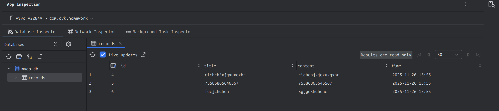

# Android 本地数据持久化综合实验

---

姓名：董一坤	学号：42312240	班级：软件2301班	实验日期：2025-11-26	实验内容：Android 本地数据持久化

---

## 一、实验目标

1. **文件（File）读写：** 使用 `FileInputStream` / `FileOutputStream` 或 `openFileInput` / `openFileOutput` 进行文本文件的保存与加载。
2. **SharedPreferences：** 使用 `getSharedPreferences()` 保存和读取简单的键值对配置数据（实现账户，密码的自动保存和读取）。
3. **SQLite 数据库：** 使用 `SQLiteOpenHelper` 管理数据库，完成基本的增删改查（CRUD）操作。

## 二、实验步骤

### 1. 文件读写模块
- 在 `activity_main.xml` 中放置 `EditText`、两个 `Button` 以及用于展示结果的 `TextView`，并通过 `MainActivity` 中的 `findViewById` 完成视图绑定。
- 点击“保存”时将输入内容以 `MODE_APPEND` 方式写入 `data.txt`；点击“读取”时流式读取文件并在界面展示。

```58:109:src/MainActivity.java
fos = openFileOutput(file_name, Context.MODE_APPEND);
fos.write(input.getBytes());
...
fis = openFileInput(file_name);
BufferedReader br = new BufferedReader(new InputStreamReader(fis));
tv_show.setText(content.toString());
```

### 2. SharedPreferences 模块
- `activity_pref.xml` 布局包含账号、密码输入框和“记住密码”复选框；`PrefActivity` 在 `onCreate` / `onResume` 中调用 `loadPref()` 以便每次进入页面都能恢复上次保存的数据。
- 登录按钮被点击后调用 `savePref()` 将账号、密码和复选框状态写入 `settings.xml`，随后清空输入框模拟登录流程。

```java
SharedPreferences settings = getSharedPreferences(pref_name,MODE_PRIVATE);
String account = settings.getString("account","");
...
SharedPreferences.Editor edit = settings.edit();
edit.putString("account",account);
edit.putBoolean("remember",remember);
edit.apply();
```

### 3. SQLite 数据库模块
- `activity_sqlactivity.xml` 提供标题、内容、ID 输入框及新增/查询/更新/删除按钮；`SQLActivity` 负责处理用户输入、调用 `DBHelper` 操作数据库并把结果输出到 `TextView`。
- `DBHelper` 继承 `SQLiteOpenHelper`，在 `onCreate` 中建表，封装 `insert`、`queryAll`、`queryById`、`update`、`delete` 等方法，配合实体类 `MyEntity` 使用。

```java
List<MyEntity> list = db.queryAll();
...
long insertID = db.insert(obj);
...
int upgradeCount = db.upgrade(new MyEntity(id, title, content, currentTime));
```

```java
public void onCreate(SQLiteDatabase db) {
    String sql = "CREATE TABLE "+ TABLE_NAME +" (...";
}
...
public long deleteAll(){
    db = this.getWritableDatabase();
    return db.delete(TABLE_NAME,"1 = 1",null);
}
```

## 三、实验结果展示

1. 文件的读写

   <video src='./res/文件的读取.mp4'></video>

2. 共享首选项的读写

   <video src='./res/共享首选项的读取.mp4'></video>

3. 数据库的读写

   <video src='./res/数据库的读取.mp4'></video>

