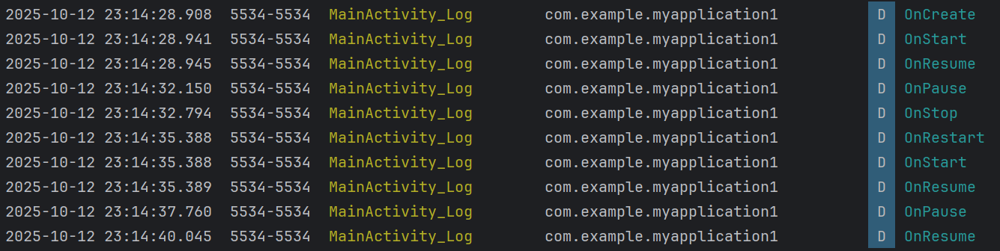

# Android Activity 生命周期代码实现与数据分析
## 一、关键代码实现
### 1. MainActivity 关键代码
```java
package com.example.myapplication1;

import android.content.Intent;
import android.net.Uri;
import android.os.Bundle;
import android.util.Log;
import android.view.View;
import android.widget.Button;
import android.widget.TextView;
import android.widget.Toast;

import androidx.activity.EdgeToEdge;
import androidx.annotation.Nullable;
import androidx.appcompat.app.AppCompatActivity;
import androidx.core.graphics.Insets;
import androidx.core.view.ViewCompat;
import androidx.core.view.WindowInsetsCompat;

public class MainActivity extends AppCompatActivity {
    Button b1,b2,b3,b4,b5,b6;
    TextView tv;
    public static final String TAG = "MainActivity_Log";
    @Override
    protected void onCreate(Bundle savedInstanceState) {
        super.onCreate(savedInstanceState);
        EdgeToEdge.enable(this);
        setContentView(R.layout.activity_main);
        ViewCompat.setOnApplyWindowInsetsListener(findViewById(R.id.main), (v, insets) -> {
            Insets systemBars = insets.getInsets(WindowInsetsCompat.Type.systemBars());
            v.setPadding(systemBars.left, systemBars.top, systemBars.right, systemBars.bottom);
            return insets;
        });

        Log.d(TAG,"OnCreate");

        b1 = findViewById(R.id.button1);
        b2 = findViewById(R.id.button2);
        b3 = findViewById(R.id.button3);
        b4 = findViewById(R.id.button4);
        b5 = findViewById(R.id.button5);
        b6 = findViewById(R.id.button6);
        tv = findViewById(R.id.tv);
        b1.setOnClickListener(new MyListener1());
        b2.setOnClickListener(new MyListener1());
        b3.setOnClickListener(new MyListener1());
        b4.setOnClickListener(new MyListener1());
        b5.setOnClickListener(new MyListener1());
        b6.setOnClickListener(new MyListener1());


    }

    @Override
    protected void onStart() {
        super.onStart();
        Log.d(TAG,"OnStart");
    }

    @Override
    protected void onPause() {
        super.onPause();
        Log.d(TAG,"OnPause");
    }

    @Override
    protected void onStop() {
        super.onStop();
        Log.d(TAG,"OnStop");
    }

    @Override
    protected void onRestart() {
        super.onRestart();
        Log.d(TAG,"OnRestart");
    }

    @Override
    protected void onResume() {
        super.onResume();
        Log.d(TAG,"OnResume");
    }

    @Override
    protected void onDestroy() {
        super.onDestroy();
        Log.d(TAG,"onDestroy");
    }

    @Override
    protected void onActivityResult(int requestCode, int resultCode, @Nullable Intent data) {
        super.onActivityResult(requestCode, resultCode, data);
        if(resultCode == 3)
            if(requestCode == 1){
                String resultString = data.getStringExtra("result");
                tv.setText(resultString);
            }

    }


    class MyListener1 implements View.OnClickListener{
        @Override
        public void onClick(View view){
            if(view.getId() == R.id.button1){
                Toast.makeText(MainActivity.this,"peace and love",Toast.LENGTH_LONG).show();
            }
            else if(view.getId() == R.id.button2){
                Intent it = new Intent(MainActivity.this,SecondActivity.class);
                startActivity(it);
                //Toast.makeText(MainActivity.this,"Android",Toast.LENGTH_LONG).show();

            }
            else if(view.getId() == R.id.button3){

                Intent it = new Intent(Intent.ACTION_VIEW, Uri.parse("http://www.snnu.edu.cn"));
                startActivity(it);
            }
            else if(view.getId() == R.id.button4){
                Intent it = new Intent("com.package.myapplication1.ThirdActivity");
                startActivity(it);

            }
            else if(view.getId() == R.id.button5){
                Intent it = new Intent(MainActivity.this,ForceActivity.class);
                startActivityForResult(it,1);
            }
            else if(view.getId() == R.id.button6){
                Intent it = new Intent(MainActivity.this,DialogActivity.class);
                startActivity(it);
                //Toast.makeText(MainActivity.this,"Android",Toast.LENGTH_LONG).show();

            }

        }
    }
}
```

### 2. SecondActivity 关键代码
```java
package com.example.myapplication1;

import android.os.Bundle;

import androidx.activity.EdgeToEdge;
import androidx.appcompat.app.AppCompatActivity;
import androidx.core.graphics.Insets;
import androidx.core.view.ViewCompat;
import androidx.core.view.WindowInsetsCompat;

public class SecondActivity extends AppCompatActivity {

    @Override
    protected void onCreate(Bundle savedInstanceState) {
        super.onCreate(savedInstanceState);
        EdgeToEdge.enable(this);
        setContentView(R.layout.activity_second);
        ViewCompat.setOnApplyWindowInsetsListener(findViewById(R.id.main), (v, insets) -> {
            Insets systemBars = insets.getInsets(WindowInsetsCompat.Type.systemBars());
            v.setPadding(systemBars.left, systemBars.top, systemBars.right, systemBars.bottom);
            return insets;
        });
    }
}
```

### 3. DialogActivity 关键代码
```java
package com.example.myapplication1;

import android.os.Bundle;

import androidx.activity.EdgeToEdge;
import androidx.appcompat.app.AppCompatActivity;
import androidx.core.graphics.Insets;
import androidx.core.view.ViewCompat;
import androidx.core.view.WindowInsetsCompat;

public class DialogActivity extends AppCompatActivity {

    @Override
    protected void onCreate(Bundle savedInstanceState) {
        super.onCreate(savedInstanceState);
        EdgeToEdge.enable(this);
        setContentView(R.layout.activity_dialog);
        ViewCompat.setOnApplyWindowInsetsListener(findViewById(R.id.main), (v, insets) -> {
            Insets systemBars = insets.getInsets(WindowInsetsCompat.Type.systemBars());
            v.setPadding(systemBars.left, systemBars.top, systemBars.right, systemBars.bottom);
            return insets;
        });
    }
}
```

## 二、数据记录与分析
| 场景                   | MainActivity 生命周期顺序      | 目标 Activity 生命周期顺序    |
| ---------------------- | ------------------------------ | ----------------------------- |
| 应用启动               | onCreate → onStart → onResume  | -                             |
| Main → SecondActivity  | onPause → onStop               | onCreate → onStart → onResume |
| SecondActivity 返回    | onRestart → onStart → onResume | onPause → onStop → onDestroy  |
| Main → Dialog Activity | onPause                        | onCreate → onStart → onResume |
| Dialog Activity 返回   | onResume                       | onPause → onStop → onDestroy  |

