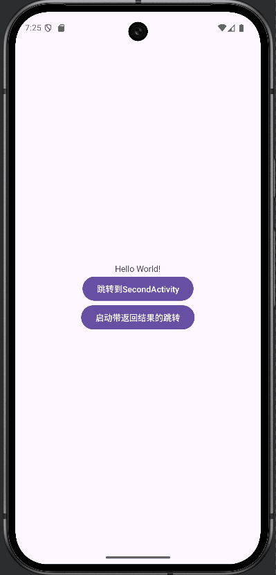
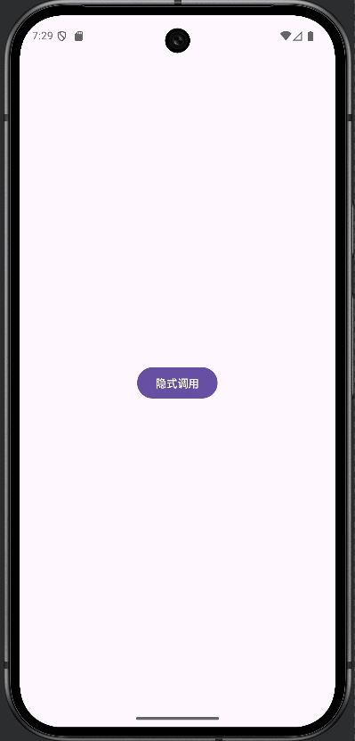
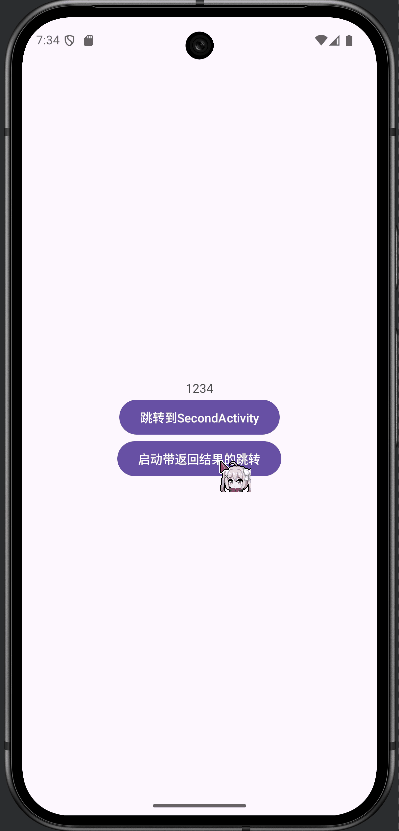
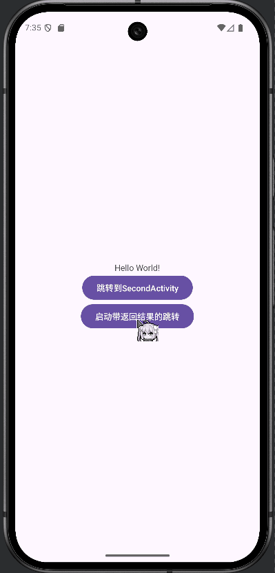

# **Android Activity 跳转课程作业实现**

## 功能实现

### 1. 显式跳转 (Explicit Intent)
- `MainActivity` → `SecondActivity`
- 通过明确的类名直接启动目标Activity
```java
findViewById(R.id.explicit).setOnClickListener((view) -> {
    Intent intent = new Intent(view.getContext(), SecondActivity.class);
    startActivity(intent);
});
```

- 运行效果图

  

### 2. 隐式跳转 (Implicit Intent)

- `SecondActivity` → `ThirdActivity`
- 通过Action字符串匹配来启动符合条件的Activity
```java
findViewById(R.id.implicit).setOnClickListener((view) -> {
    Intent intent = new Intent("ThirdActivity");
    startActivity(intent);
});
```
- 另外，需要在`AndroidManifest.xml`中为`ThirdActivity`配置对应的intent-filter以及将exported设置为true

```xml
<activity
    android:name=".ThirdActivity"
    android:exported="true">
    <intent-filter>
        <action android:name="ThirdActivity" />
        <category android:name="android.intent.category.DEFAULT" />
    </intent-filter>
</activity>
```

- 运行效果图

  

### 3. 带返回结果的跳转 (Start Activity for Result)
- `MainActivity` ↔ `ThirdActivity`
- 启动子Activity并等待返回结果
```java
findViewById(R.id.forResult).setOnClickListener((view) -> {
    Intent intent = new Intent(view.getContext(), ThirdActivity.class);
    startActivityForResult(intent, ThirdActivity.REQ_CODE);
});
```
- 返回结果处理:
```java
// 成功返回
findViewById(R.id.ret).setOnClickListener((view) -> {
    Intent intent = new Intent();
    intent.putExtra("Ret", "1234");
    setResult(RESULT_SUCCEED, intent);
    finish();
});

// 取消操作
findViewById(R.id.cancel).setOnClickListener((view) -> {
    setResult(Activity.RESULT_CANCELED);
    finish();
});
```
- 在`MainActivity`中接收结果:
```java
@Override
protected void onActivityResult(int requestCode, int resultCode, @Nullable Intent data) {
    super.onActivityResult(requestCode, resultCode, data);
    if(requestCode == ThirdActivity.REQ_CODE) {
        if(resultCode == ThirdActivity.RESULT_SUCCEED) {
            TextView textView = findViewById(R.id.text);
            textView.setText(data.getStringExtra("Ret"));
        }
    }
}
```

- 运行效果图

  

- 注意到返回到MainActivity后Hello World变为ThirdActivity返回的"1234"

## 加分项实现

### 1. 长按监听器
- 使用setOnLongClickListener即可，注意监听器的返回值意为是否阻断将事件继续传递给其他监听器
```java
findViewById(R.id.forResult).setOnLongClickListener((view) -> {
    Toast.makeText(getApplicationContext(), "长按了带返回结果的跳转", Toast.LENGTH_LONG).show();
    return true;
});
```

- 运行效果图

  

### 2. 取消操作处理
- 在XML文件中添加一个"返回取消"按钮，并添加相应的事件监听器

```java
// 取消操作
findViewById(R.id.cancel).setOnClickListener((view) -> {
    setResult(Activity.RESULT_CANCELED);
    finish();
});
```

- 并在`MainActivity`中添加处理取消操作的代码

```java
@Override
protected void onActivityResult(int requestCode, int resultCode, @Nullable Intent data) {
    super.onActivityResult(requestCode, resultCode, data);
    if(requestCode == ThirdActivity.REQ_CODE) {
        if(resultCode == ThirdActivity.RESULT_SUCCEED) {
            TextView textView = findViewById(R.id.text);
            textView.setText(data.getStringExtra("Ret"));
        } else if(resultCode == RESULT_CANCELED) {
            Toast.makeText(getApplicationContext(), "用户取消操作", Toast.LENGTH_LONG).show();
        }
    }
}
```

- 运行效果图

  