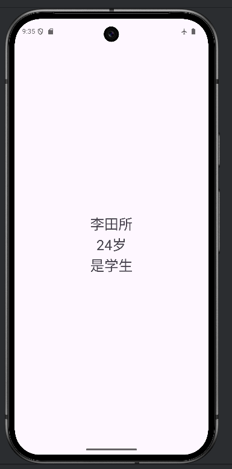
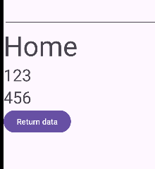
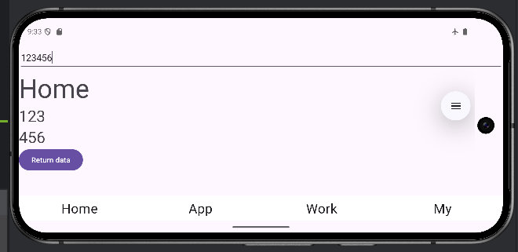

# Android Fragment与数据传输实验报告

## 一、RadioGroup控制Fragment切换

### 实现方案
1. **界面布局**：在`activity_main.xml`中创建包含4个RadioButton的RadioGroup
2. **样式定义**：
   - 在`res/drawable/`下创建`radio_button_selector.xml`，定义选中和未选中状态
   - 在styles.xml中统一定义RadioButton样式

3. **核心代码**：
```java
// MainActivity中设置RadioGroup监听
RadioGroup group = findViewById(R.id.group);
group.setOnCheckedChangeListener((radioGroup, checkedId) -> {
    for (int i = 0; i < radioGroup.getChildCount(); i++) {
        RadioButton button = (RadioButton) radioGroup.getChildAt(i);
        if(button.isChecked()) {
            setFragment(i);
        }
    }
});
```

4. **Fragment管理**：
   - 使用Fragment数组缓存已创建的Fragment实例
   - 通过`FragmentTransaction`动态显示/隐藏Fragment
   - 避免重复创建，提升性能

## 二、Bundle数据传输

### 场景A：Activity → Activity
**实现方式**：

```java
// AppFragment中启动DetailActivity
var intent = new Intent(getContext(), DetailActivity.class);
intent.putExtra("name", "李田所");
intent.putExtra("age", "24岁");
intent.putExtra("student", "是学生");
startActivity(intent);

// DetailActivity中接收数据
TextView t = findViewById(R.id.name);
t.setText(getIntent().getStringExtra("name"));
```



### 场景B：Activity ↔ Fragment

**Activity向Fragment传参**：
```java
// MainActivity中创建Fragment时传递参数
cache[index] = HomeFragment.newInstance("123", "456");

// HomeFragment中接收参数
TextView v1 = root.findViewById(R.id.t1);
v1.setText(mParam1);
```



**Fragment向Activity返回结果**：

```java
// HomeFragment发送结果
var bundle = new Bundle();
bundle.putString("result", "HomeResult");
getParentFragmentManager().setFragmentResult("REQ_KEY", bundle);

// MainActivity监听结果
getSupportFragmentManager().setFragmentResultListener("REQ_KEY", this, 
    (reqkey, bundle) -> {
        Toast.makeText(getApplicationContext(), 
            "Fragment Result: " + bundle.getString("result"), 
            Toast.LENGTH_LONG).show();
    });
```


### 场景C：Fragment → Fragment

**通过Activity中转**：
```java
// MyFragment监听来自其他Fragment的消息
getParentFragmentManager().setFragmentResultListener("REQ_KEY", this, 
    (req, result) -> {
        resView.setText("Msg from Home: " + result.getString("result"));
    });
```


## 三、屏幕旋转与状态保存

### 实现方案
1. **状态保存**：
```java
@Override
protected void onSaveInstanceState(@NonNull Bundle outState) {
    super.onSaveInstanceState(outState);
    outState.putString("editText", editText.getText().toString());
}
```

2. **生命周期观察**：
   - `onSaveInstanceState`在Activity即将被销毁前调用
   - 屏幕旋转时系统自动调用此方法保存临时状态
   - 在`onCreate`中可以通过`savedInstanceState`恢复数据

3. **数据恢复**：
```java
@Override
protected void onCreate(Bundle savedInstanceState) {
    super.onCreate(savedInstanceState);
    // ...
    if(savedInstanceState != null) {
        editText.setText(savedInstanceState.getString("editText"));
    }
}
```



## 技术要点总结

1. **Fragment管理**：使用缓存机制优化Fragment切换性能
2. **数据传输**：
   - Intent Bundle用于Activity间通信
   - Fragment Arguments用于Activity向Fragment传参
   - Fragment Result API用于Fragment间通信
3. **状态持久化**：利用Bundle在配置变更时保存重要数据
4. **UI响应**：通过Toast和TextView更新展示传输结果
