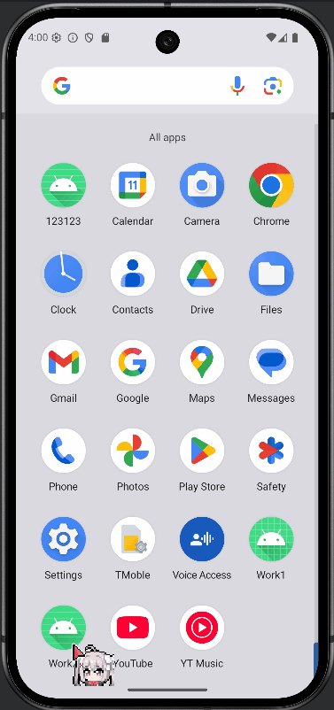
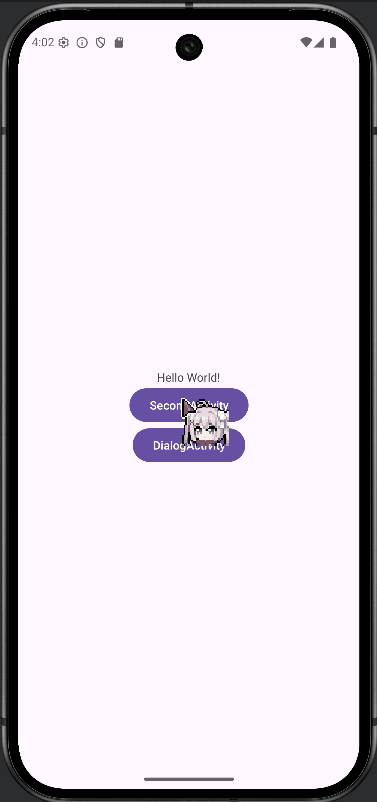
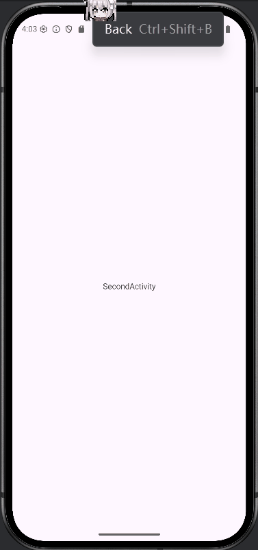
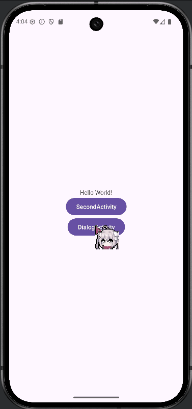
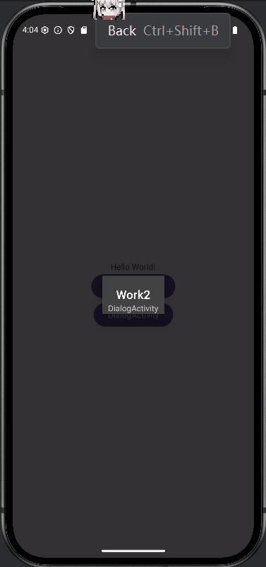

# Android Activity 生命周期观察实验报告

## 实验目的

1. 掌握 Android Activity 生命周期的基本概念
2. 通过 Log 观察 Activity 在不同场景下的生命周期变化
3. 理解 Activity 跳转和返回时的生命周期调用顺序
4. 分析普通 Activity 与 Dialog Activity 在生命周期上的差异

## 实验要求

### 基础任务

1. **创建主 Activity**

   - 创建 MainActivity，重写所有生命周期方法
   - 在每个生命周期方法中添加 Log 输出，格式：`Log.d("Lifecycle", "MainActivity - onCreate")`

   ```java
   public class MainActivity extends AppCompatActivity {
       private static final String TAG = "MainActivity";
   
       @Override
       protected void onCreate(Bundle savedInstanceState) {
           super.onCreate(savedInstanceState);
           Log.d("LifeCycle", TAG + " - onCreate");
           EdgeToEdge.enable(this);
           setContentView(R.layout.activity_main);
           ViewCompat.setOnApplyWindowInsetsListener(findViewById(R.id.main), (v, insets) -> {
               Insets systemBars = insets.getInsets(WindowInsetsCompat.Type.systemBars());
               v.setPadding(systemBars.left, systemBars.top, systemBars.right, systemBars.bottom);
               return insets;
           });
   
           findViewById(R.id.second).setOnClickListener((view) -> {
               Intent intent = new Intent(view.getContext(), SecondActivity.class);
               startActivity(intent);
           });
   
           findViewById(R.id.dialog).setOnClickListener((view) -> {
               Intent intent = new Intent(view.getContext(), DialogActivity.class);
               startActivity(intent);
           });
       }
   
       @Override
       protected void onRestart() {
           super.onRestart();
           Log.d("LifeCycle", TAG + " - onRestart");
       }
   
       @Override
       protected void onStart() {
           super.onStart();
           Log.d("LifeCycle", TAG + " - onStart");
       }
   
       @Override
       protected void onStop() {
           super.onStop();
           Log.d("LifeCycle", TAG + " - onStop");
       }
   
       @Override
       protected void onDestroy() {
           super.onDestroy();
           Log.d("LifeCycle", TAG + " - onDestroy");
       }
   
       @Override
       protected void onResume() {
           super.onResume();
           Log.d("LifeCycle", TAG + " - onResume");
       }
   
       @Override
       protected void onPause() {
           super.onPause();
           Log.d("LifeCycle", TAG + " - onPause");
       }
   }
   ```

   - 

2. **创建普通 SecondActivity**

   - 创建第二个普通 Activity
   - 同样重写所有生命周期方法并添加 Log 输出

   ```java
   public class SecondActivity extends AppCompatActivity {
       private static final String TAG = "SecondActivity";
   
       @Override
       protected void onCreate(Bundle savedInstanceState) {
           super.onCreate(savedInstanceState);
           Log.d("LifeCycle", TAG + " - onCreate");
           EdgeToEdge.enable(this);
           setContentView(R.layout.activity_second);
           ViewCompat.setOnApplyWindowInsetsListener(findViewById(R.id.main), (v, insets) -> {
               Insets systemBars = insets.getInsets(WindowInsetsCompat.Type.systemBars());
               v.setPadding(systemBars.left, systemBars.top, systemBars.right, systemBars.bottom);
               return insets;
           });
       }
   
       @Override
       protected void onRestart() {
           super.onRestart();
           Log.d("LifeCycle", TAG + " - onRestart");
       }
   
       @Override
       protected void onStart() {
           super.onStart();
           Log.d("LifeCycle", TAG + " - onStart");
       }
   
       @Override
       protected void onStop() {
           super.onStop();
           Log.d("LifeCycle", TAG + " - onStop");
       }
   
       @Override
       protected void onDestroy() {
           super.onDestroy();
           Log.d("LifeCycle", TAG + " - onDestroy");
       }
   
       @Override
       protected void onResume() {
           super.onResume();
           Log.d("LifeCycle", TAG + " - onResume");
       }
   
       @Override
       protected void onPause() {
           super.onPause();
           Log.d("LifeCycle", TAG + " - onPause");
       }
   }
   ```

   

3. **创建 Dialog Activity**

   - 创建第三个 Activity，设置为主题为对话框样式

   ```xml
   <activity
       android:name=".DialogActivity"
       android:theme="@style/Theme.AppCompat.Dialog"
       android:exported="false" />
   ```

   - 重写所有生命周期方法并添加 Log 输出

   ```java
   public class DialogActivity extends AppCompatActivity {
       private static final String TAG = "DialogActivity";
       @Override
       protected void onCreate(Bundle savedInstanceState) {
           super.onCreate(savedInstanceState);
           Log.d("LifeCycle", TAG + " - onCreate");
           EdgeToEdge.enable(this);
           setContentView(R.layout.activity_dialog);
           ViewCompat.setOnApplyWindowInsetsListener(findViewById(R.id.main), (v, insets) -> {
               Insets systemBars = insets.getInsets(WindowInsetsCompat.Type.systemBars());
               v.setPadding(systemBars.left, systemBars.top, systemBars.right, systemBars.bottom);
               return insets;
           });
       }
   
       @Override
       protected void onRestart() {
           super.onRestart();
           Log.d("LifeCycle", TAG + " - onRestart");
       }
   
       @Override
       protected void onStart() {
           super.onStart();
           Log.d("LifeCycle", TAG + " - onStart");
       }
   
       @Override
       protected void onStop() {
           super.onStop();
           Log.d("LifeCycle", TAG + " - onStop");
       }
   
       @Override
       protected void onDestroy() {
           super.onDestroy();
           Log.d("LifeCycle", TAG + " - onDestroy");
       }
   
       @Override
       protected void onResume() {
           super.onResume();
           Log.d("LifeCycle", TAG + " - onResume");
       }
   
       @Override
       protected void onPause() {
           super.onPause();
           Log.d("LifeCycle", TAG + " - onPause");
       }
   }
   ```

   

### 实验步骤

#### 第一部分：基础生命周期观察

1. **启动应用观察**

   - 启动应用，观察 MainActivity 的生命周期调用顺序

   - 记录 Logcat 中的输出

     

2. **普通 Activity 跳转**

   - 从 MainActivity 跳转到 SecondActivity

   

   - 观察两个 Activity 的生命周期变化
   - 从 SecondActivity 返回 MainActivity

   

   - 再次观察生命周期变化

3. **Dialog Activity 跳转**

   - 从 MainActivity 跳转到 Dialog Activity

   

   - 观察生命周期变化
   - 从 Dialog Activity 返回

   

   - 观察生命周期变化

#### 第二部分：数据记录与分析

记录以下场景的 Log 输出：

| 场景                   | MainActivity 生命周期顺序        | 目标Activity 生命周期顺序       |
| ---------------------- | -------------------------------- | ------------------------------- |
| 应用启动               | onCreate -> onStart -> onResume  | -                               |
| Main → SecondActivity  | onPause -> onStop                | onCreate -> onStart -> onResume |
| SecondActivity 返回    | onRestart -> onStart -> onResume | onPause -> onStop -> onDestroy  |
| Main → Dialog Activity | onPause                          | onCreate -> onStart -> onResume |
| Dialog Activity 返回   | onResume                         | onPause -> onStop -> onDestroy  |