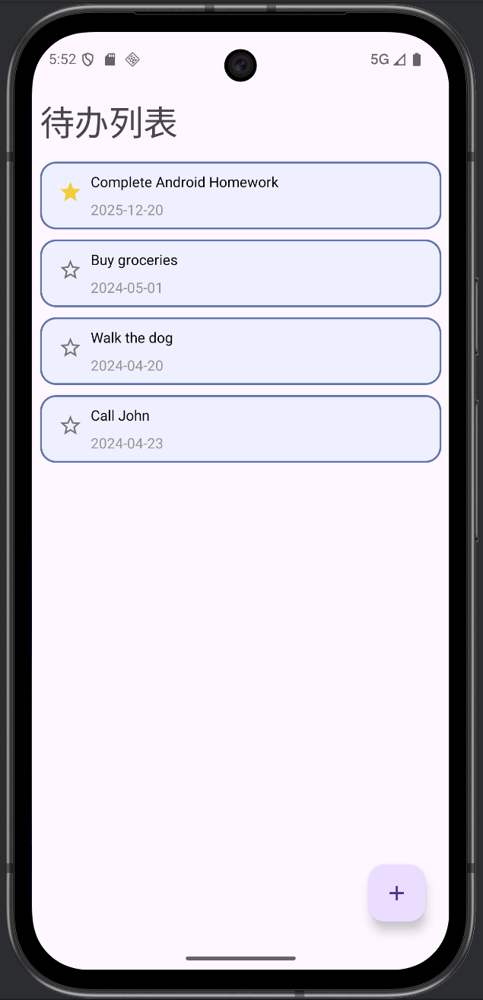
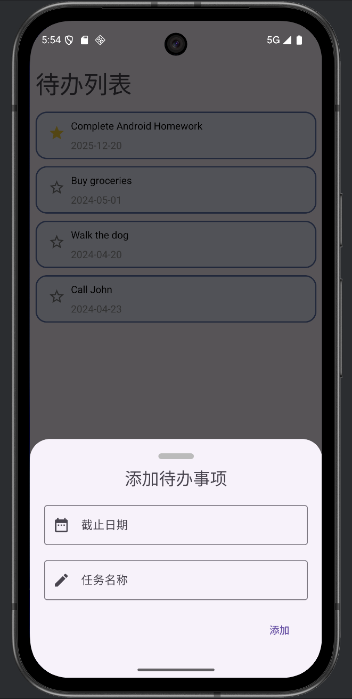
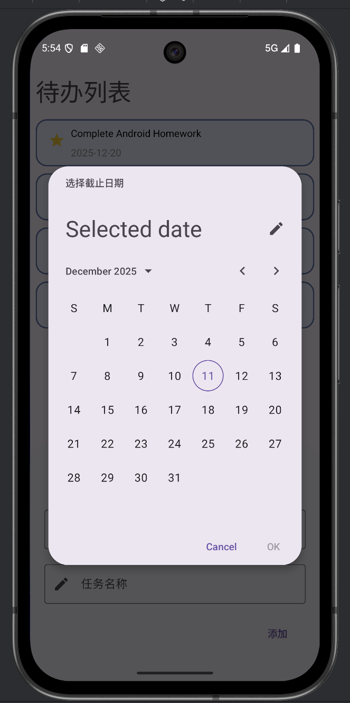

# Android ListView 待办事项清单应用实验报告

## 一、实验目的
掌握Android中ListView组件的使用，包括自定义适配器、列表项布局设计、数据绑定以及用户交互实现。

## 二、实验环境
- Android Studio
- Android SDK

## 三、主要功能实现

### 1. 主界面布局实现
使用ConstraintLayout作为主布局，包含：
- 标题TextView显示"待办列表"
- ListView组件作为任务列表容器
- FloatingActionButton用于添加新任务
- 设置列表项分隔间距和自定义选择器



### 2. 数据模型设计
```java
public class TaskItem {
    public String taskName;    // 任务名称
    public String dueDate;     // 截止日期
    public boolean marked;     // 标记状态
}
```

### 3. 自定义适配器实现
继承ArrayAdapter<TaskItem>，主要功能：
- 自定义列表项布局(list_item.xml)
- 绑定数据到任务名称和截止日期TextView
- 实现星标图标的点击切换功能
- 根据marked状态显示不同星标图标

### 4. 示例数据初始化
在MainActivity中初始化四个示例任务：
```java
items.add(new TaskItem("Complete Android Homework", "2025-12-20"));
items.add(new TaskItem("Buy groceries", "2024-05-01"));
items.add(new TaskItem("Walk the dog", "2024-04-20"));
items.add(new TaskItem("Call John", "2024-04-23"));
```

### 5. 添加功能实现
- 使用BottomSheetDialogFragment创建底部弹窗
- 通过MaterialDatePicker选择日期
- 添加新任务到列表并更新适配器





### 6. 界面美化
- 列表项使用圆角矩形背景
- 设置不同颜色区分任务名称和日期
- 使用Material Design图标

## 四、核心代码说明

### 1. 列表项数据绑定
```java
public View getView(int position, @Nullable View convertView, @NonNull ViewGroup parent) {
    // 绑定数据到视图组件
    name.setText(item.taskName);
    date.setText(item.dueDate);
    image.setImageResource(item.marked ? R.drawable.baseline_star_24 : R.drawable.baseline_star_outline_24);
}
```

### 2. 星标交互
```java
icon.setOnClickListener((v) -> {
    item.marked = !item.marked;
    m.adapter.notifyDataSetChanged();
});
```

## 五、实验结果
成功实现了待办事项清单应用，具备以下功能：
1. 显示任务列表，包含任务名称和截止日期
2. 自定义列表项布局，视觉清晰美观
3. 支持添加新任务
4. 支持基于 Material 3 的日期选择器
5. 支持星标标记重要任务
6. 列表项间有清晰分隔

## 六、实验总结
通过本次实验，掌握了：
- ListView的基本使用和数据绑定
- 自定义ArrayAdapter的实现方法
- 复杂列表项布局的设计
- 用户交互事件的正确处理
- Material Design组件的应用
