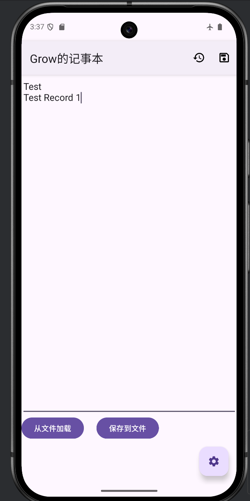
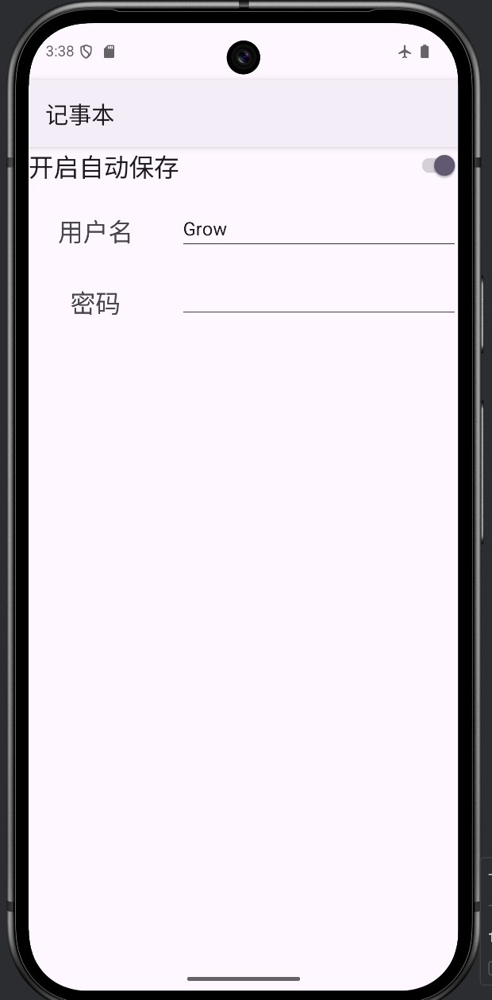
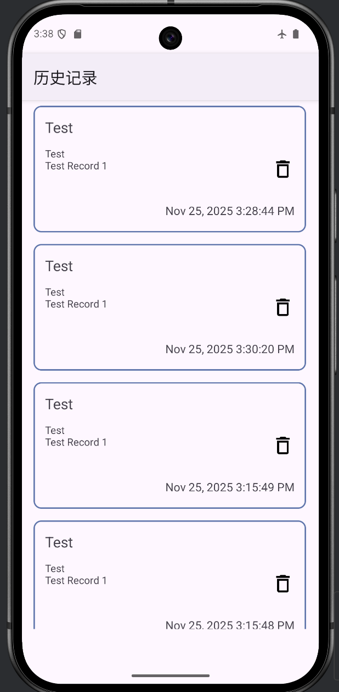
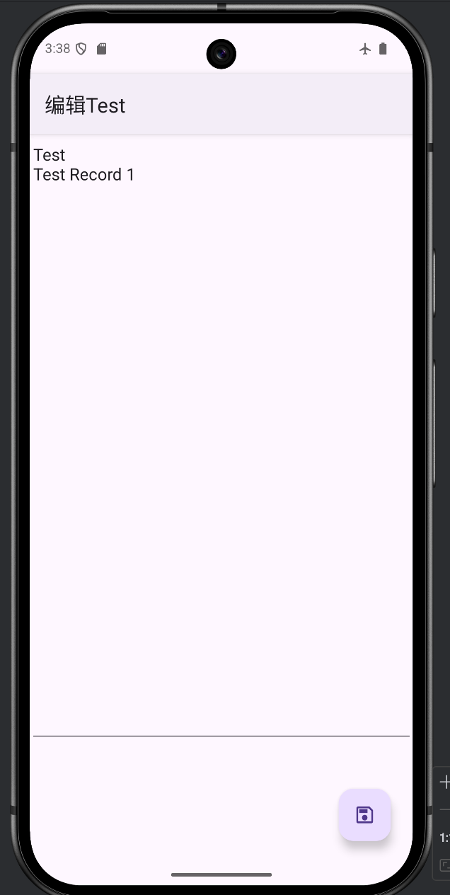

# Android 本地数据持久化综合实验报告

## 一、实验成果

本实验成功实现了Android中三种常用本地数据存储方式：

1. **文件读写**：使用`openFileInput`/`openFileOutput`进行文本文件保存与加载
2.  **SharedPreferences**：使用`getSharedPreferences()`保存和读取配置数据
3.  **SQLite数据库**：使用`SQLiteOpenHelper`完成基本的增删改查操作

## 二、功能模块实现

### 1. 文件读写模块 (MainActivity)

**核心实现：**
```java
// 保存到文件
private void save() {
    try (var file = openFileOutput("note.txt", MODE_PRIVATE)) {
        var writer = new OutputStreamWriter(file);
        var txt = editText.getText().toString();
        writer.write(txt);
        writer.close();
    } catch (IOException e) {
        Log.e("MainActivity", Objects.requireNonNull(e.getMessage()));
    }
}

// 从文件加载
private void load() {
    try (var file = openFileInput("note.txt")) {
        var txt = new String(file.readAllBytes(), Charset.defaultCharset());
        editText.setText(txt);
    } catch (FileNotFoundException e) {
        Toast.makeText(getApplicationContext(), "记事本文件不存在", Toast.LENGTH_LONG).show();
    } catch (IOException e) {
        Log.e("MainActivity", Objects.requireNonNull(e.getMessage()));
    }
}
```

**功能特点：**
- 使用应用私有目录存储`note.txt`文件
- 完整的异常处理机制
- 文件不存在时显示Toast提示

### 2. SharedPreferences模块 (SettingsActivity)

**核心实现：**
```java
// 读取配置
var sp = getSharedPreferences("settings", MODE_PRIVATE);
nameEdit.setText(sp.getString("user_name", "Guest"));
autoSave.setChecked(sp.getBoolean("auto_save", false));
password.setText(sp.getString("password", ""));

// 保存配置
var editor = sp.edit();
editor.putBoolean("auto_save", autoSave.isChecked());
editor.putString("user_name", nameEdit.getText().toString());
editor.putString("password", password.getText().toString());
editor.apply();
```

**自动保存功能：**
```java
@Override
protected void onResume() {
    super.onResume();
    var sp = getSharedPreferences("settings", MODE_PRIVATE);
    if(sp.getBoolean("auto_save", false)) {
        save();
    }
}
```

### 3. SQLite数据库模块

**数据库设计 (MyDbHelper)：**
```java
public class MyDbHelper extends SQLiteOpenHelper {
    private static final String DB_NAME = "record.db";
    private static final int DB_VERSION = 1;
    
    @Override
    public void onCreate(SQLiteDatabase db) {
        String sql = "CREATE TABLE records (" +
                "_id INTEGER PRIMARY KEY AUTOINCREMENT," +
                "title TEXT," +
                "content TEXT," +
                "time TEXT)";
        db.execSQL(sql);
    }
}
```

**数据模型：**
```java
public static class Value {
    public int id;
    public String title;
    public String content;
    public String time;
    
    // 自动生成标题（取前几个字符）
    public Value(String content) {
        int pos = Math.min(content.indexOf(' '), content.indexOf('\n'));
        if(pos == -1) pos = 5;
        title = content.substring(0, pos);
        time = DateFormat.getDateTimeInstance().format(new Date());
        this.content = content;
    }
}
```

**CRUD操作：**
- **新增记录**：`db.insert(new MyDbHelper.Value(txt))`
- **查询所有**：`db.readAll()` - 返回按ID降序排列的记录
- **删除记录**：`db.delete(value.id)`
- **编辑记录**：`db.edit(value.id, content.getText().toString())`

## 三、界面设计与交互

### 1. 主界面 (MainActivity)
- 多行文本编辑区域
- 文件保存/加载按钮
- 浮动设置按钮
- 右上角选项菜单：保存到数据库、查看历史记录
- 动态标题显示用户名



### 2. 设置界面 (SettingsActivity)
- 用户名和密码输入

- 自动保存开关

- 配置自动持久化保存

  

### 3. 记录列表 (RecordActivity)
- 使用Fragment动态加载记录项
- 卡片式布局显示标题、内容预览和时间
- 点击进入详情编辑，支持删除操作



### 4. 详情编辑界面 (DetailActivity)
- 全屏文本编辑
- 浮动保存按钮
- 实时更新数据库



## 四、关键技术点

### 1. 数据传递
使用Bundle在Activity/Fragment间传递复杂对象：
```java
// 序列化
public Bundle toBundle() {
    Bundle args = new Bundle();
    args.putString(ARG_TITLE, title);
    // ...
    return args;
}

// 反序列化
public static Value fromBundle(Bundle bundle) {
    // ...
}
```

### 2. 数据库优化
- 使用try-with-resources自动关闭数据库连接
- 实现完整的生命周期管理
- 支持事务操作

### 3. UI/UX设计
- 使用Material Design组件（FloatingActionButton）
- 响应式布局适配不同屏幕
- 直观的操作反馈

## 五、实验总结

本实验成功实现了：
1. **完整的文件IO系统** - 支持文本的持久化存储和读取
2. **灵活的配置管理系统** - 通过SharedPreferences管理用户设置
3. **功能完善的数据库模块** - 实现完整的CRUD操作和复杂数据管理
4. **良好的用户体验** - 直观的界面设计和流畅的操作流程

**创新点：**
- 自动标题生成机制
- 配置驱动的自动保存功能  
- Fragment动态列表加载
- 统一的数据模型设计
